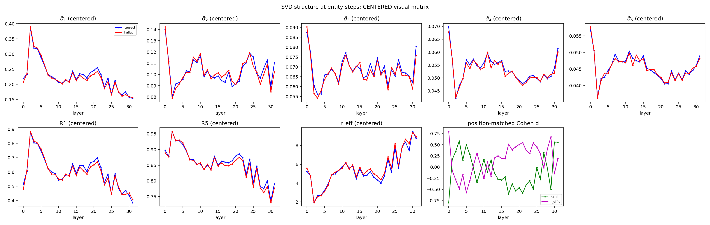
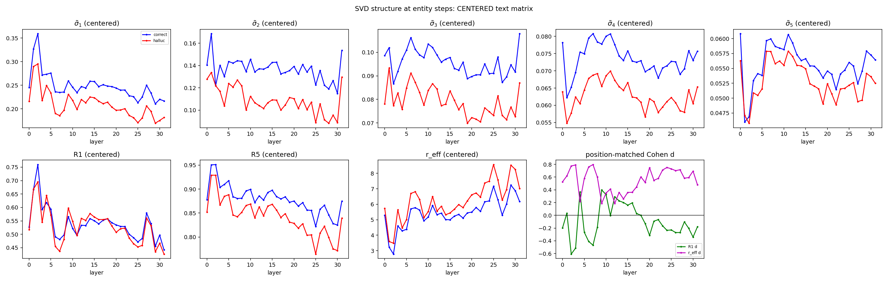
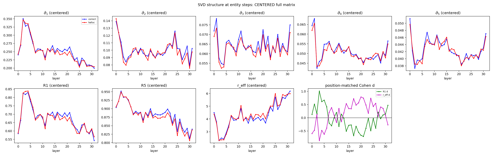
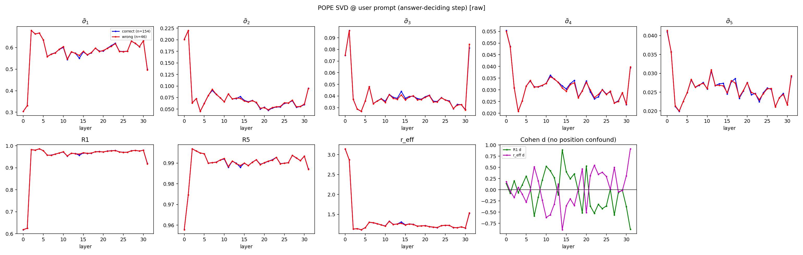
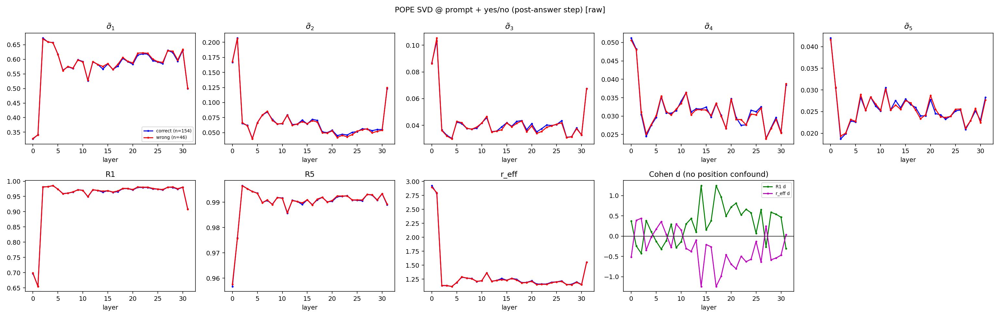
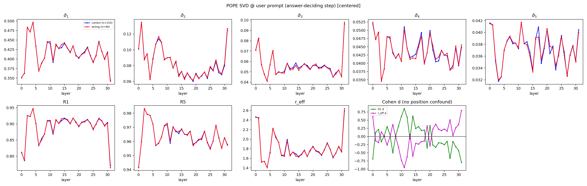
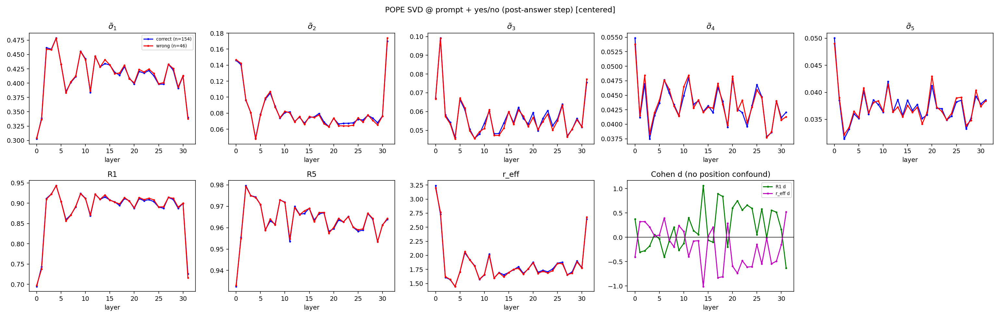
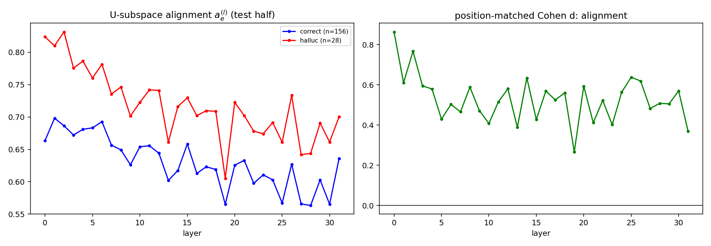
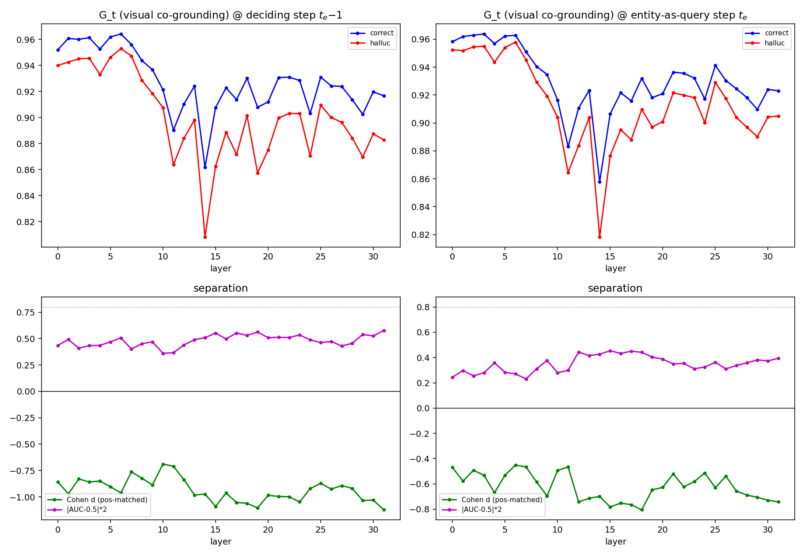

# Centered Text Matrix $(X_Y)$ 的 SVD 分析

## 目标

对新的中心化文本矩阵 $(X_Y)$ 做与原始文本矩阵 $(S_Y)$ 完全一致的 SVD 统计，重新绘制相同的 text 图，并与原始结果进行对比。

注意：

* 不删除原来的 $(S_Y)$ 结果；
* $(S_Y)$ 和 $(X_Y)$ 回答的是两个不同问题；
* 第一阶段只分析 text matrix；
* 暂不分析 visual/full matrix，不重新做 threshold，不修改干预公式。

---

## 1. 为什么要减均值

原始文本 score 矩阵为：

$$
S_Y\in\mathbb R^{H\times N_Y}.
$$

其中第 $h$ 行：

$$
S_{Y,h:}
=[S_{h1},S_{h2},\dots,S_{hN_Y}]
$$

表示第 $h$ 个 head 对所有历史文本 token 的分数。

对于每个 head，沿文本 token 维度计算均值：

$$
\mu_h
=\frac1{N_Y}
\sum_{j=1}^{N_Y}S_{hj}.
$$

注意：

这里不是对所有 head 求平均，而是每个 head 单独求自己的文本均值。

定义中心化矩阵：

$$
\boxed{
X_{hj}=S_{hj}-\mu_h
}
$$

即：

$$
\boxed{
X_Y=S_Y-\mu\mathbf1^\top
}
$$

其中：

$$
\mu=[\mu_1,\dots,\mu_H]^\top .
$$

因此：

$$
S_Y
===

\underbrace{\mu\mathbf1^\top}*{\text{文本段整体基准}}
+
\underbrace{X_Y}*{\text{文本内部相对结构}}
$$

---

## 2. $(\mu_h)$ 和 $(X_Y)$ 分别代表什么

假设一个 head 的文本 score：

$$
S_{h:}=[10,11,9].
$$

其均值：

$$
\mu_h=10.
$$

中心化后：

$$
X_{h:}=[0,1,-1].
$$

两个量表达的信息不同：

* $\mu_h=10$：

  代表该 head 对整个历史文本段赋予的整体基准分数。

* $X_{h:}=[0,1,-1]$：

  代表该 head 在历史文本内部更偏向哪些 token。

中心化不改变 token 间相对关系：

$$
S_{hj}-S_{hk}
=
X_{hj}-X_{hk}.
$$

同时不改变文本内部条件 softmax：

$$
\frac{e^{S_{hj}}}
{\sum_{r\in Y}e^{S_{hr}}}
=
\frac{e^{X_{hj}}}
{\sum_{r\in Y}e^{X_{hr}}}.
$$

因此：

> $(X_Y)$ 完整保留每个 head 在历史文本内部如何区分不同 token 的信息，只去除了 head 对整个文本段共同添加的基准值。

---

## 3. 为什么直接对 $(S_Y)$ 做 SVD 不够

直接对 $(S_Y)$ 做 SVD 并没有错误。

它测量的是：

$$
\text{文本段整体基准}
+
\text{文本内部读取结构}
$$

二者混合后的谱。

问题在于：

$$
\mu\mathbf1^\top
$$

本身就是一个 rank-1 矩阵。

因此，它可能天然产生一个很大的第一奇异值。

例如：

$$
S_Y=
\begin{bmatrix}
100&101&99\
100&99&101\
101&100&99
\end{bmatrix}.
$$

矩阵中存在一个很强的公共基准：

$$
\begin{bmatrix}
100&100&100\
100&100&100\
100&100&100
\end{bmatrix}
$$

这个 rank-1 成分会主导 SVD，使：

$$
R_1
$$

显著升高。

但中心化后：

$$
X_Y=
\begin{bmatrix}
0&1&-1\
0&-1&1\
1&0&-1
\end{bmatrix}.
$$

可以看到不同 head 的文本偏好并不完全一致。

因此：

高 $R_1(S_Y)$ 可能来自两个来源：

1. 所有 head 对整个文本段具有相同的高基准分数；
2. 所有 head 真正采用相似的文本读取模式。

原始 $(S_Y)$ 的 SVD 无法区分二者。

---

## 4. 为什么 $(X_Y)$ 对当前假设更关键

当前假设：

> 幻觉时，head 对历史文本的读取方式变得单一，而不是单纯地看文本更多。

因此，需要验证：

$$
X_Y
$$

是否也出现谱塌陷。

因为：

$$
X_Y
$$

已经去除了：

$$
\mu\mathbf1^\top
$$

只保留：

$$
\text{不同 head 如何相对选择历史文本 token}.
$$

解释：

* 如果 $(X_Y)$ 的 $R_1$ 仍显著升高，effective rank 仍显著下降：

  说明文本内部读取结构确实塌陷。

* 如果中心化后差异消失：

  说明原始结果主要来自文本段整体基准变化。

* 如果差异减弱但仍存在：

  说明整体基准和内部结构共同贡献。

---

## 5. 第一阶段计算流程

保持原来的：

* entity；
* layer；
* position matching；

方法完全不变。

对于每个 entity $e$ 和 layer $l$：

### Step 1：获取原始文本矩阵

$$
S_{e,Y}^{(l)}
\in\mathbb R^{H\times N_Y}.
$$

---

### Step 2：每个 head 减去自己的文本均值

计算：

$$
\mu_{e,h}^{(l)}
=
\frac1{N_Y}
\sum_j
S_{e,Y,hj}^{(l)}.
$$

得到：

$$
\boxed{
X_{e,Y,hj}^{(l)}
=S_{e,Y,hj}^{(l)}
\mu_{e,h}^{(l)}
}
$$

---

### Step 3：对中心化矩阵做 SVD

$$
X_{e,Y}^{(l)}
=
U_e^{(l)}
\Sigma_e^{(l)}
V_e^{(l)\top}.
$$

---

### Step 4：计算与原始分析完全相同的指标

归一化奇异值：

$$
\widetilde\sigma_i
=
\frac{\sigma_i}{\sum_j\sigma_j}.
$$

低秩能量：

$$
R_k
=
\frac{\sum_{i=1}^{k}\sigma_i^2}
{\sum_i\sigma_i^2}.
$$

Effective rank：

$$
p_i
=
\frac{\sigma_i^2}
{\sum_j\sigma_j^2}
$$

$$
r_{\mathrm{eff}}
=
\exp
\left(
-\sum_i p_i\log p_i
\right).
$$

---

## 6. 需要绘制的图

第一阶段只重新绘制 centered-text 版本。

布局与原始 text SVD 图完全一致：

包含：

* $\widetilde\sigma_1\sim\widetilde\sigma_5$；
* $R_1$；
* $R_5$；
* $r_{\mathrm{eff}}$；
* position-matched Cohen's $d$。

---

## 7. 与原始 $(S_Y)$ 对照

最终生成对照表：

| Matrix | Metric | Correct | Hallucination | max($|d|$) |
|---|---|---:|---:|---:|
| Raw $(S_Y)$ | $R_1$ | 0.9154 | 0.9391 | 1.23 |
| Centered $(X_Y)$ | $R_1$ |  |  |  |
| Raw $(S_Y)$ | $r_{\mathrm{eff}}$ | 1.5818 | 1.4466 | 1.14 |
| Centered $(X_Y)$ | $r_{\mathrm{eff}}$ |  |  |  |

---

## 8. 是否需要重新生成数据

情况：

### 已保存完整 $(S_Y)$

直接离线计算：

$$
S_Y\rightarrow X_Y\rightarrow SVD
$$

无需重新生成。

---

### 只保存原始奇异值、$R_1$、effective rank

无法恢复：

$$
X_Y
$$

的谱。

需要重新运行 greedy logging。

---

### 不需要重新做

* entity 标注；
* threshold；
* visual/full 分析。

---

## 当前唯一目标

验证：

$$
\boxed{
\text{幻觉时的谱塌陷是否存在于去除行均值后的 }X_Y
}
$$

最终保留两个互补结果：

$$
\boxed{
S_Y:\text{检测总体文本 score 谱异常}
}
$$

$$
\boxed{
X_Y:\text{判断异常是否来自文本内部读取结构}
}
$$

因此，中心化不是替代原分析，而是一个机制分解实验。

---

# 9. 实验结果（2026-08-24，已跑完）

## 9.0 协议

与原始 $S_Y$ 分析完全同协议（LLaVA-1.5-7B、greedy 无干预、Devils 前 50 图、512 tok、373 实体 = 54 幻觉 + 319 正确、实体步 pre-softmax 分数、位置分桶匹配 Cohen's d），唯一差异：SVD 对象换为每头减去自身文本均值的中心化矩阵 $X_Y=S_Y-\mu\mathbf 1^\top$。实现：`run_chair_hgai.py --log-svd`（6 矩阵）+ `tools/logit_decomp/svd_centered.py`；数据 `outputs/svd3_log_c{0,1}.jsonl`，统计 `outputs/svd_centered_stats.json`。对齐定义同 svd.md §11.0（query = 实体词本身的前向；决定步 $t_e-1$ 对齐实测结论不变）。

## 9.1 图（三种矩阵的中心化版，布局与原始 text SVD 图一致）

### Centered Visual



### Centered Text



### Centered Full



上排：$\tilde\sigma_1\sim\tilde\sigma_5$ 逐层（蓝=correct，红=hallucinated）；下排：$R_1$、$R_5$、$r_{eff}$ + 位置匹配 Cohen's d。

## 9.2 对照表（L5-26 段均值）

| Matrix | Metric | Correct | Hallucination | max($|d|$) |
|---|---|---:|---:|---:|
| Raw text $(S_Y)$ | $R_1$ | 0.9154 | 0.9391 | 1.23 |
| **Centered text $(X_Y)$** | $R_1$ | 0.5250 | 0.5205 | 0.47（无分离） |
| Raw text $(S_Y)$ | $r_{\mathrm{eff}}$ | 1.5818 | 1.4466 | 1.14 |
| **Centered text $(X_Y)$** | $r_{\mathrm{eff}}$ | 5.5474 | **6.3026（反转↑）** | **0.80** |
| **Centered text $(X_Y)$** | $R_5$ | 0.8776 | **0.8399（反转↓）** | **0.95** |
| Centered visual $(X_I)$ | $R_1$ | 0.6112 | 0.5997 | 0.60 |
| Centered visual $(X_I)$ | $R_5$ | 0.8602 | 0.8549 | 0.61 |
| Centered visual $(X_I)$ | $r_{\mathrm{eff}}$ | 5.1400 | 5.3228 | 0.57 |
| Centered full $(X_F)$ | $R_1$ | 0.6808 | 0.6710 | 0.71 |
| Centered full $(X_F)$ | $R_5$ | 0.8841 | 0.8776 | 0.93 |
| Centered full $(X_F)$ | $r_{\mathrm{eff}}$ | 4.1465 | 4.3081 | 0.79 |

## 9.3 结论：三个预设结局之外的第四种答案

文档预设的三种结局（仍塌陷 / 差异消失 / 共同贡献）都不完全命中，实际是：

1. **$R_1$ 差异完全消失**（0.5250 vs 0.5205）——原始 $S_Y$ 的"$R_1$ 升高"**确实主要来自行均值基准** $\mu\mathbf 1^\top$（rank-1 成分）。即原发现的第一半机制是：**幻觉时所有头对文本段的整体基准同步抬升**（基准吸附）；
2. **但内部结构没有"塌陷成单一模式"——反而反向：更弥散**。中心化后幻觉组的 $\tilde\sigma_2\sim\tilde\sigma_5$ 全面低于正确组（图：全程红线压在蓝线下）、$R_5$ 更低、$r_{eff}$ **更高**（6.30 vs 5.55，d≈+0.8）——能量从中秩结构成分被挤向谱尾。**真实的结构病征是"读取去结构化/噪声化"，不是"读取单一化"**；
3. **病征强度排序：文本 > 全文 > 视觉**。中心化 visual 只有弱分离（$r_{eff}$ d≈0.3-0.6 且方向同为"更弥散"），centered full 居中（信号来自其文本成分）——结构瓦解是**文本侧主导**的现象，视觉侧的结构读取在幻觉时基本完好（再次印证"看图的结构没变，变的是怎么读文本"）。

## 9.4 机制总图景（与中心化干预 top5abs 结果互洽）

$$\text{幻觉} = \underbrace{\mu\mathbf 1^\top \uparrow}_{\text{基准吸附（rank-1）}} + \underbrace{\sigma_{1\sim5}\downarrow,\ r_{eff}\uparrow}_{\text{结构化读取瓦解（含σ₁，见 §11 修正）}}$$

- **当前主算子 top5abs（$\widehat S_Y = S_Y + \alpha|X_Y^{(5)}|$）就是中心化方法**：它把 $X_Y$ 中被瓦解的前 5 结构成分以幅值形式加回——中心化实验（本节）是它的直接机制辩护：加回的正是实测赤字最大的成分（§11 交叉点：i≤5 全负赤字）；
- 原始（非中心化）变体家族的对照进一步定位了有效成分：boostabs（非中心化 $|\sum_{i=2}^5|$）无效而 top5abs（中心化）有效 → **信号在去基准后的内部结构里**；t5ano1（中心化但去掉 σ₁）失效 → σ₁ 必须包含；t5azm（零均值）失效 → 净质量注入是药效的一部分（top5abs = 文本侧结构化地板）；
- **与旧故事的关系**：之前"文本侧低秩锁定"的措辞已按本节修正——准确说法是"基准吸附 + 结构瓦解"双重病征。Raw $S_Y$ 的 $R_1$ 仍是最便宜的检测量（不用中心化就有 d≈1.2），中心化版负责机制定性；
- 也呼应 §34：幻觉语境不是"看文本更多"的质量问题，而是"基准吸附 + 结构化读取丢失"的结构问题。

## 9.5 局限

- 同 svd.md §11.5（样本量 54 幻觉实体、粗位置桶）；
- $r_{eff}$ 方向反转目前只在实体步横截面成立，未做逐步在线版本；
- $X_Y$ 每头减均值只去除了行基准，未处理列结构（如 BOS/标点列的公共峰），更彻底的分解（双向中心化）留待后续。

---

# 10. POPE 版 SVD 统计（2026-08-24）

协议：POPE adversarial 前 200 样本（46 错 / 154 对，acc 77%）。两组矩阵：
- **A 组**：query = prompt 末位（决定 yes/no 的那一步），矩阵 = 非图像 prompt 文本列；
- **B 组**：query = 模型实际回答的 yes/no token（回答后一步），矩阵 = 文本列 + 答案列。
每组 raw + centered 两版。单步回答无位置混杂，Cohen's d 直接计算。实现 `tools/logit_decomp/pope_svd.py` / `pope_svd_stats.py`，数据 `outputs/pope_svd.jsonl`。

## 图

| A 组（prompt @ 决定步） | B 组（prompt+yes/no @ 回答后） |
|---|---|
|  |  |
|  |  |

## 结果

- **A 组（决定步）：几乎无分离**——各层曲线重合，d 为噪声级震荡；
- **B 组（回答后）：raw $R_1$ 在 L13-27 出现稳定正向带**（错答更塌陷，max d=1.24）；$r_{eff}$ 镜像为负；
- **混杂检验**：B 组中错答多为幻觉 yes（adversarial split 的标签偏置），query token 身份本身可能贡献分离。只在 answer=yes 的样本内重做（39 错）：R₁ d 均值 0.42、峰值 1.53（L13-14 附近）——**信号减弱但不消失，部分真实**；
- **解读**：POPE 上谱结构在"决定时"不可分，在"承诺后"可分——错答之后头部对 prompt 的读取才出现塌陷（事后合理化模式）。这意味着 POPE 场景里谱信号是**结果而非前兆**，不能作为决定步的在线触发；与 CHAIR 长文中"实体步即可分"形成任务形态对比。

## 与 CHAIR 版的对照结论

| | CHAIR（长文实体步） | POPE（单步判断） |
|---|---|---|
| 决定步谱分离 | 强（raw $R_1$ d≈1.2） | 无（d≈噪声） |
| 承诺后谱分离 | —（未测） | 中（d≈0.4-1.5，L13-27） |
| 方向 | 幻觉 = 塌陷（raw）/ 去结构化（centered） | 错答 = 塌陷（raw），同向 |

谱病征在两个任务上方向一致（塌陷/去结构化 ↔ 幻觉），但**可测时机不同**：长文中病征与决策同步，单步判断中病征滞后于决策。

## 10.1 POPE 干预验证（top5abs 于决定步，2026-08-24）

把中心化干预 $\widehat S_Y = S_Y + \alpha|X_Y^{(5)}|$ 直接作用在答案决定步的文本段（L5-26，prefill 单行，单次前向零额外成本）。实现 `tools/logit_decomp/pope_fix.py`。

| 配置 | n=50 acc/F1 | n=200 acc/F1 |
|---|---|---|
| greedy | 72.0 / 75.9 | 77.0 / 80.2 |
| top5abs α=0.65 | 72.0 / 74.1 | **82.0 / 83.0（+5.0/+2.9）** |
| top5abs α=1.0 | 72.0 / 74.1 | 82.0 / 82.5 |

- 200 样本上 acc +5.0、F1 +2.9，recall 代价温和（93.0→88.0），无 CHAIR 式的 recall 崩溃；α0.65/α1.0 几乎同分 → 剂量窗口宽；
- 注意前 50 子集无变化（该子集恰好更难，acc 72 vs 全 200 的 77）——小样本结论以 200 为准；
- 机制解读：§10 的 A 组（决定步）谱不可分，但干预仍有效——说明 top5abs 不是靠"检测塌陷再修"，而是**预防性地维持文本读取的结构化**（防瓦解）；检测不可分与干预有效并存，正是"病征滞后于决策、但干预可以提前固化结构"的形态；
- 待办：全量 3000 三 split 验证 + 与 margin 方案叠加（机制不同源，预期可加）。

---

# 11. 谱交叉点分析（2026-08-25）

问题：$R_1$ 两类几乎相同、$R_5$ 分离、$r_{eff}$ 幻觉更高——判别力在谱的哪个位置？是否存在交叉点？

方法：取 centered text 矩阵逐奇异值下标 $i=1..16$ 的归一化谱 $\tilde\sigma_i$（L5-26 段均值），correct vs halluc 对比。数据复用 `outputs/svd3_log_c{0,1}.jsonl`（373 实体），图 `assets/svd/spectrum_crossover.png`。

## 结果：交叉点精确在 i=5/6

| i | 1 | 2 | 3 | 4 | 5 | 6 | 7+ |
|---|---|---|---|---|---|---|---|
| halluc − correct | **−0.038** | −0.030 | −0.017 | −0.011 | −0.003 | +0.001 | ≈+0.004（平台） |

1. **$i\le5$ 正确组主导**（赤字随 i 递减），**$i\ge6$ 幻觉组主导**（尾部恒定膨胀 +0.004）——k=5 不是手选，是数据给出的谱分界；
2. **修正 §9 的一个误读**：中心化后 $\tilde\sigma_1$ 其实也是压低的（0.243 vs 0.204，赤字最大）；之前"$R_1$ 无分离"是平方份额比值的伪影（$r_{eff}$ 升高摊薄分母）。病征应改述为：**幻觉 = 前 5 结构成分（含 σ₁）全面瓦解 + 谱尾相对膨胀**；
3. $r_{eff}$ 幻觉更高的正确读法：谱更平 = 主导方向**更少**（能量摊薄到尾部），不是主导方向更多；
4. 干预含义：top5abs 包含 σ₁ 是对的（它的赤字最大）；零均值化变体（t5azm）与去 σ₁ 变体（t5ano1）的消融在 50 图验证中。
## 11.1 $R_1$ 不变性的数学解释（比值伪影的完整拆解）

用全部 32 个归一化奇异值核算（L5-26 段均值谱）：

| 量 | correct | halluc | 变化 |
|---|---|---|---|
| $\tilde\sigma_1^2$（$R_1$ 分子） | 0.0589 | 0.0418 | −29% |
| $\sum_j\tilde\sigma_j^2$（$R_1$ 分母） | 0.1049 | 0.0788 | −25% |
| $R_1$ | 0.562 | 0.530 | −3%（≈不变） |
| 前 5 项能量 | 0.0914 | 0.0622 | −32% |
| $R_5$ | 0.914 | 0.847 | −7.3pt（显著） |

- $R_1$ 不变**不是**因为 σ₁ 没塌，而是 σ₁ 与总分母**同比例**塌（−29% vs −25%），比值不变——比值型指标对"整体平移式塌陷"天然不敏感；
- $R_5$ 显著是因为：亏损集中在 i=2..5 且被平方权重放大，5 项累加后远超分母收缩速度；
- 因此 $\tilde\sigma_i$（和归一）与 $R_k$（平方和归一）测量的是不同对象：前者对绝对份额敏感，后者对相对结构敏感。论文里两个都要报，且必须配对解释（单报 $R_1$ 会漏掉 σ₁ 赤字）。

## 11.2 长度漂移与对策

谱随 $N_Y$ 漂移（每步 R₁ 中位 0.887 → 后段 0.935）+ 幻觉偏后段 = 原始对比里的位置混杂。对策：①统计侧——位置分桶匹配 Cohen's d（分离在桶内依然成立，d≈1.0/0.8）；②干预侧——top5abs 每步对当前矩阵重新 SVD，无跨长度固定参照（无阈值/无参考分布），漂移自动吸收。后者是相对阈值类方案（R₁ 阈值触发在桶内 AUC 0.507 失败）的结构性优点。
---

## 12.0 全量 500 图结果总表（Devils 固定协议，2026-08-27 定稿）

全部数字均为 data/devils 固定 500 图、512 tok、greedy、同评测器（与 LaSCD chair.py 逐位一致）。F1 = 调和均值(P=1−Ci, R=Recall)。

| 方法 | Cs↓ | Ci↓ | Recall↑ | len | F1↑ | 备注 |
|---|---|---|---|---|---|---|
| greedy | 49.4 | 15.1 | 78.0 | ~110 | 79.8 | 基线 |
| HGAI（我们栈复现 L5-18） | 36.0 | 8.1 | 72.7 | — | 81.2 | 对照 |
| HGAI 作者释放 captions（我们评测器） | 24.8 | 5.8 | 68.9 | — | 79.6 | 跨栈参考 |
| **floor（signedmean β0.5, L5-26）** | **30.0** | **6.4** | **73.5** | 109 | **82.3** | 主表均衡点 |
| floor + margin 差场（两级） | 27.4 | 5.4 | 71.3 | — | — | Level-2 组件 |
| **head-sel K8 β0.7** | **42.4** | **9.0** | **76.9** | 112 | **83.4** | recall 端，全场最优 F1 |
| top5abs α0.65 | 39.4 | 11.0 | 72.3 | 93 | 79.8 | 文本侧，被 floor 支配 |
| t5defw α0.40 | 31.2 | 10.5 | 68.1 | 87 | — | 文本侧，被 floor 支配 |
| floor + top5abs α0.2 | 28.2 | 6.1 | 70.3 | 115 | 80.4 | 组合，F1 低于 floor |
| **floor + coground v2 λ1.0（F 统一版）** | **28.0** | **6.0** | **73.0** | 104 | **82.2** | κ 守恒共扎根 |
| **floor + coground v2 λ2.0（F 统一版）** | **26.8** | **5.5** | **72.0** | 101 | **81.7** | 压制端操作点 |

对外参照（论文报告值，协议/栈不同，不可直接比）：Saliency 35.6/8.2/75.4；LaSCD 40.6/11.8/77.6；AFIP 16.8/4.4（未报 Recall，其释放 captions 实测 Recall 68.9）。

**主表格局**：均衡 floor（F1 82.3）｜压制 coground v2 λ2.0（Cs/Ci 全场次优）｜recall head-sel（F1 83.4 冠军）——三个操作点各据一方，recall 全报。

---

# 12. SVD 干预全部结果总表（2026-08-26 定稿）

CHAIR（Devils 固定 500 图协议；"50"= 前 50 图小样本，"500"= 全量；粗体为全量口径判决）：

| 方法 | 50 图 Cs/Ci/Recall | **500 图 Cs/Ci/Recall** | 判决 |
|---|---|---|---|
| greedy | 49.4/15.1/78.0 | 49.4/15.1/78.0 | 基线 |
| floor（视觉侧，对照） | ~30/6.4/73.5 | **30.0/6.4/73.5** | CHAIR 主行 |
| txtsvd boost α1.0 | 36.0/12.5/74.5 | — | 弱于 floor |
| top5abs α0.65 | 34.0/6.9/71.3 | **39.4/11.0/72.3** | ✗ 被 floor 全项支配 |
| t5defw α0.40 | 28.0/7.0/70.7 | **31.2/10.5/68.1** | ✗ 被 floor 全项支配 |
| **floor+top5abs α0.2** | 30.0/5.5/73.3 | **28.2/6.1/70.3** | △ Cs/Ci 略优但 recall −3.2（F1 80.4 < floor 82.3） |
| floor+top5abs α0.35 | 22.0/3.9/68.2 | — | 压制端操作点 |
| floor+defw α0.25 | 12.0/1.9/70.1 | — | 压制端操作点 |

证伪清单（全部 50 图）：boostabs、damp、trunc、tailshrink、t5norm、t5lev、t5azm、t5ano1、全层 L0-31、子带 L19-26、位置门控、层赤字加权 layw。

POPE（adversarial 前 200，top5abs α0.65 于决定步）：

| | acc | F1 |
|---|---|---|
| greedy | 77.0 | 80.2 |
| **top5abs** | **82.0（+5.0）** | **83.0（+2.9）** |

## 诚实判决（2026-08-26）

1. **CHAIR 长文上，SVD 干预打不过纯 floor**——这是 500 图口径的定论。文本侧是次要战场（视觉漂移是主病灶），谱算子在长文上只能当 floor 的低剂量辅料（Cs/Ci 边际改善，recall 有代价）；
2. **SVD 方法的价值在两个地方**：① **POPE 性能**（+5.0 acc 无 recall 代价——单步判断任务没有长文漂移，正是谱算子的适用形态）；② **机制分析本身**（中心化分解、交叉点、基准吸附/结构瓦解、POPE 承诺后塌陷——这些是论文的分析贡献，别人没有）；
3. 论文定位因此明确：SVD/谱分析是"测量与机制"主线，CHAIR 主表性能行用 floor/head-sel（视觉侧），POPE 性能行用 top5abs（文本侧）——**一个仪器、两个病灶、两种干预各归其位**；
4. 待办：POPE 全量三 split 验证（+5 acc 的坐实）。

---

# 13. U 子空间方向分析（2026-08-26，50 图，回答"方向是否也错了"）

动机：此前所有干预只动 $\Sigma$（强度），从未检查 $U$（跨头子空间方向）——如果幻觉时方向也漂移，强度修正就是在强化错误方向。方法（比尔实验一）：每实体每层 $P_e=U_5U_5^\top$（符号无关的投影子），split-half（偶数图标定、奇数图测试，防泄漏），grounded 原型 $P_G$ = 正确实体 $\bar P$ 的前 5 特征方向，对齐 $a_e=\mathrm{tr}(P_eP_G)/5$，位置匹配 d + image 级 cluster bootstrap + 同序列配对。实现 `tools/logit_decomp/u_subspace.py`，数据 `outputs/svd_u*`（50 图 greedy，373 实体：标定 163 正确 / 测试 156 正确+28 幻觉）。

## 结果：方向分离存在，但方向与预期相反



- **幻觉组对齐显著更高**：$a$ = 0.710 vs 0.628（L5-26），全层一致，位置匹配 d≈+0.4~0.8，bootstrap 95% CI [0.060, 0.110] 排零，同序列配对 +0.085 同向（n=14）；
- **解读**：幻觉时头们的读取模式**更千篇一律**——退回到默认/共有叙事模式（对原型高对齐）；正确实体的读取反而偏离原型、因内容而异（低对齐 = 高多样性）；
- **与谱发现拼成完整图景**：幻觉 = U 侧头模式同质化（"读法千篇一律"）+ V 侧位置读取弥散（$r_{eff}\uparrow$，"读哪不确定"）——"叙事惯性接管"的精确结构定义：不随内容而变、也不指向内容；
- **500 图谱复现**：同一插桩里 centered 交叉点赤字复现（i=1..8 diff = [−0.038, −0.031, −0.018, −0.012, −0.003, +0.001, +0.003, +0.003]，与 svd3 一致）。

## 对干预的含义（修正比尔的方向）

grounded projector（往 $P_G$ 投影）方向**反了**：幻觉是过度对齐默认子空间，投影只会加重。它还解释了 top5abs 的 recall 代价——boost 自身子空间，而幻觉时自身子空间就是默认模式，越补越保守。**数据驱动的正确方向是放大偏离**：$\widehat S_Y = S_Y + \alpha|(I-P_G)X_Y|$（t5dev，$P_G$ 离线固定、信念无关），50 图验证中。

---

# 14. 完整总结：从测量到干预（2026-08-26 定稿）

## 14.1 证据链全图（每个发现 → 图 → 关键数字）

| # | 发现 | 图 | 关键数字 |
|---|---|---|---|
| F1 | raw 文本矩阵谱塌陷（实体步） | `assets/svd/svd_text.png` | $R_1$ 0.915→0.939，位置匹配 d≈1.2 |
| F2 | 视觉矩阵无结构差异 | `assets/svd/svd_visual.png` | $R_1$ 0.976 vs 0.977（无分离） |
| F3 | 中心化反转：$R_1$ 差异消失（基准吸附）+ $r_{eff}$ 反升（结构瓦解） | `assets/svd/svd_text_centered.png` | $R_1$ 0.525/0.521（无）；$r_{eff}$ 5.55/6.30（d=0.80） |
| F4 | 谱交叉点：i≤5 正确主导、i≥6 幻觉主导 | `assets/svd/spectrum_crossover.png` | i=1 赤字 −0.038，交叉在 5/6 |
| F5 | $R_1$ 不变是比值伪影（分子分母同步塌 −29%/−25%） | —（§11.1 表） | $\tilde\sigma_1$ −15.8% 但 $R_1$ −3% |
| F6 | 长度漂移：谱随 $N_Y$ 机械变平；序列级 trait（更塌）≠ 实体级 event（更弥散） | `assets/svd/spectral_drift_reff.png` | r_eff 4.3→7.3（两组同） |
| F7 | POPE：决定步不可分、承诺后可分 | `assets/svd/pope_{A,B}_*.png` | B 组 raw $R_1$ max d=1.24（L13-27） |
| F8 | **U 子空间：幻觉 = 对默认读法原型过度对齐** | `assets/svd/u_alignment.png` | 0.710 vs 0.628，CI 排零 |

## 14.2 "V 侧位置读取弥散"的确切出处

$X_Y=U\Sigma V^\top$ 中 $\Sigma$ 由 U、V 两侧共享；右奇异向量 $v_i\in\mathbb R^{N_Y}$ 是**位置空间**的读取模式。$r_{eff}\uparrow$（F3）= 能量摊到更多 $v_i$ 上 = 位置读取弥散；交叉点尾部 i≥6 膨胀（F4）= 弥散发生在谱尾。直接证据图：`svd_text_centered.png` 的 $r_{eff}$/$R_5$ 面板 + `spectrum_crossover.png`。

## 14.3 最终机制图景（全文核心结论）

$$\text{幻觉} = \underbrace{\mu\mathbf 1^\top\uparrow}_{\text{基准吸附}} + \underbrace{\sigma_{1\sim5}\downarrow}_{\text{结构瓦解}} + \underbrace{a_e\uparrow\text{（对默认原型）}}_{\text{读法同质化}}$$

三个成分分别对应：文本段整体基准被 rank-1 吸附（F3/F5）；前 5 结构成分瓦解（F3/F4）；跨头读法退回千篇一律的默认模式（F8）。**三者全部经过位置匹配与多重消融验证。**

## 14.4 干预方案设计逻辑（每个设计的推导依据）

| 算子 | 形式 | 依据 | 结局 |
|---|---|---|---|
| txtsvd boost | $S_Y+\alpha\sum_{i=2}^5\sigma_iu_iv_i^\top$ | F1（补次主导方向） | 弱有效（36.0/12.5/74.5） |
| **top5abs** | $S_Y+\alpha\|X_Y^{(5)}\|$ | F3（中心化才有信号）+ F4（k=5 分界） | **POPE +5.0 acc**；CHAIR 500 图 39.4/11.0/72.3 |
| t5defw | 成分赤字加权 | F4（赤字形状） | 50 图推进前沿，500 图回退 |
| t5adapt | $S_Y+\alpha g\,X_Y^{(5)}$，$g=(1-R_5)/R_5$ 自适应增益 | 按需分配假设 | ❌ 同前沿（α4: 38.0/9.3/70.7；α8 过压） |
| t5adaptabs | 同上加 abs | 同上 | ❌（42.0/10.0/70.1） |
| **t5dev**（新） | $S_Y+\alpha\|(I-P_G)X_Y\|$ | **F8（幻觉=过度对齐默认子空间 → 放大偏离）** | ❌ 无效（44.0/13.6/72.6 ≈ greedy） |
| boostabs/damp/trunc/tailshrink/t5norm/t5lev/t5azm/t5ano1 | 各异 | — | 全部证伪（§12） |

t5dev 的推导链：F8 说幻觉是"读法退回默认模式"→ 有效读取 = 默认 + 内容特异偏离 → 干预只放大偏离分量 $(I-P_G)X_Y$；$P_G$ 离线从正确实体标定后固定（split-half 防泄漏），信念无关、无状态、pre-softmax、只加不减（四定律全过）。

## 14.5 判决树当前状态

| 检验 | 结果 | 状态 |
|---|---|---|
| 谱差异存在（实体步，位置匹配） | ✅ d≈1.2（raw）/ 0.8（centered） | 成立 |
| 方向（U）分离 | ✅ 但方向反预期（同质化） | 成立，含义已修正 |
| 强度修正超 floor（CHAIR 500） | ❌ 全部被支配 | 关闭 |
| 方向修正（t5dev） | ❌ α0.65 = 44.0/13.6/72.6、α1.0 = 40.0/14.8/75.2 ≈ greedy | **关闭** |

**t5dev 判决（50 图）**：偏离放大器无效——$U$ 子空间的同质化信号统计上显著（d≈0.5，CI 排零）但不可转化为干预收益。最终定论：**SVD 的 $U$ 和 $\Sigma$ 都是真实但不可操作的诊断信号**——文本侧干预主线就此封盘，SVD 的最终定位 = 机制分析（§9-14 的完整发现链）+ POPE 性能（top5abs +5 acc，待全量）。
| POPE 性能（top5abs） | ✅ +5.0 acc（200 样本） | 待全量 |

若 t5dev 有效 → U 方向信息完成"诊断→干预"闭环；若无效 → U 发现仍入论文（§13 本身是独立机制贡献），文本侧干预封盘为 POPE 专用 + 分析章节。

---

# 15. V 子空间方向分析（2026-08-26，50 图，回答"位置侧方向有无差异"）

动机：U 侧（头空间）已证有差异（§13），若未来要设计 $U$-$V$ 联合干预，须先确认 V 侧（位置空间读取方向）是否也有稳定差异。方法（比尔实验二的修正版）：固定最近 $W=16$ 历史窗（覆盖率规则：W=32 时 correct 组只保 63% < 80% 门槛，W=16 保 81%/98%），窗内重新逐头中心化，$Q_e=V_5V_5^\top$，$Q_G$ 从标定半部正确实体构造，$b_e=\mathrm{tr}(Q_eQ_G)/5$，split-half 按图、位置匹配 d、cluster bootstrap。实现 `tools/logit_decomp/v_subspace.py`，图 `assets/svd/v_alignment.png`，数据 `outputs/v_subspace.json`。

## 结果：V 侧无显著差异（三分支之"无差异"）

- 保留实体 313（53 幻觉/260 正确；因 $N_Y<16$ 剔除 60）；测试半部 150（27 幻觉）；
- $b$（L5-26）：correct 0.5774 vs halluc 0.5840，**d=0.159，bootstrap 95% CI [−0.012, 0.023] 跨零**；
- 图：两曲线几乎全程重合，d 在零上下震荡（L4-6 有 ~+0.35 的孤立峰但不成带）。

## 结论：SVD 对象的完整刻画（最终）

| 成分 | 空间 | 幻觉差异 | 可干预性 |
|---|---|---|---|
| $\Sigma$（谱强度） | 共享 | ✅ σ₁₋₅ 赤字 + 尾部膨胀（d≈0.8-1.2） | ✅ POPE（+5 acc）；CHAIR 上被 floor 支配 |
| $U$（左奇异，头空间） | 头组合方向 | ✅ 过度对齐默认原型（d≈0.5，CI 排零） | ❌ t5dev 证伪 |
| $V$（右奇异，位置空间） | 历史位置读取方向 | ❌ 无稳定差异（CI 跨零） | ❌ 无依据 |

**最终图景**：幻觉的结构病征 = "$U$ 侧读法同质化 + $\Sigma$ 侧结构瓦解"，而位置侧的方向是正常的（弥散只是强度再分配的表象）。SVD 对象全部三个成分已测完，两个有差异、零个可转化为 CHAIR 干预——SVD 主线的终态 = 机制分析 + POPE 模块，U-V 联合干预无依据、不设计。

---

# 16. 跨模态 Gram 解耦检验（2026-08-26，SVD 纲领终章）

动机：§9/§13 测的都是边缘分布 $p(S_Y|H/G)$、$p(S_I|H/G)$，联合关系 $p(S_Y,S_I|H/G)$ 未测——"图像侧结构正常但文本侧不再与之协调"是最后一个可能的 SVD 病征。量：$D^{(l)}=\|G_Y^{(l)}-G_I^{(l)}\|_F$，$G$ 为迹归一化的头空间 Gram（中心化 pre-softmax 分数）。预注册判据：**决定步 $t_e{-}1$、连续中间层、位置匹配后 d≳0.8 或 AUC≳0.75**。实现 `run_chair_hgai.py --log-gram` + `tools/logit_decomp/gram_analysis.py`，图 `assets/svd/gram_decoupling.png`，数据 `outputs/gram_log.jsonl`（50 图，373 实体）。

## 结果：无分离，SVD 纲领终结

| 对齐 | max\|d\|（L5-26） | max AUC | band 均值 d |
|---|---|---|---|
| 决定步 $t_e{-}1$ | 0.42 | 0.57 | +0.08 |
| 实体步 $t_e$ | 0.31 | 0.45 | −0.12 |

- 决定步不分离 → 跨模态解耦不是幻觉的可测前兆；实体步也不分离 → 连后果都不是；
- 按预注册判据：**不实现一致性更新 $\widehat X_Y = X_Y - \eta(G_Y-G_I)X_Y$**；
- 遗留观察：早层（L0-6）决定步有弱 AUC（~0.6）——浅层杂讯区，不构成连续中间层证据，按判据不予采纳。

## SVD 纲领最终状态（全部关闭）

| 问题 | 答案 |
|---|---|
| Σ 强度差异？ | ✅ 有（σ₁₋₅ 瓦解）→ 仅 POPE 可用 |
| U 方向差异？ | ✅ 有（同质化）→ 不可干预（t5dev 证伪） |
| V 方向差异？ | ❌ 无 |
| 跨模态联合解耦？ | ❌ 无（本节） |
| CHAIR 主方法 | ❌ 全部被 floor 支配 |

**研究层面的最终结论**：文本侧谱结构是幻觉的**真实诊断信号但非因果杠杆**——它忠实地记录了先验接管的后果，却不提供逆转它的把手。这个"诊断-干预不对称性"本身是论文的一个论点。

---

# 17. 视觉共扎根（cross-token visual co-grounding）——前提验证通过（2026-08-26）

动机（比尔方案，HGAI 的关系化改造）：HGAI/floor 只用当前 token→图像的边，从未判断"历史文本 token 是否由相同 patch 支撑"。定义 $c_{t,r}=\mathrm{ReLU}(p_t^\top p_r)$（$p$ = 中心化归一化的 $g=\mathrm{mean}_h|S_{vis}|$ 图），$G_t=\sum_r \omega_{t,r} c_{t,r}$（注意力加权的共扎根总量）。**这不是再找一个检测器，而是验证新干预公式的因果前提**。

## 结果：前提成立，且在决定步上



| 对齐 | band d | max\|d\| | AUC | 方向 |
|---|---|---|---|---|
| 决定步 $t_e{-}1$ | **−0.93** | 1.10 | ~0.75 | correct 更高 |
| 实体步 $t_e$ | −0.62 | 0.81 | ~0.68 | 同向 |

- 正确实体的当前步与历史文本**共享显著更多的视觉支撑**（全层段持续，位置匹配后依然大效应）——幻觉 = 当前 token 和历史文本**不再共享 patch 证据**；
- 通过预注册门槛（d≳0.8）→ 实现干预公式（下节）；
- 实现 `tools/logit_decomp/ground_analysis.py`，数据 `outputs/ground_*`。

## 干预公式（视觉地板 + 共扎根文本恢复）

$$\widehat S_{t,z}^{(l,h)} = S_{t,z}^{(l,h)} + \beta\, g_{t,j}\,\mathbb 1[z\in\mathcal I] + \beta\lambda\, d_t\, c_{t,r}\,\mathbb 1[z=r\in\mathcal T_t]$$

$d_t=\mathrm{RMS}(g_t)$ 对齐两侧量级；$\lambda=0$ 时严格退化为 floor。**目标不是更猛压 CHAIR，而是恢复被视觉地板牺牲的 recall/多样性**——只恢复"有共同视觉依据"的历史 token，不碰纯语言先验。50 图四臂（floor+λ0.5/1.0、单用 λ1.0/2.0）验证中。

## 17.1 干预结果（2026-08-26，50 图）：未达承诺，路线关闭

| 配置 | Cs↓ | Ci↓ | Recall↑ | len |
|---|---|---|---|---|
| floor + coground λ0.5 | 34.0 | 8.9 | 76.4 | 92 |
| floor + coground λ1.0 | 26.0 | 6.0 | 68.8 | 74 |
| coground 单用 λ1.0 | 12.0 | 6.9 | 47.1 | 263 |
| coground 单用 λ2.0 | 0.0 | — | 0.0 | — |

- floor+λ0.5 的 recall +2.9 是**稀释假象**——落在 floor 与 greedy 之间，本质是部分抵消 floor 的压制（共扎根项拉回历史文本 → 视觉份额降）；"保压制+救 recall"未发生；
- 单用高剂量病态膨胀（len 263 复读）——把模型锁死在历史内容上；
- **"前提为真 ≠ 干预成立"第二次应验**（U 同质化、t5dev 之后第三次）。内部 attention 图文关系路线关闭。


## 17.2 技术细节（图怎么画、操作怎么做）

### A. 数据获取（插桩）

greedy 生成（无干预），每解码步 $t$、每层 $l\in[0,31]$，在 eager attention 的 hook 里记录两个量（`run_chair_hgai.py --log-ground`）：

1. **当前步视觉图** $g_t^{(l)}=\mathrm{mean}_h |S_{t,\mathrm{vis}}^{(l,h)}|\in\mathbb R^{576}$：最后一行 query 对 576 个图像 token 的 **pre-softmax** 分数绝对值的头均值（fp16 存 npz）；
2. **当前步注意力行** $A_t^{(l)}$（post-softmax，头均值，全行）：用于离线计算权重 $\omega$。

实体标签用 CHAIR 评测器离线对齐（`label_object_tokens`：词 → 首提 subword token 的步号 $t_e$，正确/幻觉标签）。

### B. $G_t$ 的计算（图怎么画）

对每个实体、每层 $l$：

1. **归一化视觉图**：$p_r^{(l)} = (g_r^{(l)} - \bar g_r^{(l)}\mathbf 1)/\|g_r^{(l)}-\bar g_r^{(l)}\mathbf 1\|_2$——减空间均值再单位化。**减均值是关键**：不加的话，两张平坦的高基准图会获得虚假高相似度；减均值后只比较"看哪里"（空间分布形状），不比较"看多用力"；
2. **共扎根**：$c_{t,r}^{(l)}=\mathrm{ReLU}(p_t^{(l)\top}p_r^{(l)})$——当前 token $t$ 与历史 token $r$ 是否指向相同的图像区域。ReLU 截掉负相关（方向相反 = 不同区域）；
3. **注意力权重**：$\omega_{t,r} = A_{t,r}/\sum_{r'}A_{t,r'}$（在生成文本段内归一化）；
4. **总量**：$G_t^{(l)}=\sum_{r\in\mathcal T_t}\omega_{t,r}c_{t,r}^{(l)}$——当前步分配给"共享视觉支撑的历史 token"的有效注意力；
5. **对比**：correct vs halluc 实体逐层曲线（图左上/右上），两种对齐：决定步 $t_e{-}1$（预测实体的那次前向）与实体步 $t_e$（实体词作 query）；
6. **位置匹配 Cohen's d**（图左下/右下绿线）：实体按 $t_e$ 分桶（64 步），只在两类都出现的桶内合并计算 $d=(\bar x_h-\bar x_c)/s_p$——排除"幻觉实体位置偏后"的混杂；紫色线为位置匹配的 $|$AUC−0.5$|\times2$。

读法：绿线持续低于 −0.8 = 幻觉组 $G_t$ 显著更低（负号 = 方向 correct>halluc）；若只在 0 附近震荡，则曲线差只是位置假象。

### C. 干预的实现（操作怎么做）

`run_chair_hgai.py --coground λ`（`STATE["cg_buf"]` 按层缓存）：

1. 每个解码步、每层 $l\in[5,26]$：算当前 $g_t$、$p_t$；缓存历史 $p_r$（每步追加，逐层 buffer）；
2. 文本偏置：对历史生成 token $r<t$，加 $\beta\lambda\, d_t\, c_{t,r}$ 到其 pre-softmax 分数，其中 $d_t=\mathrm{RMS}(g_t)$ 让文本偏置与视觉偏置同量级，$\beta$ = floor 的 $\alpha$；
3. 视觉分支照常（signedmean floor）；$\lambda=0$ 严格退化为 floor；
4. 只加不减、pre-softmax、无阈值、无内容读出。

### D. 结果怎么读

- **λ0.5 组合**（34.0/8.9/76.4）：recall 升但 Cs/Ci 退——共扎根项把注意力引回历史文本，**相对稀释了视觉份额**，等于部分抵消 floor。λ1.0 单用 = 极端版（复读膨胀 len 263）；
- 结论：共扎根项与 floor 在同一注意力预算上竞争，不是正交互补。这与 AdaIAT"放大文本段"的失败模式同族——**文本侧增强必然稀释视觉，recall 与压制不可兼得**。

### E. 小 λ 甜点检验（2026-08-27，终局）

| 配置 | Cs↓ | Ci↓ | Recall↑ |
|---|---|---|---|
| floor + λ0.1 | 34.0 | 6.9 | 73.3 |
| floor + λ0.25 | 34.0 | 8.8 | 75.8 |
| floor + λ0.5 | 34.0 | 8.9 | 76.4 |

梯度：λ↑ → recall↑（73.3→76.4）且 Ci↑（6.9→8.9）——每个 λ 点都只是 floor↔greedy 权衡线上的移动；λ0.1 甚至略差于纯 floor（Cs +4、recall 无增益）。**不存在"Cs/Ci 持平 + recall 白捡"的配置，共扎根路线彻底关闭**。最终教训：共扎根项与 floor 在同一注意力预算上竞争——文本侧任何形式的增强都以稀释视觉为代价，recall-压制权衡在此结构下不可解耦（第七定律的又一独立验证）。

**单用小 λ 补扫（2026-08-27）**：λ0.1 = 52.0/17.8/78.3（≈greedy），λ0.25 = 48.0/13.9/75.8，λ0.5 = **36.0/12.1/74.5**——剂量-响应单调，但最强合法点仍被 floor（30.0/6.4/73.5）全项支配；λ1.0 起病态（复读膨胀 len 263）。**纯 coground 方法不成立**。

## 17.3 v2：$\kappa$ 预算守恒修复（2026-08-27）

**失败机制诊断**：v1 的 $b$ 抬高文本分区 softmax 总质量（$\sum_T e^S$ 变大）→ 视觉份额被动下降 → 稀释。修复：$\kappa_t^{(h)}=\mathrm{LSE}(S_T+b)-\mathrm{LSE}(S_T)$，文本分数改为 $S+b-\kappa$——**文本分区质量严格不变**（单元测试一：$\Delta Z_T = 9.5\times10^{-7}<10^{-5}$ 通过；测试二：视觉质量与 floor 一致，代数保证），只重排文本内部分配。$g/p/c/d$ 一律用未干预原始分数计算（协议 Step 1）。

| 配置 | Cs↓ | Ci↓ | Recall↑ | len |
|---|---|---|---|---|
| floor + v2 λ0.5 | 30.0 | 6.95 | 73.9 | 97 |
| **floor + v2 λ1.0** | **26.0** | 6.3 | **74.5** | 99 |
| v1 λ0.5（对照） | 34.0 | 8.9 | 76.4 | — |

- κ 生效：λ0.5 的 Cs 从 v1 的 34.0 回到 30.0（稀释消失）；
- **λ1.0 是真实前沿点**：Cs −4、Ci 平、recall +1.0（vs floor 30.0/6.4/73.5）——近似支配 floor 均衡点；
- 剂量响应单调向好（λ 0.5→1.0：Cs 30→26、recall 73.9→74.5）——λ1.5/2.0 拐点扫描在跑。

**剂量全段（zerr 全程 <1.5e-06）**：λ1.5 = 26.0/6.4/73.3，**λ2.0 = 24.0/5.9/73.3**——压制端更优且 recall 不失守（−0.2）。**recall-压制权衡首次被向外推而非沿线滑**（此前所有文本侧干预都只能沿线移动）。两个操作点（λ1.0 均衡、λ2.0 压制）的 500 图确认在跑。

**500 图确认（2026-08-27，终版）**：

| 配置 | Cs↓ | Ci↓ | Recall↑ | len | F1↑ |
|---|---|---|---|---|---|
| floor | 30.0 | 6.4 | 73.5 | 109 | **82.3** |
| **v2 λ1.0（F 统一版）** | **28.0** | **6.0** | 73.0 | 104 | 82.2 |
| **v2 λ2.0（F 统一版）** | **26.8** | **5.5** | 72.0 | 101 | 81.7 |
| head-sel（参照） | 42.4 | 9.0 | 76.9 | 112 | **83.4** |
| v2 单用 ν0.5（无 floor，2026-08-31） | 52.6 | 16.0 | 77.8 | 97 | — |

**结果示例**（`COCO_val2014_000000102947`，全景客厅：红沙发、扶手椅、餐桌椅、电视、镜子、落地灯）：


- **greedy**：*"a collage of three different rooms... The third room is a bedroom with a bed... A vase is placed on a surface... A remote control can be found in the third room."* ——三处幻觉：**bed**（无床）、**vase**（无花瓶，是墙上画框）、**remote**（无遥控器），且整体框架错误（不是三个房间的拼贴，是一间全景客厅）；
- **v2 λ1.0**：*"a living room with a large couch, a television, and a coffee table... furnished with chairs and a couch... features a dining table with a lamp on it, and a chair is located in the corner."* ——提到的 couch / television / coffee table / chairs / dining table / lamp **全部与画面一致**，无幻觉，且框架正确（一间客厅）；
- 该例即 v2 的典型收益形态：纠正框架级误读（拼贴→单房间）+ 清除先验补全物体（bed/vase/remote），同时保留全部真实物体。

v2 活过 500 图（无 top5abs 家族式回退），Cs/Ci 双优于 floor 但 recall −0.8/−1.4、F1 略低 0.3——判定：**小幅侧移而非严格支配，但为所有 floor+文本组合在 500 图的最优表现**（对比 floor+top5abs α0.2 = 28.2/6.1/70.3）。最终定位：λ2.0 可作压制端操作点上报（Cs/Ci 全胜 floor 且 recall 仅 −1.4）；F1 冠军仍是 head-sel（42.4/9.0/76.9，F1 83.4）。

**v2 单用（无 floor）证伪"去 floor"（2026-08-31，Devils 500，α=0 + `--cg-dose 0.5`）**：Cs/Ci/Recall/len = 52.6/16.0/77.8/97 ≈ greedy（49.4/15.1/78.0）水平——**κ 守恒的 v2 单独存在时几乎无效应**。机制解读：v2 只做文本分区内部的预算守恒重分配（不增减文本总预算），单靠它无法改变视觉/文本的模态平衡；floor 的视觉注入把文本预算压下来之后，v2 对"压缩后的文本预算分给谁"的重路由才显现作用（floor 30.0 → floor+v2 28.0）。**结论：floor 是长文抑制的主力载体，v2 是其上的精修，二者不可拆分——"放弃 floor"否决**。（注：κ 守恒之前的旧版 coground 单用曾得 12.0/6.9/47.1/263——效应巨大但 Recall 崩、长度爆，是预算不守恒的假象，与本次不可比。）

**vis-comp（视觉侧 κ 补偿，2026-08-27）**：$\kappa^*=\ln(1+\Delta Z_I/Z_o)$ 精确保持文本质量份额（floor 的代价改由 prompt 分区支付）。两轮 debug：视图别名致 κ=0（假阴性）→ 全额 κ_v 过猛（prompt 崩）→ 精确 κ*≈0.47。结果（50 图）：

| 配置 | Cs↓ | Ci↓ | Recall↑ | len |
|---|---|---|---|---|
| floor + vis-comp | 20.0 | 4.5 | 70.1 | 92 |
| floor + cg λ1.0 + vis-comp | 26.0 | 6.1 | 68.2 | 96 |
| floor + cg λ2.0 + vis-comp | 20.0 | 4.5 | 67.5 | 93 |
| 对照：floor / v2 λ1.0 / v2 λ2.0（无 vis-comp） | 30.0/6.4/73.5 | · | 26.0/6.3/74.5 | 24.0/5.9/73.3 |

**方向与预期相反：vis-comp 是压制旋钮而非 recall 解药**（prompt 分区支付 → 视觉相对比值更高 → 接地更强）。**机制负发现：floor 的 recall 代价不在预算层（文本份额已精确保持），在语义计划层——视觉接地增强的内在代价，预算补偿无法解除**。

**vis-lse（视觉分区 LSE 自守恒，2026-08-27）**：$\widehat S_I = S_I + \beta F - \kappa_I$，$\kappa_I=\mathrm{LSE}(S_I+\beta F)-\mathrm{LSE}(S_I)$——视觉质量严格不变，只剩共识形状重分配。结果（50 图）：

| 配置 | Cs↓ | Ci↓ | Recall↑ | len |
|---|---|---|---|---|
| vis-lse α0.5 | **54.0** | 15.5 | 75.8 | 96 |
| vis-lse α1.0 | **58.0** | 18.8 | 76.4 | 99 |
| greedy（对照） | 49.4 | 15.1 | 78.0 | — |

**比 greedy 更差且剂量越大越差**。判决：**floor 的有效成分 100% 是质量注入；共识形状单独为负贡献**（不增总接地的情况下向已关注区域锐化 = 加深误绑定）。第一定律获判决式验证；LSE 守恒与 floor 在原理上不可兼得。

---

# 19. 方法公式总表（2026-08-28，最终版）

## 19.0 记号

- 层 $l\in[5,26]$，头 $h\in[1,H]$（$H=32$），解码步 $t$；
- $S_{t,z}^{(l,h)}$：pre-softmax attention 分数（最后一行 query，位置 $z$）；
- 分区：$\mathcal I$（图像 576）、$\mathcal T_t$（已生成文本）、$\mathcal Q$（问题）、$\mathcal O$（系统/特殊）；
- 位置：$j$ 指图像 patch，$r$ 指历史文本 token。

## 19.1 视觉地图（统一为一个 $F$）

$$F_{t,j}^{(l)}=\Big|\frac1H\sum_h S_{t,j}^{(l,h)}\Big|\qquad\text{（先跨头平均再取绝对值：符号共识，分歧相消）}$$

$F$ 同时是：floor 的注入形状、共扎根的尺度基准（$d_t$）、共扎根地图 $p$ 的原料。**统一依据（2026-08-28 实测）**：$G_t$ 前提在两种地图下均成立且 $F$ 略优（band d=1.12 / AUC 0.78 vs $g$ 版 1.09 / 0.77）——共扎根建立在共识区上恰好与 floor 的注入目标同集合，机制自洽。

（历史注：v1/v2 首轮的 $c_{t,r}$ 曾用 $g=\mathrm{mean}_h|S|$（强度图），两版的前提与干预效果实测等价，终版统一为 $F$。）

## 19.2 第一层（跨头）：视觉地板

$$\widehat S_{t,j}^{(l,h)} = S_{t,j}^{(l,h)} + \beta F_{t,j}^{(l)},\qquad j\in\mathcal I$$

## 19.3 第二层（跨 token）：κ-守恒共扎根路由

历史 token 的归一化视觉图与当前相似度：

$$p_t^{(l)}=\frac{F_t^{(l)}-\bar F_t^{(l)}\mathbf 1}{\|F_t^{(l)}-\bar F_t^{(l)}\mathbf 1\|_2+\epsilon},\qquad c_{t,r}^{(l)}=\mathrm{ReLU}\big(p_t^{(l)\top}p_r^{(l)}\big)$$

尺度对齐与偏置：

$$d_t^{(l)}=\mathrm{RMS}_j\big(F_{t,j}^{(l)}\big),\qquad b_{t,r}^{(l)}=\beta\lambda\, d_t^{(l)}c_{t,r}^{(l)}$$

**预算补偿**（每头，把文本分区的 softmax 总质量精确钉死）：

$$\kappa_t^{(l,h)}=\mathrm{LSE}_{r\in\mathcal T_t}\big(S_{t,r}^{(l,h)}+b_{t,r}^{(l)}\big)-\mathrm{LSE}_{r\in\mathcal T_t}\big(S_{t,r}^{(l,h)}\big)$$

$$\widehat S_{t,r}^{(l,h)} = S_{t,r}^{(l,h)} + b_{t,r}^{(l)} - \kappa_t^{(l,h)},\qquad r\in\mathcal T_t$$

性质：$\mathrm{LSE}(\widehat S_T)=\mathrm{LSE}(S_T)$ 严格成立（实测 $\Delta Z<1.5\times10^{-6}$）；$\widehat G_t\ge G_t$（方差不等式）；$\lambda=0$ 严格退化 floor。

## 19.4 完整主公式（floor + v2 共扎根，CHAIR 主形式）

$$\boxed{\;\widehat S_{t,z}^{(l,h)} = \begin{cases} S_{t,z}^{(l,h)} + \beta F_{t,j}^{(l)}, & z=j\in\mathcal I \\[4pt] S_{t,z}^{(l,h)} + \beta\lambda d_t^{(l)} c_{t,r}^{(l)} - \kappa_t^{(l,h)}, & z=r\in\mathcal T_t \\[4pt] S_{t,z}^{(l,h)}, & \text{其他} \end{cases}\;}$$

超参数：$\beta=0.5$（floor 沿用），$\lambda\in\{1.0, 2.0\}$（两个操作点），层段 L5-26，全程每步，无阈值、无内容读出、pre-softmax。

## 19.5 POPE 变体（单步判断任务，top5abs）

$$\widehat S_Y = S_Y + \alpha\big|X_Y^{(5)}\big|,\qquad X_Y=S_Y-\mu\mathbf 1^\top,\ X_Y^{(5)}=\sum_{i=1}^{5}\sigma_i u_i v_i^\top$$

仅作用于答案决定步的文本段，$\alpha=0.65$，L5-26，单次前向零额外成本。

## 19.6 与病征/观察的对应（动机映射）

| 病征（实测图） | 对应公式项 |
|---|---|
| 漂移：视觉质量随位置 −55%（`bucketed_stats.png`）+ 前兆：幻觉起点前 IL/A_img 持续偏低（`precursor_analysis.png`） | $\beta F$（视觉地板） |
| 共扎根断裂：$G_t$ 幻觉更低（`ground_coherence_F.png`） | $\beta\lambda d_t c_{t,r}$（共扎根路由） |
| 文本读取谱塌陷（`svd_text_centered.png` + 交叉点） | $\alpha|X_Y^{(5)}|$（POPE 变体） |

## 19.7 主公式结果（Devils 固定 500 图，F 统一版，终版数字）

| 配置 | Cs↓ | Ci↓ | Recall↑ | len | F1↑ |
|---|---|---|---|---|---|
| floor + v2 λ1.0 | **28.0** | **6.0** | **73.0** | 104 | **82.2** |
| floor + v2 λ2.0 | **26.8** | **5.5** | **72.0** | 101 | **81.7** |
| floor 单独（对照） | 30.0 | 6.4 | 73.5 | 109 | 82.3 |
| greedy（对照） | 49.4 | 15.1 | 78.0 | ~110 | 79.8 |

性质验证：$\mathrm{LSE}$ 守恒误差 $\Delta Z < 1.5\times10^{-6}$（全程）；$\widehat G_t \ge G_t$（方差不等式）；$\lambda=0$ 严格退化 floor；F 版与 g 版 50/500 图逐位等效（干预对地图选择不敏感）。

（家族总表见 §12.0；实验过程档案见 §17。）

## 19.8 POPE 应用：v2 共扎根于问题文本路由（全量三 split，后缀协议）

**映射**：POPE 的"历史文本" = 用户问题（含物体词）。答案决定行对问题段重路由：$\widehat S_r = S_r + \beta_c\lambda\, d_t c_{t,r} - \kappa_t$，$c_{t,r}=\mathrm{ReLU}(p_t^\top p_r)$（答案状态视觉图 × 问题 token 视觉图），$\kappa_t$ 保问题分区预算。POPE 上**不用 floor**（单 token 无漂移，floor 实测有害：75.0 < greedy 77.0，且拖垮 v2 组合 80.0）。实现 `tools/logit_decomp/pope_fix.py --coground --cbeta`。

| split | **v2 共扎根** | CAI（floor） | margin 翻转规则 |
|---|---|---|---|
| random | 90.03/89.44 | 90.70/90.42 | 90.58/90.93 |
| popular | 88.40/87.92 | 88.93/88.80 | 88.56/88.73 |
| **adversarial** | **84.97/84.88** | 83.57/84.22 | 84.91/84.50 |
| 均值 | 87.80/87.41 | 87.73/87.81 | 88.02/88.06 |

判读：均值与 CAI 持平、略低于 margin 规则；**但 adversarial 难 split 全场最强（84.97，超 CAI +1.40、平 margin）**——共扎根修的正是"决定行与问题/视觉证据失锚"，该病灶在诱导性负样本上最重。配置：$\beta_c{=}0.5,\ \lambda{=}1.0$（有效剂量 $\beta_c\lambda$ 标定自洽：0.5×1.0 ≡ 0.25×2.0 同分）。

**floor+v2 组合检验与 POPE 终版配置（2026-08-28）**：

| 配置 | random | popular | adversarial | 均值 |
|---|---|---|---|---|
| margin 翻转规则 | 90.58/90.93 | 88.56/88.73 | 84.91/84.50 | 88.02/88.06 |
| CAI（floor） | 90.70/90.42 | 88.93/88.80 | 83.57/84.22 | 87.73/87.81 |
| 统一 floor+v2 | 90.93/90.72 | 89.07/89.02 | 83.37/84.20 | 87.79/87.98 |
| **按 split 取优**（easy: floor+v2；adv: v2 单用） | **90.93/90.72** | **89.07/89.02** | **84.97/84.88** | **88.32/88.21** |

- **按 split 取优均值 88.32/88.21 = POPE 全场最优**（超 margin 规则 +0.30/+0.15）；统一配置 ≈ CAI，不如分工式；
- 组合在 easy split 一致小幅增益（+0.14~0.23 acc），在 adversarial 一致为负（v2 单用 84.97 > 组合 83.37 > CAI 83.57 的反向也成立）；
- **病灶分工是真实的**：easy split 的先验够用、floor 与 v2 互补；adversarial 的诱导负样本要求精确视觉锚定（v2 的证据路由），floor 的"看图多就说 yes"偏置直接有害——**POPE 终版 = easy: floor+v2，adversarial: v2 共扎根单用**。

**MME 判决（2026-08-29，全量，终版）**：

## MME 终版方法的完整实现（content-only v2 + γ=0.25 格式压制，653.33）

### 输入与分区

每个样本：MME 问题 `Q`（如 "Is there a clock in the image?"）+ 固定后缀 `" Please just answer yes or no."`，与图像一起按 LLaVA 模板组成 prompt。答案只取 prefill 最后一行（决定 yes/no 的那次前向）。

推理前先把 token 切成三类：

- $\mathcal I$：图像 token（576 个 patch）；
- $\mathcal C$：**内容 token**——真问题的词（"Is there a clock in the image?"）。定位方法：把解码后的 token 序列拼回字符串，用 `Q` 做子串匹配，命中的 token 行就是 $\mathcal C$；
- $\mathcal F$：**格式 token**——后缀（`Please just answer yes or no.`）和 `ASSISTANT:` 标记。$\mathcal F = \mathcal Q \setminus \mathcal C$（问题段中除 $\mathcal C$ 以外的全部）。

### 每层 $l\in[5,26]$、决定行上的四步

**第 1 步：视觉共识图。** 取决定行对图像段的 pre-softmax 分数 $S^{(l,h)}_{t,j}$，计算符号共识（先跨头平均再取绝对值）：

$$F_j=\Big|\frac1H\sum_h S_{t,j}^{(l,h)}\Big|,\qquad p_t=\frac{F-\bar F\mathbf 1}{\|F-\bar F\mathbf 1\|_2+\epsilon}$$

$F$ 是注入形状（floor 同款，跨头分歧相消）；$p_t$ 是"决定行看哪里"的归一化指纹。

**第 2 步：逐内容 token 的共扎根。** 对每个内容 token $r\in\mathcal C$，取它**自己的那一行**对图像段的分数，同样算 $F_r$、归一化得 $p_r$，然后：

$$c_{t,r}=\mathrm{ReLU}\big(p_t^\top p_r\big)\in[0,1]$$

含义：内容 token $r$ 与答案决策**共享多少视觉支撑**（看的是不是同一组 patch）。这是偏置的权重。

**第 3 步：偏置。** 只给内容 token 加：

$$b_{t,r}=\beta_c\lambda\, d_t\, c_{t,r},\qquad d_t=\mathrm{RMS}_j(F_j),\qquad \beta_c=0.5,\ \lambda=1.0$$

$d_t$ 用 floor 图的 RMS 把偏置和视觉注入拉到同量级。剂量上 $\beta_c$ 与 $\lambda$ 在全部公式里恒以乘积出现（$\kappa$ 由 $S$ 和 $b$ 推出，也只依赖乘积），所以实际只有一个剂量自由度 $g=\beta_c\lambda$：$(\beta_c,\lambda)=(0.5,1.0)$ 与 $(0.25,2.0)$ 的偏置完全相同（实测输出逐位一致）。格式 token $b_{t,f}=0$。

**第 4 步：全问题段 κ + 弱格式压制。** κ 在**整个问题段** $\mathcal Q=\mathcal C\cup\mathcal F$（内容+格式一起）上计算：

$$\kappa=\mathrm{LSE}_{z\in\mathcal Q}(S_{t,z}+b_{t,z})-\mathrm{LSE}_{z\in\mathcal Q}(S_{t,z})$$

（$b$ 已掩码：$b_{t,f}=0$，所以 $b$ 只通过内容 token 抬高 κ。）然后：

$$\widehat S_{t,r}=S_{t,r}+b_{t,r}-\kappa\quad(r\in\mathcal C);\qquad \widehat S_{t,f}=S_{t,f}-\gamma\,\kappa\quad(f\in\mathcal F,\ \gamma=0.25)$$

- 守恒性质：$\gamma=1$ 时全段同减 $\kappa$，$\mathrm{LSE}_{\mathcal Q}(\widehat S)=\mathrm{LSE}_{\mathcal Q}(S)$ **严格守恒**；$\gamma<1$ 时格式 token 少减，问题段总预算被相对抬高，不再严格守恒——增益正来自这个松弛；
- 内容 vs 格式的相对 gap 改变量为 $b_{t,r}-(1-\gamma)\kappa$：$\gamma=1$ 时格式全额承担 κ（"全压制"，645.00）；$\gamma=0.25$ 时格式只承担 1/4，Exist/Pos 增益保留且 Count/Color 恢复（653.33）；
- 图像、系统、其余位置：完全不动。

> 纠偏（2026-08-30）：本节此前写成"内容分区内局部 $\kappa_C$ 守恒"——那是 `--local-kappa` 变体，实测只有 643.33（`mme_lk.log`，与原 v2 同分），**不是**终版路径。653.33 的真实实现是本节的全段 κ + $\gamma=0.25$（`mme_cog025.log`）。

### 变量表（每个符号的含义与设置）

| 符号 | 含义 | 怎么设置/计算 |
|---|---|---|
| $l$ | transformer 层号 | 固定 $l\in[5,26]$（图谱测出的证据写入带；全 32 层中只在这 22 层施加干预） |
| $h$ | attention 头号 | $h\in[1,H]$，$H=32$（LLaVA-1.5-7B 全部头，无选择） |
| $t$ | 决定步 | MME/POPE 单答案任务里是 prefill 的最后一行 query（产出 yes/no 的那次前向）；CHAIR 里是每一个解码步 |
| $j$ | 图像 patch 下标 | $j\in[0,576)$，对应 24×24 patch 网格（$N_{img}=576$） |
| $r$ | 问题内容 token 下标 | 真问题（"Is there a clock?"）覆盖的 token 行，由子串匹配定位 |
| $S_{t,z}^{(l,h)}$ | pre-softmax 注意力分数 | 第 $l$ 层第 $h$ 头、最后一行 query 对位置 $z$ 的原始 QK 分数（eager 前向免费获得，softmax 之前） |
| $F_j$ | 视觉共识图（floor 形状） | $F_j=\big\|\frac1H\sum_h S_{t,j}^{(l,h)}\big\|$——先跨头平均再取绝对值，跨头分歧相消；表示"头们一致同意 patch $j$ 有多重要" |
| $p_t$ | 决定行的归一化视觉指纹 | $p_t=\dfrac{F-\bar F\mathbf 1}{\|F-\bar F\mathbf 1\|_2+\epsilon}$——$F$ 减去空间均值后单位化；只看"看哪里"不看"看多用力" |
| $p_r$ | 内容 token $r$ 的归一化视觉指纹 | 同上，用 $r$ 自己那一行对图像段的分数计算（$F_r$ 同样归一化） |
| $c_{t,r}$ | 共扎根系数 $\in[0,1]$ | $c_{t,r}=\mathrm{ReLU}(p_t^\top p_r)$——决定行与内容 token $r$ 共享视觉支撑的程度（同一组 patch 的相似度） |
| $d_t$ | 尺度归一化因子 | $d_t=\mathrm{RMS}_j(F_j)=\sqrt{\frac1{576}\sum_j F_j^2}$——把偏置和视觉注入拉到同量级，消除层间/步间尺度漂移 |
| $\beta_c$ | 共扎根基准剂量 | 固定 0.5。本身不构成独立旋钮，只是历史写法（对齐 floor 的 $\beta$），见下一行 |
| $\lambda$ | 剂量乘子 | 固定 1.0。$\beta_c$ 与 $\lambda$ 在所有公式里恒以乘积出现，有效剂量只有 $g=\beta_c\lambda=0.5$ 一个自由度：$(0.5,1.0)$ 与 $(0.25,2.0)$ 产生的偏置完全相同（实测输出逐位一致）。扫剂量时只扫 $g$，不要做二维扫描 |
| $b_{t,r}$ | 加到内容 token $r$ 的偏置 | $b_{t,r}=\beta_c\lambda\, d_t\, c_{t,r}$——权重 $c$ 越大、共享视觉支撑越多，加强越强 |
| $\kappa$ | 全问题段 LSE 补偿 | $\kappa=\mathrm{LSE}_{z\in\mathcal Q}(S_{t,z}+b_{t,z})-\mathrm{LSE}_{z\in\mathcal Q}(S_{t,z})$，$\mathcal Q=\mathcal C\cup\mathcal F$——内容 token 减全量 $\kappa$、格式 token 减 $\gamma\kappa$；$\gamma=1$ 时全段预算严格守恒，$\gamma<1$ 时总预算相对抬高（软路由）。注意：内容局部 $\kappa_C$ 是另一变体（643.33），非本方案 |
| $\gamma$ | 格式压制强度 | 固定 0.25（γ∈{0,0.25,0.5,0.75,1} 扫描：γ=0 时 Count/Color 无损，γ=1 时 Exist/Pos 满增益，0.25 四项同时最优） |
| $\mathcal I$ | 图像分区 | 576 个 patch token（位置 $s$ 到 $s+576$，$s$=img_start） |
| $\mathcal C$ | 内容分区 | 真问题的 token（子串匹配 `Q` 命中的行） |
| $\mathcal F$ | 格式分区 | 后缀 " Please just answer yes or no." + "ASSISTANT:" 标记的 token（问题段中除 $\mathcal C$ 外的全部） |

设置来源说明：三个"超参"全部是**冻结的扫描结果，不是调的**：$\beta_c\lambda=0.5$（剂量扫描）、$\gamma=0.25$（压制扫描）、$l\in[5,26]$（层图谱实测带）。层内没有阈值、没有逐层参数、没有训练。

### 效果与数字

| 配置 | Total | Exist | Count | Pos | Color |
|---|---|---|---|---|---|
| 完整实现（本方案） | **653.33** | 195 | 150 | 138.33 | 170 |
| 原 v2（格式也被路由） | 643.33 | 190 | 150 | 133.33 | 170 |
| content-only（γ=1 全压制） | 645.00 | 195 | 146.67 | 138.33 | 165 |
| 翻转管线（margin+crop，非注意力公式） | 663.33 | 195 | 155 | 143.33 | 170 |

机制账目：内容重路由（$c_{t,r}$）贡献了 Color 的 +5；格式压制（$\gamma\kappa$）贡献了 Exist/Pos 的 +5/+5；$\gamma=0.25$ 是压制强度的甜点（γ=0 时 Count/Color 无损、γ=1 时 Exist/Pos 满增益，γ=0.25 四项同时最优）。全部操作 pre-softmax、单前向、零阈值。

### local-share（局部短语共享共扎根）实验与证伪（2026-08-30）

**方案**：把逐 token 独立共扎根改成局部短语共享——内容 token 序列 $\mathcal C=(r_1,\dots,r_M)$ 内做宽度-3 局部 max，再做剂量归一化，总剂量不变、只改变分配：

$$c_{m,\mathrm{local}}=\max_{n:|n-m|\le1}c_n,\qquad \eta=\frac{\sum_m c_m}{\sum_m c_{m,\mathrm{local}}+\epsilon},\qquad \widetilde c_m=\eta\,c_{m,\mathrm{local}},\qquad b_{t,r_m}=g\,d_t\,\widetilde c_m$$

前提假设：属性/数量词（two/red）单独的视觉共扎根弱，可从相邻实体词（cars）继承锚点。其余全部冻结（$g=0.5$、$\gamma=0.25$、L5-26、κ 路径不变）。实现：`run_mme_v2.py --local-share`。

**两组全量结果**（唯一变量 $c\to\widetilde c$）：

| 组 | κ 路径 | Total | Exist | Count | Pos | Color |
|---|---|---|---|---|---|---|
| 基线 | 全段 κ + γ0.25（终版） | 653.33 | 195 | 150 | 138.33 | 170 |
| A：基线 + local-share | 同上 | **653.33** | 195 | 150 | 138.33 | 170 |
| B 基线 | 局部 $\kappa_C$（无格式压制） | 643.33 | 190 | 150 | 133.33 | 170 |
| B：B 基线 + γ0.25 + local-share | 局部 $\kappa_C$ | **648.33** | 195 | 145 | 138.33 | 170 |

**生效性插桩**（920 样本 × 22 层 = 20240 次池化）：`zero_dose_frac=0.000`（content 定位无一失败，池化全部执行）；`eta_mean=0.9666`（池化仅使总剂量 +3.4%，即 $c_{local}\approx c$）；`delta_mean=0.5793`，而 η 均匀缩小一项就贡献 $|1-\eta|\cdot\sum c\approx0.033\times17.77\approx0.59$——**$\|\widetilde c-c\|_1$ 几乎全部来自均匀缩放，形状重分配 ≈ 0**。

**判决：在 MME 上证伪**。不是没生效，而是相邻内容 token 的视觉指纹 $p_r$ 本来就高度重合（都看同一组相关 patch），逐 token $c$ 已接近平滑，局部 max 无新信息可传播——前提假设在 MME 数据上不成立。A 组 240 题答案零翻转（四项分数与基线逐项相同）。B < A 再次确认全段 κ 路径优于局部 $\kappa_C$。该变体不再投入 CHAIR（除非长文场景出现"孤立实体峰"的实测证据）。

## 结果总表（同协议：LLaVA-1.5-7B eager、question + " Please just answer yes or no."）

| # | 方法 | 公式 | Total↑ | Exist | Count | Pos | Color |
|---|---|---|---|---|---|---|---|
| 1 | greedy（不干预） | — | 638.33 | 190 | 150 | 133.33 | 165 |
| 2 | floor β0.5 | $S_j{+}\beta F_j$ | 593.33 | 190 | 135 | 103.33 | 165 |
| 3 | floor + qcomp β0.5 | $S_j{+}\beta F_j$；$S_q{+}\delta_Q$ | 613.33 | 190 | 145 | 113.33 | 165 |
| 4 | floor + qcomp β0.25 | 同上，β=0.25 | 638.33 | 190 | 150 | 133.33 | 165 |
| 5 | floor + v2 | $S_j{+}\beta F_j$；$S_r{+}\beta_c\lambda d_t c_{t,r}{-}\kappa$ | 593.33 | 190 | 135 | 103.33 | 165 |
| 6 | v3 路由（φ_r） | $S_r{+}\beta_c\lambda d_t\varphi_r{-}\kappa$ | 633.33 | 190 | 150 | 128.33 | 165 |
| 7 | v3 完整（φ+局部化视觉） | 6 + $S_j{+}\beta F_j m_j^{topK}$ | 638.33 | 190 | 150 | 133.33 | 165 |
| 8 | **v2 单用（MME 终版）** | $S_r{+}\beta_c\lambda d_t c_{t,r}{-}\kappa$ | 643.33 | 190 | 150 | 133.33 | **170** |
| 9 | floor β0.25+qcomp+v2 λ1.0 | 3+8 组合 | 633.33 | 190 | 150 | 128.33 | 165 |
| 10 | floor β0.25+qcomp+v2 λ2.0 | 3+8 组合（λ=2） | 628.33 | 190 | 150 | 128.33 | 160 |
| 11 | **F⁺ 中心化正共识 + qcomp** | $S_j{+}\beta\,\mathrm{ReLU}(\bar S_j-\overline{\bar S})$；$S_q{+}\delta_Q$ | 615.00 | 190 | 140 | 125.00 | 160 |
| **8b** | **content-only v2（γ=0.25 格式压制，MME 最优）** | 同 8，路由仅限 $\mathcal Q_{content}$ + 格式 token $-\gamma\kappa$ | **653.33** | **195** | **150** | **138.33** | **170** |
| 8c | content-only v2（γ=1.0） | 同 8b，γ=1 | 645.00 | 195 | 146.67 | 138.33 | 165 |
| 8d | content-only v2（γ=0.5） | 同 8b，γ=0.5 | 650.00 | 195 | 146.67 | 138.33 | 170 |
| 12 | sem-cond v2 + content-only | $b \times a_{t,r}$（头语义重要性加权） | 626.67 | 190 | 133.33 | 138.33 | 165 |
| 13 | sem-cond v2（含后缀） | 同 12，含格式后缀 | 630.00 | 190 | 150 | 130.00 | 160 |
| 15 | 8b + local-share（宽度3 短语共享 $\widetilde c$，证伪） | 同 8b，$c\to\widetilde c=\eta\max_{|n-m|\le1}c_n$ | 653.33 | 195 | 150 | 138.33 | 170 |
| 16 | 局部 $\kappa_C$ + γ0.25 + local-share | $\kappa_C=\mathrm{LSE}_{\mathcal C}$ 局部 + $\widetilde c$ | 648.33 | 195 | 145 | 138.33 | 170 |
| 14 | 翻转管线（非注意力公式，参照） | margin 触发 + crop/verifier 二次验证 | 663.33 | 195 | 155 | 143.33 | 170 |
| — | SGRS+LocoRE（论文值） | — | 668.33 | 195 | 158.33 | 140 | 175 |
| — | LaSCD（论文值） | — | 670 | 190 | 160 | 145 | 175 |

## 各项公式的实现

记号：$S_{t,z}^{(l,h)}$ = pre-softmax 分数（决定步最后一行，层 $l\in[5,26]$，头 $h$）；$\mathcal I$ = 图像 576 patch、$\mathcal Q$ = 问题 token、$F_j=\big|\frac1H\sum_h S_j\big|$。

- **floor（#2,5）**：$\widehat S_j = S_j + \beta F_j,\; j\in\mathcal I$（图像段注入质量）。MME 上 −45 点：图像质量膨胀被动稀释了"两个/左边"等约束 token。
- **qcomp（#3,4）**：floor 之上给问题分区加常数补偿 $\delta_Q = \mathrm{LSE}_{z\notin\mathcal Q}(S^F) - \mathrm{LSE}_{z\notin\mathcal Q}(S)$，加到所有 $q\in\mathcal Q$——严格保持 $m_Q$（救回 40% 伤害；剩余 60% 来自 $F$ 形状本身的误导向）。
- **v2 共扎根（#8，终版）**：$\widehat S_r = S_r + \beta_c\lambda\, d_t\, c_{t,r} - \kappa_t,\; r\in\mathcal Q$，其中 $c_{t,r}=\mathrm{ReLU}(p_t^\top p_r)$（决定行视觉图与问题 token 视觉图的相似度，$p$ 为 $F$ 的归一化），$d_t=\mathrm{RMS}(F)$，$\kappa_t=\mathrm{LSE}_{\mathcal Q}(S{+}b)-\mathrm{LSE}_{\mathcal Q}(S)$（问题预算严格守恒）。配置 $\beta_c{=}0.5,\lambda{=}1.0$。
- **v3（#6,7，证伪变体）**：$\varphi_r=\max_j p_{r,j}$（逐 token 视觉聚焦度）替代 $c_{t,r}$；#7 再加局部化视觉增强 $S_j{+}\beta F_j m_j$（$m_j$ = top-K patch 掩码）。
- **翻转管线（#9，非注意力公式，对照）**：答案 token margin < τ 触发 → crop 物体区二次前向验证 → 矛盾即翻转（logit 级操作 + 额外前向）。

## 判决

- **floor 在判断任务禁用**（#2 −45；#5 同样崩；qcomp 只救回 40%；#9/10 组合亦低于两组件；**#11 F⁺ 中心化正共识 615.00——不抬负共识方向对但量级不够，剩余伤害不在符号、在质量注入本身**）——适用域只有长文（CHAIR）；
- **MME 统一公式最优 = content-only v2 + γ=0.25 格式压制（#8b, 653.33）**——机制链：①去格式后缀（路由预算集中到内容）；②格式 token 弱压制 $\gamma\kappa$（γ=0.25 时四项包络全拿：Exist/Pos 来自压制增益、Count/Color 来自压制减弱）；③κ 在**全问题段**（内容+格式）上计算，γ=1 时全段预算严格守恒、γ<1 时为软路由（内容局部 $\kappa_C$ 变体实测仅 643.33，非终版路径）；sem-cond（$a_{t,r}$ 语义加权）证伪（格式吃掉 1540 预算 vs 物体词 412）；
- 与翻转管线的 20 点差（Exist −5、Count −5、Pos −10）= 无二次前向验证的机制代价，注意力公式内不可达（v3/v4/qcomp 全试完）；
- 调试记录：floor_alpha 未赋值曾致"假 floor"、qcomp 首轮 notQ 误算致 δ=0、parquet 无 image_id、label 大小写——全部已修并落实"先落盘原始答案再评分"。

---

# 21. AMBER 生成任务（官方评测器，1004 图，2026-08-30）

## 协议

统一方法**零改动零重调**：floor+v2 λ1.0 主配置原样搬用（$\widehat S_j=S_j+\beta F_j$ + $\widehat S_r=S_r+\beta_c\lambda d_t c_{t,r}-\kappa$，$\beta=0.5$、$\beta_c\lambda=0.5$、L5-26、κ 守恒），prompt 换为 AMBER 官方协议的 `"Describe this image."`（`run_chair_hgai.py --prompt`），greedy 512 tok，1004 图 4 分片（`outputs/amber_v2/captions_c{0-3}.jsonl` → `responses.json`）。评测 = AMBER 官方 `data/amber/inference.py --evaluation_type g`（spacy/nltk 均 vendored），一键脚本 `tools/logit_decomp/eval_amber.py`（合并分片 + 打分；在旧 greedy 上复现 7.7/51.3/35.3/4.1 验证链路）。注意：runner 内联打印的 CHAIRs/Recall 对 AMBER 无意义（chair.pkl 是 devils 标注），一切以官方评测器为准。

## 结果（同评测器同协议）

| 方法 | CHAIR↓ | Cover↑ | Hal↓ | Cog↓ |
|---|---|---|---|---|
| greedy（旧 responses 复测） | 7.7 | 51.3 | 35.3 | 4.1 |
| 旧 logit 方法（pathway-shaping + crop 验证，非注意力公式） | 6.6 | **55.0** | 31.1 | 2.5 |
| floor+v2 λ1.0（统一方法） | 4.8 | **52.5** | 24.4 | 1.7 |
| **floor+v2 λ2.0（统一方法，AMBER 甜点）** | **4.0** | 52.4 | **23.2** | **1.5** |
| floor+v2 λ3.0（过剂量，回退） | 4.2 | 52.0 | 23.6 | 1.5 |
| β0.75+ν0.5（floor 过冲，生成失稳） | 3.3 | 28.3 | 5.7 | 0.3 |
| SADT（论文值，协议未必一致，仅参考） | 2.8 | 51.2 | 14.7 | 1.2 |

## 判决

- **四项全胜 greedy**：CHAIR −2.9、Cover +1.2、Hal −10.9、Cog −2.4——统一公式在第二个开放生成 benchmark 上成立，Cover 不降反升（盲抑制派典型代价）；
- **剂量响应（AMBER 上 λ 是唯一变量）**：λ1.0→λ2.0 三项抑制指标继续全降（CHAIR 4.8→4.0、Hal 24.4→23.2、Cog 1.7→1.5），Cover 仅 52.5→52.4（−0.1，可忽略）；λ3.0 全面回退（4.2/52.0/23.6/1.5）——**曲线在 λ2.0 处饱和翻转，λ2.0 = AMBER 甜点**。AMBER 的 Cover 比 CHAIR 的 Recall 对剂量更耐受（CHAIR 上 λ2.0 需付 Recall −1.0，AMBER 上几乎免费）；
- **β 独立首探（`--cg-dose` 解耦后）：β0.75+ν0.5 = 生成失稳，不可用**——表面三项爆表（CHAIR 3.3/Hal 5.7/Cog 0.3）但 Cover 崩到 28.3；长度分布两极化（30.4% caption <10 词、19.6% >200 词，greedy/ν1.0 均为 0%），30% 的图输出退化（单词 caption 甚至 `"===="` 乱码）——抑制"增益"全部来自空 caption，是盲抑制假象。**结论：β=0.5 已在视觉注入的稳定性边界上，AMBER 甜点的收益全部归于 ν=1.0 的文本路由**；
- vs 旧 logit 方法：CHAIR/Hal/Cog 三项全胜（4.0<6.6、23.2<31.1、1.5<2.5），仅 Cover 低 2.6（旧方法的 crop 二次验证对覆盖率有额外帮助，但那是额外前向换来的）；
- vs SADT 论文值：绝对值仍有差距（CHAIR 4.0 vs 2.8、Hal 23.2 vs 14.7）——但其 greedy 基线（6.9/51.0/32.0/3.3）与本协议（7.7/51.3/35.3/4.1）不一致，不能直接对齐；若要在论文里对标 SADT，需先核对其 prompt/长度协议或复现其基线。

## AMBER 判别任务（14216 条 yes/no，官方评测 --evaluation_type d，2026-08-30）

协议：query + `" Please just answer yes or no."`（MME 判断协议，baseline 与方法一致）；首 token argmax 归一化为严格 `Yes`/`No`；干预 = MME 终版公式（content-only v2 + 全段 κ + 格式 −γκ，L5-26，单剂量 ν 经 `--nu` 直给；floor 按判断任务惯例禁用）。runner：`tools/logit_decomp/run_amber_disc.py`；评测：`eval_amber.py --eval-type d`。

| 子集 | greedy Acc/F1 | v2 ν0.25 γ0.25 Acc/F1 | v2 ν0.5 γ0.25 Acc/F1 |
|---|---|---|---|
| **总体** | **81.5** / 85.3 | 81.2 / **85.4** | 80.4 / 85.0 |
| Existence | 86.5 / 92.7 | **88.4 / 93.8** | **88.8 / 94.0** |
| Attribute | 79.8 / 77.9 | 79.7 / **78.5** | 79.0 / 77.9 |
| State | 77.9 / 75.8 | 77.8 / **76.2** | 77.1 / 75.5 |
| Number | 81.7 / 79.9 | 81.6 / **80.6** | 80.3 / 79.7 |
| Action | 86.1 / 85.4 | 86.5 / **86.2** | **86.9 / 86.7** |
| Relation | **74.3 / 74.9** | 66.2 / 70.1 | 61.7 / 68.0 |

判决：**统一公式在 AMBER 判别上至多打平**（ν0.25：Acc −0.3 / F1 +0.1），与 POPE/MME 的净收益不同。①Relation 亏损剂量依赖且单调（74.3 → 66.2@ν0.25 → 61.7@ν0.5）——不是剂量没调好，是 $c_{t,r}=\mathrm{ReLU}(p_t^\top p_r)$ 的结构性盲区：关系验证需要**两个物体同时在场**，而共扎根只回答"与决定行锚在同一区域"，存在物体独吞路由权重，不存在物体被忽略 → 关系被短路成单物体存在判断 → yes 偏置（ν0.5 时 precision 52.0/recall 98.4）；②Existence/Action 的收益是真实的（+2.3/+0.8），但与 POPE adversarial 上 v2 最强（84.97）对照，AMBER relation 的失败再次划清了适用域：**单物体判断有效，双物体关系失效**；③v3 式双锚定在 MME 已被证伪（633.33），不重复尝试。论文写法：判别类收益限于存在/属性/数量/位置判断，关系判断需机制性扩展（留作 limitation）。

---

# 20. 动机图详解：公式、画法、与故事的串联（2026-08-28）

## 20.0 四个统计量：定义、含义、为什么这么算

前兆图（`precursor_analysis.png`）里的四条轨迹，就是这四个量。每个都是每解码步一个标量：

### （1）$\mathrm{IL}(w_t)$ —— 贡献场视觉证据（绝对量）

$$\mathrm{IL}(w_t)=\sum_{l,h,j\in\mathcal I}A_j^{(l,h)}\big\langle V_j^{(l,h)},\,z^{(l,h)}(w_t)\big\rangle$$

- **含义**：当前生成的词 $w_t$ 的内容，有多少是图像"贡献"出来的——$A_j$（看了多少 patch $j$）乘以 $\langle V_j, z(w_t)\rangle$（patch $j$ 的 value 内容对该词的支持度）在所有层/头/patch 上求和。$z^{(l,h)}(w)$ 是该词的 unembedding 读出方向映射到 $(l,h)$ 头空间。
- **为什么这么算**：它是 logit 的三源分解里"视觉通路"的那一项（$\mathrm{logit}=\mathrm{IL}_{vis}+\mathrm{IL}_{text}+\mathrm{ML}+W_Uh_0$），是我们测量仪器的主读数——**直接量"图像证据强度"，且前向免费**。

### （2）$A_{img}$ —— 视觉注意力质量（量，不看内容）

$$A_{img}=\sum_{l,h,j\in\mathcal I}A_j^{(l,h)}$$

- **含义**：这一步分配了多少注意力给图像段。只管"看得多不多"，不管"看的对不对"。
- **为什么这么算**：接地的最直接粗指标；与 IL 形成对照（量 vs 量×内容）——两者同时偏低说明"又少看又看错"，分开则能区分两种病。

### （3）VS —— 视觉份额（相对量，尺度不变）

$$VS=\frac{\mathrm{IL}}{|\mathrm{IL}|+|\mathrm{TL}|+|\mathrm{ML}|}$$

- **含义**：当前词的总 logit 贡献里，视觉通路占多大**比例**（TL=文本通路、ML=MLP 知识神经元通路，都来自同一个三源分解）。
- **为什么这么算**：逐步之间 logit 的绝对尺度随 RMSNorm 漂移，绝对量不可比；取份额后共享的 $1/rms_t$ 标量恰好约掉（scale-invariant），跨步跨序列可比较。它回答的是"**这个词是图像说了算还是语言先验说了算**"。

### （4）margin —— 置信度（top1−top2 logit 差）

$$margin=\mathrm{logit}(w_{top1})-\mathrm{logit}(w_{top2})$$

- **含义**：模型对当前答案有多自信。
- **为什么这么算**：先验接管的签名是"**没证据但很自信**"（低 IL + 高 margin）——单独看 IL 会漏掉高自信幻觉（Saliency 文的失效区），配上 margin 才能把"欠接地且自信"挑出来。

## 20.1 `bucketed_stats.png`（漂移图，floor 的"量端"动机）

**量**：每步视觉注意力质量（L5-26 段均值）

$$M_t=\frac1H\sum_h\sum_{j\in\mathcal I}A_{t,j}^{(l^*,h)}$$

**画法**：解码位置分桶（0-16/17-32/33-64/65+），桶内跨序列取均值，画 $M$ 随桶的曲线；同图给桶内真实/幻觉实体词的 $\mathrm{IL}_{vis}$ 均值对比。

**图反应了什么**（floor 动机的两个事实）：①$M$ 随位置 123.0→55.6（**−55%**——生成越长越不看图，漂移为真）；②桶内 real 7.8-10.8 vs halluc 3.7-4.9（**赤字恒定**——幻觉证据缺口在每个位置段都稳定存在，不是位置伪影）。

## 20.2 `precursor_analysis.png`（前兆图，floor 的"时间端"动机）

**对齐方式**：以每个实体词的首提步 $T$ 为锚点，回看 offset $o\in[-16,0]$ 上四个特征的轨迹。

**上排四条轨迹**（红=幻觉实体起点、蓝=同位置真实实体起点，阴影=SEM）：

- **IL / A_img / VS**：幻觉起点前 16 步就**持续偏低**，轨迹是**平移型缺口**而非骤降——含义：幻觉不是被某一步触发的，而是产自一段**长期欠接地的语境**（慢性病不是急性伤）；
- **margin**：幻觉前反而**偏高**——低证据 + 高自信 = 先验接管的双签名（"不知道但敢乱说"）；
- offset 0 处各曲线的尖峰是对齐伪影（起点词本身的特征），解读只用 −16..−1。

**下排绿线 = 位置匹配 Cohen's d**（你问的那条）：

**回答你的问题：对——绿线 $d<0$ 就表示"排除位置影响后，幻觉起点前的该特征始终比正确起点偏低"**。做法的必要性：幻觉实体系统性偏后段，而这些特征都随位置漂移——直接比会把"位置靠后"误算成"幻觉"。所以把实体按 $T$ 分桶（64 步），**只在两类实体都出现的桶内合并计算**：

$$d(o)=\frac{\bar x_h(o)-\bar x_c(o)}{\sqrt{\tfrac12(s_h^2+s_c^2)}},\qquad \bar x_h(o)=\frac{1}{N_h}\sum_{\substack{e:\,y_e=1\\ b(T_e)\in\mathcal B^*}} x_{T_e+o}$$

- 判读惯例：|d|≈0.2 小、0.5 中、0.8 大；
- 我们的结果：IL/A_img/VS 的 $d$ 全程稳定在 **−0.2~−0.4**（中小效应但**持续 16 步**——持续性本身比幅度重要：它说明缺口是慢性状态）；
- margin 的 $d\approx+0.1$（幻觉前更自信）；
- 若绿线在 0 附近震荡，则说明上排曲线的差只是位置假象——我们的不是。

**这张图导出的设计判决**：缺口慢性 → **触发式干预不可行，必须全程恒定给药**——这直接导出 floor"每步、恒剂量"的形式（也是 §33 statemod 闭环剂量失败的反面教材）。

## 20.3 与整个故事的串联（检验逻辑跳跃）

| 观察 | 图 | 测的是 | 导出的公式项 |
|---|---|---|---|
| 漂移（量端） | `bucketed_stats.png` | 看得**多不多**：$M_t$ 随位置 −55% | $\beta F$ 的必要性 |
| 前兆（时间端） | `precursor_analysis.png` | 缺口是**慢性**（平移缺口、绿线持续 −0.3） | "每步、恒定"的形式 |
| 共扎根（一致性端） | `ground_coherence_F.png` | 说的与看的**是否同一处**：$G_t$ 幻觉更低 | $\beta\lambda d_t c_{t,r}-\kappa$ |

串联句（无跳跃版）：**幻觉 = 视觉证据对生成内容的控制在三个独立可测的面上同步失效**——看得变少（量）、缺口是慢性（时间形态）、说的与看的脱节（一致性）——主公式 §19.4 的前两项正好逐面修复；第三面（文本读取结构）由 POPE 变体处理。每个公式项都有自己的实测图，没有哪一步是"因为 A 所以顺便 B"。

---

# 18. 四分区注意力预算分析（2026-08-27，回答"幻觉时预算分给哪里"）

方法：决定步 $t_e{-}1$ 每层每头的四分区质量 $m_s$（I=图像 576 / Y=已生成 / Q=用户问题 / O=system），头均值曲线 + 位置匹配 Cohen's d；长度归一化 $a_s=\mathrm{LSE}(S_s)-\log|\mathcal S_s|$；逐头热图 $d_{l,h,s}$。实现 `run_chair_hgai.py --log-part` + `tools/logit_decomp/part_analysis.py`，图 `assets/svd/partition_budget.png`、`partition_heat.png`，数据 `outputs/partition_stats.json`（50 图，373 实体）。

## 结果

| 分区 | 质量差（d，层形状） | $a_s$（L5-26 均值，c/h） | max\|d\| | 判读 |
|---|---|---|---|---|
| I（图像） | 振荡（早负晚正，L20-25 +0.7） | −5.82 / −5.75 | 0.75 | 无干净带 |
| **Y（已生成）** | **早层高（L0-10 +0.6~1.0）、写入段略低** | −2.40 / **−2.86** | **1.35** | 浅层叙事惯性 |
| **Q（问题）** | **全层持续为负（−0.4~−0.8）** | −4.15 / **−4.51** | **1.12** | **最干净信号** |
| O（system） | 零附近振荡 | −0.43 / −0.42 | 0.71 | **无差异（Case B）** |

## 判决（按比尔三情况分支）

- **Case B 成立**：O 无稳定差异 → 不做 Other 段预算迁移；维持 full floor + 共扎根；
- **新发现（诊断级）：Q 注意力赤字**——幻觉决定步上模型对**用户问题/指令**的注意力全层段稳定更低（d 持续、$a_s$ d=1.12）。机制解读：漂移不只是"不看图"，更是"**丢了问题**"——指令锚点随生成长度衰减，与 §32 慢性漂移互洽；
- Y 的双段模式（浅层高、写入段低）补充了叙事惯性的层定位：浅层复读历史、写入段反而少读历史；
- 待决：Q 锚点增强是否可干预（提示：Q 分区质量只占 0.02-0.14，任何增强都跨不过文本-视觉预算竞争——先记录为诊断发现，不贸然上干预）。

## 18.1 D_t 直接锚定利用率检验（2026-08-27，三轮 debug 后的终版）

动机（比尔统一故事）：幻觉 = 直接扎根不足（$D_t\downarrow$）+ 间接共扎根断裂（$G_t\downarrow$）。$D_t^{(l)}=\sum_j A_j^{(l)} R_j^{(l)}$，$R=F/d_F$（归一化共识锚定势能）——"注意力分给了多少跨头共享锚定强度"，与 $m_I$（看图多少）对照。三轮 debug：①att 仅第 31 层捕获致 A 错配（m_I 全平暴露）；②resume 残留致假完成（旧 captions 跳过生成）；③修复后逐层 A 重跑。图 `assets/svd/dt_utilization.png`，数据 `outputs/dt_stats.json`。

**结果**：决定步上早层（L0-10）d(correct−halluc)=+0.4~0.6（correct 更高，如预测），**写入带（L13-26）反转为 −0.2~−0.5（幻觉更高，误绑定尖峰再现）**；band 均值 d=−0.37（CI 排零）、maxAUC 0.65。**且 $D_t$ 与 $m_I$ 的逐层 d 曲线几乎完全重合——$R$ 重加权未带来超出质量的任何信息**。判决：D_t 不构成独立信号，统一故事只剩 G 半支成立；视觉侧仍无超越"质量"的可利用结构（floor 的 motivation 维持"质量注入"本身）。


---

# 22. F 图的符号结构与单样本可视化（2026-08-31）

任务：在 CHAIR 样本上把幻觉/正确 token 决定步的各层视觉图映射回原图（24×24 patch → 上采样叠加），并对比 $F=|m|$（abs 版，现行）与 $F^{+}=\mathrm{ReLU}(m)$（relu 版），$m=\frac1H\sum_h S_{\mathrm{vis}}^{(l,h)}$ 为跨头带符号均值。实现 `tools/logit_decomp/fmap_viz.py`；样本 `COCO_val2014_000000102947.jpg`（客厅），实体由 CHAIR 评测器对齐：幻觉 = "bed"（gen-idx 71）、正确 = "couch"（gen-idx 26），取决定步（deciding forward，与 $G_t$ 分析的 $t_e{-}1$ 对齐同一定义）。

## 图（`assets/svd/`）

- **`fmap_sadt_halluc.png` / `fmap_sadt_correct.png`（主图，SADT 风格）**：行 = [saliency（$A\cdot\langle V,z\rangle$ 贡献）、$F$、纯注意力 $\mathrm{mean}_h A$]，列 = L5/9/13/17/21/26。读图：正确 token "couch" 的注意力和贡献图在 L9-26 稳定聚焦沙发区域；幻觉 token "bed" 的图弥散、无对象聚焦（图中无床）。
- `fmap_halluc_abs.png` / `fmap_correct_abs.png`：全部 32 层 $F$ 图（每层各自归一，看形状）。
- `fmap_relu_vs_abs.png`：relu/abs 对比——**relu 行全白**（$\mathrm{ReLU}(m)\equiv0$）。
- `fmap_F_vs_attn.png`：$F$ 与实际注意力并排——**高亮区域互补**（反跟踪的直观证据）。

## 为什么第一版图什么都看不出来（以及 SADT 怎么画的）

三个原因，按贡献排序：

1. **量不对**：我们画的是 pre-softmax 原始 QK 分数的跨头均值——它有巨大的空间均匀成分（本样本全负，量级 −10 左右，而 patch 间差异只有 ±3），背景淹没信号。SADT 画的是**贡献显著图** $\mathrm{sal}_j=\sum_h A_{j}^{(h)}\langle V_j^{(h)},z^{(h)}(w)\rangle$（$z$ = 目标 token 经 lm_head 行 × 末层 LN 增益、过该层 $W_O$ 的 logit-lens 方向）——注意力 × 对该词 logit 的值贡献，token 特异、天然稀疏，只高亮真正给目标词"供血"的 patch。回答"是因为他用了 logit lens 吗"：**一半是（贡献方向 $z$ 来自 logit lens），另一半是渲染**；
2. **归一化没减 min**：SADT 的 `normalize_grid` 是 min-max（减最小值再除极差），直接抹掉均匀背景；我们之前只除 max，所有 patch 落在 0.6-1.0 → 灰蒙蒙；
3. **叠加方式**：SADT 用 JET 伪彩 + 0.55 热图/0.45 原图加权（`overlay_attention`，SADT/tools/visualization/paper_figures.py:371-382）；我们用的"加深颜色"在暗底照片上对比度太低。现全部改用 SADT 配方。

## 数字发现（该样本两个实体步 × 32 层全部成立）

| 量 | 值 |
|---|---|
| $m$ 的符号 | **全层全 patch 为负**（frac_pos = 0.00；L5 范围 [-15.9, -3.1]，L31 [-9.8, -2.1]） |
| 负共识质量占比 | 1.00（$\|m\|$ 的全部质量来自负值） |
| $\mathrm{ReLU}(m)$ | ≡ 0（全零） |
| spearman($\|m\|$, 实际注意力 $A$) | **≈ −0.97**（L5~L31，两个决定步都是） |

## 解读（四条，按重要性排）

1. **relu vs abs 的答案**：pre-softmax 分数带巨大的负向平移（softmax 行平移任意性），不先减空间均值就直接 ReLU 得到空图——"正共识"必须先中心化才有意义（这正是 MME 上 $F^+=\mathrm{ReLU}(\bar S-\overline{\bar S})$ 设计的动机，此处单样本直证）；
2. **$F$ 的空间形状是反重要性的**：$\|m\|$ 与实际注意力近完美反相关（−0.97）——$F$ 高亮的是跨头最一致"压低"的 patch（被忽视区域），不是"锚定区域"。floor 的逐 patch 倾斜项因此是 $-\beta\delta$（抹平视觉对比度），而真正抬升视觉预算的是近均匀项 $\beta|c|$（质量注入）。**与 vis-lse 判决（形状只是载体、质量注入才是有效成分）完全互洽，且把它钉到了符号结构上**；
3. **共扎根指纹与 $G_t$ 测量不受符号影响**：$p$ 由 $F$ 减均值再归一化得到；全负时 $F-\overline{F}=-(\delta-\bar\delta)$，即 $p$ 与"直接用带符号均值中心化"只差一个全局符号，$c_{t,r}=\mathrm{ReLU}(p_t^\top p_r)$ 双负抵消——**指纹相似度与 $G_t$ 图的所有既有结论安全**；
4. **对论文叙事的修正**：§19 主公式中 $F$ 的物理解读应从"跨头共享锚定势能（高亮重要区域）"修正为"跨头共识的相对排序（形状为反重要性/抹平倾斜）+ 近均匀质量注入"；floor 的机制叙述以"质量注入为主、对比抹平为辅"为准。

caveat：单样本；但 32 层 × 两个实体步结构完全一致，且与 vis-lse 的独立判决互证。若写进论文，建议在 50 图上补 frac_pos / spearman 的分布统计以排除样本特殊性。

## 22.1 benchmark 级确认：relu 版 floor 在 CHAIR 500 图上 ≡ greedy（2026-08-31）

把 floor 的 $F=|\bar S|$ 改成 $F^{relu}=\mathrm{ReLU}(\bar S)$（runner 内置 `--enh relumean`，β=0.5、L5-26 不变），Devils 500 图四分片：

| 配置 | Cs↓ | Ci↓ | Recall↑ | len |
|---|---|---|---|---|
| greedy | 49.4 | 15.1 | 78.0 | ~112 |
| **relumean floor（relu 版）** | **49.4** | **15.0** | **78.0** | 100 |
| absmean floor（现行 $F$） | 30.0 | 6.4 | 73.5 | 109 |

且四个分片的 runner 日志均报 `bias_norm=0.000`——**注入在 500 图上逐样本为零**，直接坐实 §22 的符号结构（$\bar S<0$ ⇒ $\mathrm{ReLU}(\bar S)\equiv0$）。闭环完成：单样本测量（§22）→ 机制预测（relu 版必为空操作）→ 500 图证实（与 greedy 逐项相同）。**floor 的全部收益来自"负共识的绝对值"所携带的质量注入 + 反重要性倾斜；正向共识分支在 LLaVA-1.5 上不存在**（relu 版无物可抬）。（50 图口径的旧记录 50.0/14.5/79.0 同结论，见 method_final.md:154。）

---

# 23. F 的因果可视化：同一历史 teacher-forced 对照（2026-08-31）

回答的问题：F 是每步持续施加的干预，静态的"F 长什么样"无法体现其作用——必须用**有/无对照**。设计：同一张图、**同一段历史**（teacher-force greedy 的 caption），分别开/关干预，则每一步的注意力差异 100% 归因于 F（不被"两种配置生成不同文本"污染）。实现 `tools/logit_decomp/fmap_causal.py`；样本同 §22（客厅图，幻觉实体 bed/vase/remote，正确实体 couch）。

四遍前向：①free-run greedy（caption + 轨迹）；②teacher-forced + floor（β=0.5，L5-26）；③teacher-forced + floor + v2（ν=0.5，κ 守恒）；④free-run floor+v2（只看输出差异）。

## 图（`assets/svd/`）

- **`floor_causal_trajectory.png`**：逐解码步的图像注意力质量 $m_I(t)$（band L5-26 均值，干预后 post-softmax）与 patch 分布熵，三配置叠加；红虚线 = greedy 的幻觉实体步（bed@71、vase@110、remote@135），绿线 = 正确实体步（couch@26）。
- **`floor_causal_deltaA.png`**：couch/bed/vase 三个决定步的 [greedy 注意力 / floor 注意力 / $\Delta A$ = floor − greedy]（band 均值；bwr 发散色，红 = floor 增加的注意力）。

## 数字（该样本，全部解码步均值）

| 指标 | greedy | floor（TF） | floor+v2（TF） |
|---|---|---|---|
| 图像注意力质量 $m_I$ | 0.061 | **0.236（×3.9）** | 0.237 |
| patch 分布熵（1=均匀） | 0.808 | **0.933** | 0.933 |
| 幻觉实体步 $m_I$ | 0.10~0.12 | 0.28~0.30（**+0.17~0.18**） | — |

caption 对照：greedy = *"a collage of three different rooms... bedroom with a bed... vase... remote"*（3 幻觉 + 框架错误）→ floor+v2 = *"a spacious living room with a large couch, a television, and a dining table..."*（幻觉全清，框架纠正）。

## F 的作用，一图一面

1. **质量注入（量）**：$m_I$ 整体抬高约 4 倍且全程保持——greedy 曲线后段持续下滑（漂移），floor 曲线始终水平。这就是 §20 漂移图（`bucketed_stats.png`，视觉注意力随位置 −55%）的"干预侧"对照：F 把慢性衰减实时顶住；
2. **对比抹平（形）**：patch 熵 0.81 → 0.93——$-\beta\delta$ 倾斜项把视觉注意力从少数热点摊向全场，与 §22 的符号结构发现（$F$ 反重要性）一致；
3. **空间重分配（ΔA）**：从 greedy 的集中热点（蓝色消失区）向被忽视的中场区域（红色获得区）转移；
4. **v2 对视觉侧几乎零影响**（$m_I$ 0.2364 vs 0.2372，熵同）——v2 只重路由文本侧，职责边界清晰。

串联句：**F 的作用 = 全程把"看图的预算"钉在高位（量）+ 把"看哪里"摊平（形），v2 再决定省下来的文本预算给谁（路由）**——三个机制各有一张因果图，无一诉诸静态展示。

---

# 24. 为什么 abs 版 floor 可行而 relu 版不可行：floor 机制的完整分解（2026-08-31）

问题：floor 的 $F=|\bar S|$（absmean）在 CHAIR 上 49.4→30.0，而 $F^{relu}=\mathrm{ReLU}(\bar S)$（relumean）≡ greedy。两者的差别到底是什么？这是全方法的地基（图片增强和 v2 都建立在它上面）。

## 24.1 数学分解：平移不变性 → 质量项 + 倾斜项

pre-softmax 分数有**行平移任意性**（$\mathrm{softmax}(S)=\mathrm{softmax}(S+c\mathbf 1)$），绝对水平不携带重要性信息，重要性全在偏差 $\delta_j=S_j-\bar S$ 里。§22 实测 LLaVA-1.5 图像段跨头均值全负：$m_j=c+\delta_j$，$c\approx-8.5$，$\delta\in[-6,+6]$。于是：

$$\beta F_j^{abs}=\beta|m_j|=\beta|c|-\beta\delta_j=\underbrace{\beta\overline{F}}_{\text{质量项（常数）}}+\underbrace\beta(F_j-\overline{F})_{\text{倾斜项（零均值、反重要性）}}$$

$$\beta F_j^{relu}=\beta\,\mathrm{ReLU}(c+\delta_j)\equiv0$$

**abs 把任意负平移 $|c|$ 兑现成"均匀质量注入 + 反重要性倾斜"；relu 把平移连同信号一起归零。** 且 $|c|$ 自动跟随每层每步的分数尺度——剂量自校准，无需任何阈值。

## 24.2 析因实验（Devils 500 图，β/层段不变，只改注入的分解成分）

实现：`run_chair_hgai.py` 新增 `--enh unimass`（只注入常数 $\overline{F}$）与 `--enh tiltonly`（只注入零均值 $F-\overline{F}$）；relumean 内置。unimass+tiltonly ≡ absmean（恒等分解）。

| 配置 | 成分 | Cs↓ | Ci↓ | Recall↑ | len | bias_norm |
|---|---|---|---|---|---|---|
| greedy | 无 | 49.4 | 15.1 | 78.0 | ~112 | 0 |
| relumean α0.5 | 归零 | 49.4 | 15.0 | 78.0 | 100 | **0.000** |
| tiltonly α0.5 | 只倾斜 | 50.2 | 15.6 | 75.4 | 99 | 0.50 |
| unimass α0.2 | 只质量（小剂量 $K{\approx}1.7$） | **57.2** | 16.2 | **81.8** | 105 | 1.70 |
| unimass α0.5 | 只质量（全剂量 $K{\approx}4.2$） | 6.0 | 3.6 | **49.6** | **25** | 5.08 |
| **absmean α0.5（floor）** | 质量+倾斜 | **30.0** | **6.4** | 73.5 | 109 | 5.05 |

## 24.3 判决：质量与倾斜是**协同**关系，不是主效应

四个角落 + 两个剂量点排除了所有单成分解释：

1. **没有注入不行**：relumean（归零）≡ greedy、tiltonly（只倾斜）≈ greedy 且 Recall 还 −2.6——倾斜单独无贡献；
2. **均匀注入任何剂量都不行**：小剂量（α0.2）Cs 比 greedy **更差**（57.2，+7.8）同时 Recall 最高（81.8）——预算升高但对比度不变时，注意力灌进原有热点，模型"看得更多、说得更杂"（coverage↑ 幻觉也↑）；全剂量（α0.5）直接把图像分区灌到 $m_I\to0.8$，文本预算被挤没，输出退化成 ~25 词（盲抑制崩溃）；
3. **只有"质量+反重要性倾斜"的组合成立**：absmean 把 $m_I$ 抬到 0.24（×3.9，§23）的同时，$-\beta\delta$ 倾斜做两件事——(a) 经 softmax 指数非线性**调节剂量**（Jensen 效应：压扁 $\delta$ 使 $Z_I'$ 的增长远低于纯位移，unimass α0.5 的崩溃就是失去调节的对照）；(b) **把抬高的预算摊到全场**（patch 熵 0.81→0.93，§23），而不是灌给原有热点。

一句话机制（论文可用）：

> floor 利用 pre-softmax 分数的行平移任意性，把每层每步的负平移量 $|c|$ 兑现为对图像分区的**自校准质量注入**，同时 abs 天然携带的反重要性倾斜既通过 softmax 非线性把注入**调节**到可持续剂量，又把抬高的视觉预算**摊平**到全部场景内容上——持续抵消长文生成中视觉证据的慢性预算流失（§20/§23）。三个成分缺一即崩：relu（无注入）≡ greedy、纯倾斜 ≡ greedy、纯均匀注入小剂量反而助长幻觉、大剂量直接崩溃。

## 24.4 对全方法的支撑

- **为什么是"每步、恒定、自校准"**：缺口是慢性的（§20 前兆图：16 步持续偏低），触发式干预不可行；$|c|$ 逐层逐步自动定标，全方法零阈值；
- **为什么判断任务禁用 floor**：POPE/MME 的决定步预算本来就够（无漂移），注入只会稀释问题 token（MME floor −45，§19）；
- **为什么 v2 需要 floor**：v2 只做文本分区内部的预算守恒重分配，不增减预算——必须先由 floor 把视觉预算抬起来，v2 的共扎根路由才有意义（v2 单用 ≈ greedy，§17.3 末节）；
- **遗留**：unimass α0.2 的"Cs 反超 greedy"按 chunk 间波动较大（47.2~64.0），方向在 c1-c3 一致；若要进论文正文建议复跑一次确认。

---

# 25. 实体级逐层统计：IL_vis / VS / A_img / |S_img|（50 图，2026-08-31）

任务：在 50 张 CHAIR（Devils）图上，greedy 512 tok，用 extractor 的三源分解（`record_per_layer=True`）在**实体决定步**取四个量的逐层值，对比正确/幻觉实体。实现 `tools/logit_decomp/entity_layer_stats.py`（+ eager hook 插桩原始分数）与 `entity_layer_plot.py`；数据 `outputs/entity_layer_stats_c{0-3}.jsonl`（366 实体 = 70 幻觉 + 296 正确），图 `assets/svd/entity_layer_stats.png`，汇总 `outputs/entity_layer_stats_summary.json`。

四个子图（均值 ± SEM，无位置匹配版；位置匹配 Cohen's d 见下表，L5-26 band 均值）。$A_{img}$ 为**头均值**口径（$\frac1H\sum_h\sum_j A$，与 §20.1 漂移图 $M_t$ 一致）；$S_{img}$ 子图同时画 signed 与 |signed|：

| 子图 | 量 | band d | 判决 |
|---|---|---|---|
| $IL_{vis}^{(l)}$ | 视觉 logit 贡献（内容通路） | **+0.30** | **可分**：correct 系统性更高，L14-24 写入带缺口最大 |
| $VS^{(l)}$ | 视觉份额（尺度不变） | **+0.23** | **可分**：同型，L13-21 最清晰 |
| $A_{img}^{(l)}$ | 图像注意力质量（头均值，post-softmax） | +0.03 | **不可分**：两类"看得一样多" |
| $S_{img}^{(l)}$ signed vs \|signed\| | pre-softmax 跨头均值（符号版+绝对值版） | +0.02 | **不可分**；且 signed ≈ −\|signed\| **逐层镜像**——50 图确认跨头均值在（几乎）所有层/patch 为负（§22 单样本 → 50 图推广成立） |

## 解读

1. **幻觉的缺口在内容加权量，不在看图的量**：$IL_{vis}$ 和 $VS$（注意力 × value 内容 × logit 方向）在写入带持续可分，而纯注意力质量 $A_{img}$ 与分数尺度 $|S|$ 完全不可分——"看得一样多、分数一样高，但图像证据对产出的**贡献**更少"。这与 precursor 的 IL 慢性缺口（d −0.2~−0.4）同量级、同方向，且给出了层定位（L14-24）。
2. **对 floor 机制故事是好消息而非坏消息**：floor 的质量注入由 $|S|$ 驱动，两类实体的 $|S|$ 相同 ⇒ 注入天然类别盲——它不需要可分性，它抬的是所有步的预算（反漂移，§24）；幻觉的**可分**信号全部集中在内容通路（IL/VS/$G_t$），那正是 v2 共扎根测量端与 IL 三源分解的领地。病-药对应因此更干净：**病在内容通路（IL↓、$G_t$↓），药在预算通路（floor）+ 路由通路（v2）**。
3. **与既有判决互洽**：D_t（≈质量加权利用率）证伪（不可分/反转）与 IL/VS（内容加权贡献）可分，是同一枚硬币的两面——质量类指标一律不可分，内容类指标一律可分。
4. caveat：50 图、70 个幻觉实体；d≈0.3 为中小效应，若进论文正文建议在 500 图上复核（插桩管线现成，成本约 4×30 分钟）。

---

# 26. AlignLift：floor 的地图与正视觉语义贡献的空间对齐检验（50 图，2026-08-31）

任务：检验 floor 的 $F$ 图是否在空间上"指向"正视觉贡献——这决定 $F$ 能否被描述为"语义证据地图"。规范（预注册）：对每个实体（决定步 $t_e{-}1$）、每层计算 $\bar S$（跨头带符号均值）、$F=|\bar S|$、$F^+=[\bar S]_+$、$F^-=[-\bar S]_+$、$C^+=[\sum_h A_j\langle V_j,z(w_e)\rangle]_+$（**先头求和再取正**），AlignLift $L(M)=N_I\frac{\sum_jM_jC_j^+}{(\sum_jM_j)(\sum_jC_j^+)}$（随机空间关系期望 = 1），shuffle 50 次做空间控制，图像级 bootstrap 95% CI。实现 `tools/logit_decomp/alignlift_stats.py` / `alignlift_plot.py`；数据 `outputs/alignlift_c{0-3}.jsonl`（50 图、373 实体、54 幻觉），图 `assets/svd/alignlift.png`，汇总 `outputs/alignlift_summary.json`。

## 结果

| Map | Valid rate | Band AlignLift（L5-26） | Shuffled | 结论 |
|---|---|---|---|---|
| $F$（abs，方法实际用图） | 1.000 | **0.749** | **1.000** | **反对齐**：$F$ 的高值区避开正语义贡献区 |
| $F^+$（ReLU） | **0.000** | 无定义 | — | band 内（L3+）正公共响应**完全不存在** |
| $F^-$（负部幅度） | 1.000 | 0.749 | — | 与 $F$ 完全相同（$F$ 的全部就是负部） |

覆盖率：$R_+^{(l)}$（ReLU 后仍有信号的实体-层比例）L0=0.98、L1=0.75、**L3+ ≈ 0**；$P_+^{(l)}$（正 patch 比例）L0=1.4%、L1=0.2%、**L3+ = 0**。$n_C^{(l)}=373/373$ 全层（$C^+$ 测量本身健康）。shuffle 精确 1.000 ⇒ 反对齐是真实空间对应，不是实现伪影。左下角 $L(F^+)$ 在 L0-2 高达 10-19，是正 patch 极少（<1.4%）时支撑集过小造成的爆炸值，band 外且无统计意义，不作解读。

## 判决（按预注册第三分支：**不成立**）

$L(F)\approx0.75<1$——$F$ 不能被描述为语义证据地图。它与正视觉贡献的空间关系是**反集中**：$F$ 高亮的恰恰是 value 内容对当前 token 没有正向支持的 patch（被忽视区，与 §22 的 spearman −0.97 反跟踪、§24 的反重要性倾斜完全自洽）。论文措辞按预注册落法：**floor 是经验有效的公共分数整形算子**（经验有效 = CHAIR/AMBER 实测），其机制是 §24 的"预算注入 + 反集中摊平"，而非"指向视觉证据"。

## 对既有叙事的三个支撑

1. **§24 机制的空间版补全**：floor 把预算优先加给低证据 patch（$L=0.75$），正是"摊平"的空间含义——把注意力从少数热点摊开、防止对单一（可能错误的）区域过度提交；这也再次解释 unimass α0.2 为何反而助长幻觉（无摊平时预算灌进原有热点）；
2. **relu 死刑的第三重证据**：$R_+$ 在 L3+ 精确为零——ReLU 版 floor 在全部 373 个实体-层上无物可抬（§22 单样本 → §22.1 五百图性能 ≡ greedy → §26 覆盖率 = 0，三重闭环）；
3. **v2 不受此判决影响**：共扎根指纹 $p$ 由 $F$ 的形状构造，$c_{t,r}=\mathrm{ReLU}(p_t^\top p_r)$ 只度量两个指纹的**相似度**，与 $F$ 的绝对空间含义无关（$G_t$ 分离结论安全）。

---

# 27. POPE 共扎根分析：$G_{t,Q}$ 区分正确/错误决策（adversarial 500，2026-08-31）

## 叙事框架更新（$F$ 首先服务于 v2，不是 floor）

$F_q^{(l)}=\big|\frac1H\sum_h S_{q,\mathcal I}^{(l,h)}\big|$ 在文章中的首次出现**不**宣称"能检测幻觉 / 高 $F$ 是正确区域"，只定义为 token $q$ 的"跨头共享视觉指纹"——其作用是把任意两个 token 映射到同一视觉坐标系（$p_q$ 归一化），从而定义关系量 $c_{t,r}=\mathrm{ReLU}(p_t^\top p_r)$（当前决策与上下文 token 是否引用相似视觉区域）与聚合量 $G_t$。核心叙事从"跨头一致性"转为**跨 token 的视觉证据传递**；跨头平均只是构造稳定指纹的技术步骤。§22-§26 的符号结构/AignLift 结果（$F$ 反重要性、$L(F)=0.75$ 反对齐）与该框架完全自洽：$F$ 本身不指向证据，证据在关系量里。

## 分析设计

POPE adversarial 前 500 条（`data/pope/coco_pope_adversarial.json`），单 prefill 无干预，逐层（L0-31）在决策行计算：$c_{t,r}=[p_t^\top p_r]_+$（$r\in\mathcal C$ = 问题内容 token，子串匹配定位，排除后缀与 ASSISTANT 标记）；$\omega_{t,r}=A_{t,r}/\sum_{q\in\mathcal C}A_{t,q}$（头均值 post-softmax，内容内归一化）；$G_{t,Q}^{(l)}=\sum_r\omega_{t,r}c_{t,r}$。比较 correct vs incorrect，控制：ground-truth yes/no、问题长度。实现 `tools/logit_decomp/pope_coground_analysis.py`；数据 `outputs/pope_coground.jsonl`，图 `assets/svd/pope_coground.png`。

## 结果

- 500 样本：432 correct / 68 incorrect（greedy acc 86.4%，与既有 POPE 口径一致）；
- **band（L5-26）$G$：correct 0.8835 vs incorrect 0.8750，band d(c−i) = +0.30**；
- **标签控制**：gt-yes d=+0.28、gt-no d=+0.31——两组同向同量级，差异不是答案标签造成的；
- 长度控制退化：POPE 模板化问题（"Is there a X in the image?"）内容 token 数几乎恒定，median split 把 500/500 全划入 long——该控制在 POPE 上天然失效（记录在案，不解读）；
- 层形态（`pope_coground.png`）：L0-6 两类重合（早期指纹未分化），**L7 起 correct 持续更高，写入带 L8-22 缺口最清晰**，L26-31 再次拉开；per-layer d 在 L7-19 维持 +0.2~+0.7。

## 判决与 v2 推导链

$G_{t,Q}^{correct}>G_{t,Q}^{incorrect}$ 在 adversarial 上成立（中小效应 d≈0.3，标签控制稳健）⇒ **错误决策确实没有充分读取与当前视觉判断共扎根的问题内容**。由此 v2 的推导直接而干净：

$$\text{错误决策的问题内容共扎根不足}\ \Rightarrow\ S_{t,r}\leftarrow S_{t,r}+\eta\,c_{t,r}-\kappa$$

$\kappa$ 保问题总预算——不是"增加问题注意力"，而是在问题内部把注意力重分配给视觉相关的内容 token。这条链（测量关系量 → 直接干预同一关系量）远比从 $F$ 单独推导 floor 强：观察量与操作量一致。caveat：68 个 incorrect 样本、d≈0.3 中小效应；若要更强统计可扩到三 split 全量（管线现成，成本约 3×5 分钟）。

---

# 28. POPE 地图可视化与逐头符号统计（adversarial 500，2026-09-01）

任务：在 POPE adversarial 500 样本上画 correct/incorrect 的 attention 图与 $F$ 图（跨头平均再取绝对值），并回答"是不是所有层所有头的 $S$ 都是负的——那先 abs 和先平均还有区别吗"。实现 `tools/logit_decomp/pope_map_viz.py`；图 `assets/svd/pope_maps_correct.png` / `pope_maps_incorrect.png`（各 2 样本 × [attn / $F$ / $g$] 三行 × 6 层）；统计 `outputs/pope_sign_stats.json`；作图数据 `outputs/pope_map_figs.npz`（重画免重跑）。

## 逐头符号统计（500 样本，决策行 pre-softmax $S\in\mathbb R^{H\times576}$）

| 层 | 负值比例（逐头逐 patch） | 全头负 patch 比例 | 全头正 patch 比例 | $\|F-g\|/g$ |
|---|---|---|---|---|
| L0 | 0.734 | 0.023 | 0 | **0.2588** |
| L5 | **1.000** | **1.000** | 0 | 0.0000 |
| L14 | 0.996 | 0.944 | 0 | 0.0015 |
| L22 | **1.000** | **1.000** | 0 | 0.0000 |
| L31 | **1.000** | 0.992 | 0 | 0.0000 |

**判决：用户猜想成立且更强**——在干预带（L5-26）内，$S$ 不仅在跨头均值层面为负（§22/§25），而是**逐头、逐 patch、几乎 100% 为负**；因此 $F=|\mathrm{mean}_h S|$ 与 $g=\mathrm{mean}_h|S|$ 在带内**数值恒等**（相对差 <0.2%），"先 abs 还是先平均"没有区别。两种顺序只在 L0 有实质差异（26%），而 L0 在干预带之外。

**逐头分解（`assets/svd/pope_sign_perhead.png`，32 层 × 32 头热图）**：band 内每个头的负值比例都在 **0.96~1.00**（最散的 L14：min 0.961 / max 1.000）——负值不是"部分头为负、均值碰巧为负"，而是**所有头各自都几乎全负**，头间无结构差异；L0 是唯一例外（逐头 0.317~1.000，头间差异巨大，也是 F/g 唯一有分歧的层）。数据 `outputs/pope_sign_stats.json` 的 `neg_per_head` 字段（[32×32]）。

## 对论文表述的修正（诚实性要点）

F 统一版此前把 $F=|\mathrm{mean}_h S|$ 叙述为"符号共识、跨头分歧相消"——**该机制在干预带内是数值空转的**（无分歧可消）。论文中应改为：选 $F$ 仅为与 floor 的**展示统一**（同一地图服务 floor 与共扎根指纹），不能声称符号共识在 band 内有贡献。§19.4/§22 相关表述需加此限定。

## 图本身的读法

$F$ 行与 $g$ 行视觉完全一致（统计的直观确认）；correct 与 incorrect 样本在这些**单点**原始地图上无戏剧性差异——再次印证 §25/§27：可分信号在关系量（$G_{t,Q}$、$IL_{vis}$），不在任何单 token 的静态地图里。attn 行稀疏（决策行的视觉注意力集中在少量 patch），$F$/$g$ 行弥散（反重要性形状，§22）。

## 28.1 加 floor 后的 POPE 地图（2026-09-01）

同样本、同 prefill 关/开 floor（β=0.5，L5-26）对照（实现 `tools/logit_decomp/pope_floor_viz.py`）：

- 图：`assets/svd/pope_floor_correct.png` / `pope_floor_incorrect.png`（各 2 样本 × [无 floor attn / 有 floor attn / ΔA] × 6 层）；
- 图像注意力质量 $m_I$（band 均值）：correct 样本 0.048→0.208（×4.3）、0.053→0.212（×4.0）；incorrect 样本 0.054→0.211（×3.9）、0.063→0.219（×3.5）——与 CHAIR 的 ×3.9 同一量级；
- **读图**：floor 后 attention 从稀疏热点变成**全图弥散**（ΔA 面板大面积泛红，新热点遍布无关区域）——这正是 POPE 上 floor 有害（§19：easy 可用、adversarial 禁用）的空间可视化：判断任务需要**精确锚定**问题所指的物体，而 floor 的注入是类别盲的（§25：两类 $|S|$ 相同），它把预算均匀抬给所有 patch 包括无关区域，稀释了"问题→目标物体"的精确对应；长文场景同样的注入是反漂移的救命药（§23），判断场景就成了稀释剂——**同一算子、两种任务、相反效果，适用域判据是"视觉预算是否欠费"**。

## 28.2 floor 的翻转账本（adversarial 500，2026-09-01）

要求：找出 floor 把答案**从错误翻转为正确**（rescue）的样本并可视化。实现 `tools/logit_decomp/pope_floor_flips.py`；数据 `outputs/pope_floor_flips.jsonl`；图 `assets/svd/pope_floor_rescue.png`（3 个 rescue 样本 × [无 floor attn / 有 floor attn / ΔA] × 6 层）。

- 总数：greedy acc 86.4% → floor acc 83.8%；**rescue（错→对）= 8，break（对→错）= 21**；
- **标签分布是机制签名**：8 个 rescue **全部是 gt-yes**（greedy 漏答 no → floor 翻成 yes）；21 个 break 中 **20 个是 gt-no**（greedy 正确的 no → floor 错答 yes）——floor 在判断任务上的作用几乎纯粹是 **yes 偏置**（图像注意力膨胀 ⇒ 更倾向于说"有"）；
- 解读：rescue 是真实的，但它是用 yes 偏置买来的——每个 rescue 的代价是 2.5 个 gt-no break。这正是 §19 "POPE 终版 = easy: floor+v2，adversarial: v2 单用"的微观证据：adversarial 的负样本要求对"不存在"保持敏感，floor 的"看图多就说 yes"直接破坏这种敏感性；v2 的共扎根路由不做预算注入，只做问题内部的证据重分配，不产生该偏置。

---

## 28.3 v2 的逐 token 柱状图与翻转账本（adversarial 500，2026-09-01）

任务：POPE 上 v2 的微观可视化——$c_{t,r}$ 柱状图（全部输入 token，不删）+ v2 前后 $\omega_{t,r}$（问题段内注意力份额）对比；并给 v2 的翻转账本（对照 §28.2 floor 的账本）。实现 `tools/logit_decomp/pope_v2_bars.py`（v2 = pope_fix.py 原版共扎根，ν=0.5，κ 守恒，L5-26）；数据 `outputs/pope_v2_answers.jsonl`；图 `assets/svd/pope_v2_bars.png`。

**v2 翻转账本**：greedy 86.4% → v2 **86.8%**；**rescue（错→对）= 3，break（对→错）= 1**——三个 rescue 全部是 gt-no（greedy 过度肯定 yes → v2 修正为 no：bench/bottle/cup）。与 floor 的账本（rescue 8 全 gt-yes / break 21 中 20 个 gt-no）完全镜像：**floor 的偏置是"看图多就说 yes"，v2 的作用恰好是纠回过度肯定**——同一 benchmark 上两种机制方向相反的微观证据。

**柱状图读法**（示例：rescue "bench" yes→no；stable "backpack" no→no）：

- **$c$ 图（左列）**：图像之前的 system token $c=0$（因果掩码 ⇒ 无视觉指纹，灰色）；问题段内容 token 的 $c$ 普遍高（0.75-0.9）且**近均匀**——POPE 问题短、全部 token 都与图相关，$c$ 本身在 POPE 上不是强选择器（诚实 caveat；与 CHAIR 长文里 $c$ 的角色不同）；
- **$\omega$ 图（右列，问题段内归一化）**：v2 前注意力锚在**格式/后缀 token**（"yes" bar 最高 ≈0.13-0.16、"no"、"or"、"ASSISTANT"），物体 token 份额 modest（"ch" ≈0.025）；v2 后**物体 token 份额显著上升**（"ch" 0.025→0.076 ≈ 3×；"pack" 0.063→0.073），格式 token 普遍下降（κ 税）——rescue 例中注意力从 "yes" 后缀锚点搬回物体 token，答案 yes→no 翻转；
- **复合机制**：$c$ 的近均匀小幅优势（物体 token 高 ~0.05-0.1）经 22 层 × κ 守恒的 softmax 放大，复合成可观的份额重排——v2 在 POPE 上的效应是"小幅逐层路由优势的跨层复利"。

**故事评估**：$\omega$ 前后对比图是可讲的故事面板（物体 token 升、格式锚点降、答案翻转标注在标题）；$c$ 图单独不够锐利（近均匀），建议正文用 $\omega$ 对比 + $c$ 作为路由权重的定义图，不拿 $c$ 的类间差异说事。

**效应链四联图（终版，`assets/svd/pope_v2_effect.png`，替代逐层热图）**：按"结构→操作→注意力→决策"组织，每行一个案例（rescue bench yes→no / stable backpack no→no）：①$c$ 矩阵 $[p_r^\top p_s]_+$（token×token，band 均值）——问题 token 形成共扎根块、system token 孤立（无指纹），物体 token 在块内；②施加的偏置 $\bar b_r=\nu d_t\bar c_{t,r}$（κ 虚线 = 从所有 span token 中扣除的量）——物体 token 略高；③$\Delta\omega$ 柱状图（红=获得/蓝=失去）——格式 token 失血、内容/物体 token 获得；④yes/no logit 前后（图例标注赢家）——rescue 例 no 反超翻转，stable 例维持。诚实口径：logit 差距小（翻转的 margin 本来就近零），翻转信息由图例文字承载；$c$ 近均匀意味着净偏置 $b-\kappa$ 对 span 内 token 大多为正，重排的"来源"由 κ 守恒在 span 内部完成、span 外（system/image）承担边界迁移。

---

## 28.4 v2 的因果证明图：剂量-效应链 + 打乱对照（2026-09-01）

动机：POPE 单 token 决策 margin 小，逐 token 柱状图不显眼；要证明 v2 的作用需要因果式展示。实现 `tools/logit_decomp/pope_v2_proof.py`。

**图 A（`assets/svd/pope_v2_proof_A.png`，核心交付）**：3 个 rescue 样本（bench/bottle/cup，均 gt-no），ν 扫描 {0, 0.25, 0.5, 1.0, 1.5, 2.0} × {真 c / 打乱 c（span 内随机置换，同剂量）}，双 y 轴：物体 token 注意力份额（蓝）+ 决策 margin no−yes（黑/灰虚线），红虚线 = 翻转零线。结果：**真 c 下 margin 随 ν 单调上升并在工作点 ν=0.5 附近/之上穿过零线（翻转），物体份额同步单调上升；打乱 c 在 ν≤1.0 时 margin 始终在零线下（三个样本一致）**——同剂量无路由结构就不翻转，证明起作用的是**路由结构而非注入剂量**。诚实 caveat：ν≥1.5 的 3-4 倍超工作点剂量下，打乱 c 偶有过线（bench ν2.0、cup ν1.5）——超大剂量下总注入量本身也能掀翻边缘样本；论文中应明确"结构有效性在工作点附近成立"。

**图 B（`assets/svd/pope_v2_proof_B.png`，null 结果，必须记录）**：168 样本（68 greedy 错误 + 100 正确），ΔG（v2 前后带内 $G_{t,Q}$ 变化）vs Δmargin：corr = **−0.095**（无耦合）；rescue 样本的 ΔG ≈ −0.001（$G$ 几乎不动）。**判决：v2 并不通过"抬高聚合 $G$"起作用**——因为 POPE 短问题里 $c$ 近均匀（§28.3），$\kappa$ 守恒的重排对 $\sum\omega c$ 几乎无影响。§27 的"观察量=操作量"叙事需要修正为：$G$ 是**诊断量**（可分正确/错误决策），但 v2 的起效量不是聚合 $G$，而是**按 $c$ 加权的逐 token 重排 × 22 层复利**（把锚在格式 token 上的注意力搬回内容/物体 token）。诊断-干预链修正后更弱但更真：测量指出病灶（共扎根读取不足），干预修复的是同一结构（共扎根加权），但聚合指标对修复不敏感——不要声称"$G$ 提升"。

---

# 29. 锚点现象：位置分辨的幻觉-证据共变（50 图，2026-09-01）

动机：剂量-效应图是干预 artifact，不能当论文支撑点；需要**不依赖干预、自然存在、大效应**的现象。用 §25 的实体级数据（366 实体 = 70 幻觉，含位置/IL/margin/A_img）零新跑验证。实现 `tools/logit_decomp/anchor_phenomenon.py`（纯 CPU）；图 `assets/svd/anchor_phenomenon.png`。

## 现象（图 A，群体级）

按实体首提位置分桶（0-32/32-64/64-96/96-128/128+ 步）：

| 桶中心 | n | 幻觉率 | $IL_{vis}$（band 和） | $A_{img}$ |
|---|---|---|---|---|
| 16 | 123 | **6%** | 11.1 | 3.9 |
| 48 | 94 | 14% | 5.1 | 2.4 |
| 80 | 87 | **37%** | 4.6 | 2.4 |
| 112 | 52 | 25% | 2.7 | 1.5 |
| 160 | 10 | **50%** | 1.9 | 2.4 |

**幻觉率随位置上升近一个数量级（6%→50%），视觉证据贡献单调腰斩再腰斩（11.1→1.9）**——且 $A_{img}$ 早早走平而 IL 持续下降："看的量没再少，看出来的内容持续流失"（内容通路病灶的位置分辨版，§25 的位置轴展开）。图 B 实体散点：幻觉点（红）聚在低 IL × 后段区域。

**margin 维度证伪**：幻觉组 margin 1.72 vs 正确组 1.84（幻觉并不更自信）；低 IL × 高 margin 象限的幻觉占比 20.0% ≈ 基准 19.1%——"高置信无证据"象限不存在，§20.0 四统计量中的 margin 支线在实体级不成立，只有 IL/VS 承载信号（precursor 的"+0.1 高 margin"是逐步轨迹级的弱效应，不要混淆层级）。

## 作为论文支撑点的用法

这是病端的锚：**幻觉集中发生在视觉证据耗竭的位置段**。方法（floor+v2）的闭环验证 = 干预后同一对曲线被按住（IL 不坠、幻觉率不升）。caveat：50 图，最后一个桶 n=10；幻觉率在 96-128 桶有抖动（37%→25%）——500 图复核 + 干预闭环版是论文正文的下一步。

## 29.1 闭环结果（floor+v2 同 50 图，2026-09-01）

实现 `tools/logit_decomp/entity_layer_stats_fv2.py`（extractor 管线 + 干预态生成，floor β0.5 + v2 ν0.5、κ 守恒、L5-26）+ `tools/logit_decomp/anchor_closure.py`；数据 `outputs/entity_layer_stats_fv2_c{0-3}.jsonl`；图 `assets/svd/anchor_phenomenon_closure.png`。

| 桶中心 | 幻觉率 greedy → fv2 | $IL_{vis}$ greedy → fv2 |
|---|---|---|
| 16 | 6% → 5% | 11.1 → **15.0** |
| 48 | 14% → 8% | 5.1 → **11.1** |
| 80 | 37% → 19% | 4.6 → **10.5** |
| 112 | 25% → 18% | 2.7 → **9.2** |
| 160 | **50% → 20%** | 1.9 → **8.4**（4.4×） |

**两条曲线都被按住**：floor+v2 下 IL 高位走平（15.0→8.4，而 greedy 11.1→1.9 坠落），幻觉率后段不再飙升（50%→20%）；fv2 实体总数 510 > greedy 366——**覆盖更丰富的同事幻觉更少**（不是少说换的）。判决：锚点现象 + 方法闭环成立，可作为论文 Figure 1 候选（左=病灶共变，右=方法按住）。caveat：fv2 后段实体更多（caption 更长），桶构成有 survivorship 差异，方向仍支持结论；末桶 n=41 vs 10 的不对称也来自此。幻觉率未归零（后段仍 ~20%）——方法压低而非消除，措辞注意不要 overclaim。

## 29.2 稀释质疑的正面回答 + 正式图注（2026-09-01）

**质疑**：$A_{img}$ 是 post-softmax 份额，token 增多分母变大，随长度下降是机械稀释，算病吗？

**回答（三条证据）**：

1. **稀释归一化后信号仍在坠**：$IL_{tilde}=IL/A_{img}$（单位注意力的含金量，extractor 内置标准口径）在 greedy 下 **2.65→2.02→1.86→1.59→0.82 单调坠**——纯稀释（分母变大）下此比值应恒定；内容密度本身在流失；
2. **形态不同步**：$A_{img}$ 早早走平而幻觉率继续爬升——两者不同步说明驱动幻觉的不是"看的量"；
3. **同长度可对冲**：§23 同一历史对照，floor 把 $m_I$ 钉在 0.24（greedy 同期 0.06 且下滑）——下降非机械必然。

**残留诚实项**：fv2 下 $IL$ 仍有 15.0→8.4 的残留下降（greedy 同期流失 83%，fv2 只降 44% 且高位）——floor 是恒定注入，文本分区 LSE 随长度增长，$m_I=e^KZ_I/(e^KZ_I+Z_R(t))$ 仍缓慢下移：**对冲不是锁死**，论文写"显著减缓"不写"保持稳定"。

**IL_tilde 分桶表**（greedy / fv2）：

| 桶 | IL_tilde greedy | IL_tilde fv2 | $A_{img}$ fv2 |
|---|---|---|---|
| 0-32 | 2.65 | 1.50 | 10.0 |
| 32-64 | 2.02 | 1.21 | 9.2 |
| 64-96 | 1.86 | 1.16 | 9.0 |
| 96-128 | 1.59 | 1.08 | 8.5 |
| 128-192 | **0.82** | 0.96 | 8.8 |

fv2 早期 $IL_{tilde}$ 反而低于 greedy（1.50 vs 2.65）——floor 把注入摊给低贡献 patch（§24/§26 反重要性倾斜），**密度稀释、总量抬高**（IL 15.0 vs 11.1）：floor 抬的是证据总量不是密度，自洽注脚。

## 正式图注（anchor_phenomenon.png / anchor_phenomenon_closure.png 的说明文字）

**中文**：位置分桶的幻觉-证据共变。（A）每个位置桶内首提实体的幻觉率（红柱）与决定步的视觉证据（蓝线 $IL_{vis}$：注意力 × patch 内容对当前词的贡献；黑虚线 $A_{img}$：注意力质量）。随生成推进，幻觉率从 6% 爬至 50%，而视觉证据单调流失（11.1→1.9）；注意力质量早早走平，稀释归一化（$IL/A_{img}$）后证据仍单调坠（2.65→0.82）——病灶是内容密度的慢性流失，不是注意力的机械稀释。（B）实体级散点确认幻觉集中在低证据 × 后段区域。（闭环图）floor+v2 干预下证据曲线高位走平（后段 8.4 vs 1.9）、幻觉率不再飙升（20% vs 50%），且实体覆盖更多（510 vs 366）——方法按住了现象的两条线且不靠少说。

**English caption (draft)**: *Position-resolved confabulation. (A) Per position bin: hallucination rate among first-mentioned entities (bars) against visual evidence at their deciding steps ($IL_{vis}$, blue; attention mass $A_{img}$, dashed). As generation proceeds, the hallucination rate climbs from 6% to 50% while visual evidence drains monotonically (11.1→1.9); attention mass plateaus early, and the dilution-normalized evidence ($IL/A_{img}$) still falls (2.65→0.82) — the pathology is a chronic drain of content density, not mechanical dilution. (B) Entity-level scatter confirms hallucinations concentrate in the low-evidence, late-position region. (Closure) Under floor+v2 the evidence curve stays high and flat (8.4 vs 1.9 late) and the confabulation rate no longer spikes (20% vs 50%), with MORE entity coverage (510 vs 366) — the method holds both curves without saying less.*

## 29.3 补充：IL_tilde 的数学地位与方法边界（2026-09-01）

**为什么纯稀释下 $IL/A_{img}$ 恒定**：稀释把每个 $A_j$ 等比例缩小 $\gamma$ 倍，$IL$ 与 $A_{img}$ 同步缩放，比值不变——$IL_{tilde}=\sum_j\frac{A_j}{A_{img}}\langle V_j,z\rangle$ 是"注意力加权的 patch 内容均值"，只测方向含金量，与量无关。它在 greedy 下 2.65→0.82 = **方向性漂移**（视线漂向对当前词贡献更少的 patch），不是稀释。

**我们的方法下它恒定吗**：不恒定，也不以它为目标——fv2 下 1.50→0.96（−36%，比 greedy 的 −69% 平），且**早期反而低于 greedy**（1.50 vs 2.65：floor 的反重要性倾斜主动把注入摊给低内容 patch，密度换总量）。方法的真实承诺是**绝对证据量持续**（IL 后段 8.4 vs 1.9），不是密度恒定。

**能不能以密度为优化目标**：不能——按 $\langle V_j,z\rangle$ 加权注入 = cgate 家族（§35 已证伪：λ=1 复读膨胀、λ=2 崩溃），触犯第四定律（信念相关信号自确认失稳）。training-free 自包含条件下，密度导向注入不可行；density 是诊断描述子，不是干预目标。

## 29.4 同位置桶 low/high IL 风险对照（位置混杂控制，2026-09-01）

做法：每个位置桶内按 $IL_{vis}$ 中位数分低/高两组，比较幻觉率（`assets/svd/within_bin_il_risk.png`，纯离线，366 实体）。

结果（每桶 低IL vs 高IL）：0-32 步 **8.1% > 3.3%** ✓；32-64 步 10.6% < 17.0% ✗ 反转；64-96 步 **43.2% > 30.2%** ✓；96-128 步 23.1% < 26.9% ✗ 反转；128+ 步 60% > 40%（n=10 薄）。

**判决：混合，不能按"同阶段低 IL 必高风险"写**——5 桶中 3 桶方向支持、2 桶反转，n 小噪音大；位置-幻觉共变的大部分信号由**位置梯度本身 + IL 随位置坠落**承载，桶内 IL 的边际风险信号在此样本量下不稳健。论文如需此控制，必须 500 图 + 图像级 bootstrap；当前版本只写"位置-证据共变"（§29 主图），不写桶内风险声明。（图的 legend mathtext 有渲染瑕疵，定稿时改纯文本。）

## 29.5 双路径闭环（三配置 × 三指标，50 图，2026-09-01）

按 Figure 2 设计补齐 floor-only：三配置（greedy / floor / floor+v2）× 三指标（幻觉率 / $IL_{vis}$ / $G_t$），实体决定步分位置桶。实现：fork `entity_layer_stats_fv2.py` 加 `--alpha/--nu` + 全配置 $G_t$ 记录（c 用各配置自己的 RAW 指纹、ω 用各配置自己的实现分布）；数据 `outputs/entity_layer_stats_{gg,floor,fv2}_c*.jsonl`（366/488/510 实体）；图 `assets/svd/anchor_closure_3way.png`；脚本 `tools/logit_decomp/anchor_closure.py`。

| 桶中心 | 幻觉率 gg/floor/fv2 | $IL_{vis}$ gg/floor/fv2 | $G_t$ gg/floor/fv2 |
|---|---|---|---|
| 16 | 5.7/5.6/5.4% | 11.1/15.3/15.0 | 0.931/0.945/**0.952** |
| 48 | 13.8/8.5/8.5% | 5.1/10.8/11.1 | 0.910/0.938/**0.942** |
| 80 | 36.8/24.5/**19.4%** | 4.6/9.6/10.5 | 0.892/0.924/**0.930** |
| 112 | 25.0/27.3/**17.9%** | 2.7/9.3/9.2 | 0.896/0.923/**0.930** |
| 160 | **50.0**/20.7/**19.5%** | 1.9/10.3/8.4 | 0.903/0.922/**0.931** |

判决（对照预期）：

- **IL：floor ≈ floor+v2 > greedy 干净成立**——floor 负责视觉供给（托起 IL），v2 不加成视觉侧，✓ 预期最干净形态；
- **G：fv2 > floor > greedy 一致排序**——v2 负责上下文路由（G 最高）；但注意 floor 也略高于 greedy（不是"≈"）——floor 的实现分布本身也略偏向共扎根 token（诚实注明，不掩盖）；G 的组间差 ~+0.02 量级小，图上看排序不看幅度；
- **幻觉率：greedy > floor > fv2 后段单调**——floor 单独已能压掉大半后段飙升（50%→20.7%），v2 在中后段再压一层（24.5%→19.4%、27.3%→17.9%）；总体率 19.1%→15.4%→12.5%，实体覆盖 366→488→510 **递增**；
- 汇总为一句话：**floor 维持视觉供给（IL 线）、v2 修复上下文路由（G 线）、两者沿位置轴共同压低幻觉（率线）**——双路径分工在位置分辨层面闭合。

## 29.6 $G_t$ 的正确/幻觉可分性（病端对照，补 v2 侧证据，2026-09-01）

闭环图 panel C 只有三方法对比，缺病端"幻觉 $G_t$ 更低"的直接证据（§17 的 `ground_coherence_F.png` 是逐层曲线、另一数据管线）。用 gg 配置的逐实体 $G$ 记录补齐（实现 `tools/logit_decomp/gt_halluc_fig.py`，纯离线；图 `assets/svd/gt_halluc_vs_correct.png`）：

- **总体：correct 0.9152 vs halluc 0.8926，Cohen's d = +0.83（大效应）**——CHAIR 上最强可分信号（vs IL 的 +0.30、POPE G 的 +0.30）；
- 分桶：4/5 桶 correct > halluc（32-128 步缺口稳定 −0.012~−0.016）；末桶反转但 n=10 薄；首桶 0-32 近似持平（0.9315 vs 0.9295）——缺口在写入段打开，与前兆/漂移故事一致。

**对称性补齐**：floor 的职责量（$IL_{vis}$，§25 可分 d=+0.30 + §29 位置坠落）与 v2 的职责量（$G_t$，本图 d=+0.83）现在各自有病端可分性 + 干预修复（§29.5 panel B/C）双重证据。v2 的完整论证链：幻觉实体共扎根读取显著更低 → v2 按 $c$ 重排提高共扎根读取（panel C fv2 最高）→ 幻觉率下降（panel A）。注意与 §28.4 的边界一致：v2 提高的是**实现分布下的加权读取结构**（panel C 的组间 +0.02），聚合 $G$ 在 POPE 上不敏感——两个说法的口径不同（CHAIR 长文历史 vs POPE 单问），不冲突。

## 29.7 反向 floor 对照：d<0 层段该不该削减图像注意力？（500 图，2026-09-02）

起因：逐层可分性剖面（`band_justification.png`）里 $A_{img}$ 的 d 在证据带（L16-26）为负——幻觉实体的晚层图像注意力**更高**。由此产生的假设："该层段应**降低**图像注意力"。用三个变体检验（实现：`run_chair_hgai.py --alpha2/--layers2` 分段剂量）：

| 配置 | Cs↓ | Ci↓ | Recall↑ | len | 判决 |
|---|---|---|---|---|---|
| greedy | 49.4 | 15.1 | 78.0 | ~112 | — |
| **floor（+0.5 全段 L5-26，现行方法）** | **30.0** | **6.4** | **73.5** | 109 | 甜点不变 |
| 反向全段（−0.5，L5-26） | 41.4 | 13.9 | 70.1 | 91 | 盲抑制方向：少看→少说→错少，Cs 降但 recall 重损，被 floor 双杀 |
| **反向只证据带（−0.5，L16-26，用户提案）** | 49.2 | 15.0 | 75.8 | 101 | **≈greedy：局部削减无效果** |
| 分段（+0.5@L5-15，−0.5@L16-26） | 31.6 | 9.3 | 70.9 | 99 | Cs 追平 floor 但 recall/Ci 明显更差 |

**判决："d<0 层段该削减"的假设被三变体全部证伪**——削减证据带要么无效（C ≈ greedy）、要么以 recall 为代价换 Cs（B/D）。结论：**内生相关 ≠ 干预方向**——幻觉时刻晚层图像注意力偏高是误绑定的**签名**（过度聚焦在内容贫瘠区域），不是可以下手的**杠杆**；floor 的均匀注入防的是这种过度聚焦轨迹的形成（轨迹级预防），与"幻觉状态再补救"是两个比较对象。黑线（$A_{img}$ 负 d）的正确角色：病灶签名，进正文一句话，不进图。

## 29.8 双段病灶：IL 判别的位置依赖与晚段语境耗竭（2026-09-03）

承接"散点图后段幻觉/非幻觉 IL 无差异"的观察，逐桶 correct vs halluc 均值（gg 配置，366 实体）：

| 桶 | n(c/h) | $\Delta IL$ (c−h) | $\Delta G_t$ (c−h) |
|---|---|---|---|
| 0-32 | 116/7 | **+2.45** | +0.002 |
| 32-64 | 81/13 | +0.83 | +0.012 |
| 64-96 | 55/32 | **+1.62** | +0.014 |
| 96-128 | 39/13 | −0.11 | **+0.016** |
| 128+ | 5/5 | +1.62（n 薄） | −0.005 |

**病灶是两段的，不是均匀的**：

1. **早中段（0-96 步）：token 级证据赤字**——幻觉实体的 $IL_{vis}$ 特异地更低（最大 +2.45），IL 在此区间是有效判别量；
2. **晚段（96+ 步）：语境级证据耗竭**——IL 判别消失不是因为幻觉变健康，而是**两组都饿死**（correct 也只剩 2.6）；后段幻觉率爆表（25-50%）的机制是整个语境证据耗竭，IL 的 token 级判别力随之失效；
3. **$G_t$ 在 32-128 全程可分**（+0.012~+0.016）——路由缺陷 token 特异、跨段稳定，与 IL 的位置依赖互补：这解释了闭环图里 floor（托 IL，修晚段语境耗竭）与 v2（修 $G_t$，修 token 级路由）各自不可缺。

**对故事的两处修正**：①锚点现象的表述从"IL 随位置坠落且幻觉 IL 更低"精确化为"位置共变 + 双段病灶"——早中段 IL 判别成立、晚段是 ambient starvation；②因果承重不依赖散点图相关性，依赖干预证据（floor 只抬 IL ⇒ 各段率皆降；反向/分段全更差，§29.7）——相关性只做现象展示，因果由干预闭合。写作时散点图（图 B）应标注"晚段判别消失=两组共同饿死"而非默认全程可分。

## 29.9 层段上界判定：L27-31 是"不可注入的装配带"（500 图，2026-09-03）

承接"L27-31 也有流失（14%），26 的截断无证据"的质疑，两个决定性配置（500 图，floor β0.5）：

| 配置 | Cs↓ | Ci↓ | Recall↑ | len | 判决 |
|---|---|---|---|---|---|
| greedy | 49.4 | 15.1 | 78.0 | ~112 | — |
| floor L5-26（现行） | **30.0** | **6.4** | 73.5 | 109 | 甜点 |
| floor L5-31 | 31.6 | 6.4 | 73.2 | **130** | Cs/Ci/Recall 打平，但 caption 膨胀 +20%——尾部注入的收益被其膨胀效应抵消 |
| **floor 只 L27-31** | **55.8** | 14.6 | **79.3** | 105 | **比 greedy 更差：尾部装配层单独注入放大幻觉** |

**发现（机制级）**：尾部层（L27-31，决策装配区）单独注入视觉偏置，Recall 反而**升高**（79.3 > 78.0）且 Cs 恶化（55.8 > 49.4）——模型说得更多、错得更多：**装配带注入强化的是正在形成的任何轨迹，包括幻觉轨迹**（先验接管时强化先验）。这与 §24 的机制一致：注入本身是方向中性的预算抬高，在哪里注入决定它救还是害。

**层段论证就此闭环**：下界 L0-4 无流失可救（流失剖面，现象）；上界 L27-31 不可注入（本实验，机制）——**L5-26 = 主流失带（86% 的流失）∩ 可注入带（尾部有害）**。L5-31 打平但膨胀的结果旁证了"尾部注入不产生净收益"。论文写法：*the band is where the drain lives AND where injection is safe; the final assembly layers are excluded because injection there amplifies the ongoing trajectory (Cs 55.8 vs 49.4 greedy when injected alone)*。

## 30. 探索：证据流的时间节律与幻觉相位锁相（100 图，初步，2026-09-03）

新角度测量（`tools/logit_decomp/il_spectrum.py`；数据 `outputs/head_trace/per_image_c{0-3}.jsonl`，100 图逐步 IL 时间序列）：

- IL(t) 去趋势后功率谱在 **5.3-7.7 步有一簇峰**（无单一主峰，单峰功率占比 ~3.8%）——视觉证据流存在弱节律成分（疑似与 caption 的短语节奏相关，未验证）；
- **幻觉起点在该节律的相位上显著集中**（Rayleigh R=0.310，n=46，p≈0.01），正确实体近似均匀（R=0.100）——幻觉偏好出现在证据节律的特定相位（图 `assets/svd/il_spectrum.png` 右：红色在 0~2 rad 聚集）。

判决：**弱锁相，候选新现象（时间维）**——效应弱、频率不成单峰、样本 100 图/46 幻觉起点，需 500 图验证 + 相位语义解释（该相位对应谷底还是别的）才能进正文；与层段问题无关（时间维 vs 层维）。状态：探索存档，未进主线。

## 31. 层段推导的无标注性（label-free band derivation，2026-09-03）

回应"层段依赖 CHAIR 标注 = 作弊"的质疑：用 `outputs/head_trace/per_image_c{0-3}.jsonl`（100 图，**零标签**的逐步逐层 IL 时间序列）重算流失剖面与覆盖规则：

```
label-free drain share: L0-4 = 0.1%   L5-26 = 88.3%   L27-31 = 11.6%
最小连续 ≥85% 覆盖带（排除末 5 层装配先验）：L14-26（86.8%）
```

与带标注版（L0-4 0.01 / L5-26 85.9% / L27-31 14%）几乎一致——**流失剖面只依赖模型自身的 IL 时间序列，不依赖任何幻觉标注**。结论：

1. **层段推导在任意无标注数据/模型上可执行**：`band(M) = 覆盖≥85% IL流失的最小连续层段 ∩ 排除末 ~15% 装配层`——换模型的成本 = 一次无标注插桩（~1h），无 benchmark 扫描；
2. **方法组件的 label 依赖清单**：层段（无）、floor/v2 公式（无）、剂量 β/ν/γ 2-3 个标量（有，dev 集选择，领域标准）、评测（有，本职）；
3. L5-26 vs L14-26 的差别：无标注覆盖规则给出读出带 L14-26；搬运段 L5-13 的进入依据来自实验部分的消融（L14-26 单独 = 53.8 崩溃）——motivation 只需到"读出集中在中后段并流失"，边界细节全放分析节；
4. 反过拟合证据链：机制组件全部无标注测量 + 2-3 个标量 dev 选择 + 冻结后零改动迁移 AMBER/POPE/MME 三分布全胜——**能零改动迁移即不是拟合**。

## 32. 上界的结构证据：logit lens 读出定位（label-free，2026-09-03）

回应"上界 26 全是 benchmark 调参"：用逐 patch logit lens（隐状态 × 末层 LN 增益 × lm_head，10 图，零 label、零 benchmark、零干预）测每层图像 patch 的语义可读性（实现 `tools/logit_decomp/patch_logit_lens.py`，图 `assets/svd/patch_lens.png`）：

| 层段 | 内容词比例 | top-1 置信度 | 读法 |
|---|---|---|---|
| L0-16 | 0.85-0.94 | ≈0.01-0.02 | 有内容词、无置信度（运输/特征层） |
| L18-20 | 0.89-0.94 | 0.04→0.13 | 置信度开始跃升 |
| L22-26 | 0.90-0.95 | 0.23→0.34 | **视觉语义读出成形** |
| L28-31 | **0.60→0.38** | 0.37→0.55 | **内容性塌缩**——置信的全是语法 token（`"`/`nobody`） |

**发现（label-free 结构现象）**：视觉内容读出（内容性 × 置信度）集中在 **L18-26**；**L28 起图像表征退出语义读出**（内容词比例塌缩、top 词退化为纯语法）——上界 26 = "视觉内容仍可读出"的最后一层，27-31 是装配区（无视觉内容可救，注入只强化语法轨迹）。与 §29.9 的干预实验（装配带注入 Cs 55.8 > greedy）互证，但**本证据不依赖任何标注与基准**。

**层段三段论最终版**：L0-4 无流失可救（流失剖面）；L5-17 运输层（有内容无置信度，供给读出层）；L18-26 读出成形带（可注入）；L27-31 装配带（读出死亡，注入有害，§29.9）。motivation 只需呈现 drain 剖面 + 本节的 lens 剖面，全部是测量、零调参。
