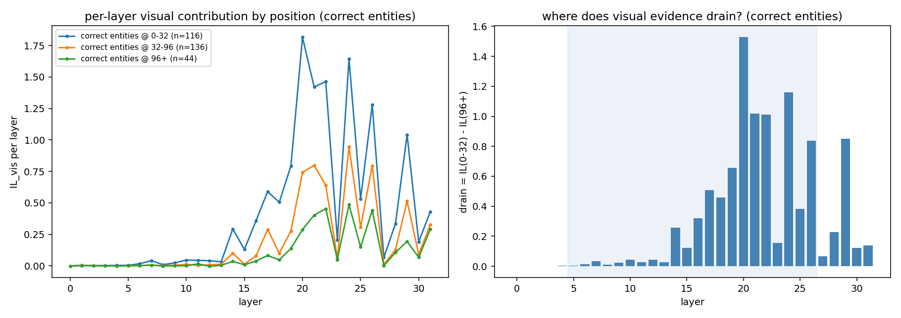
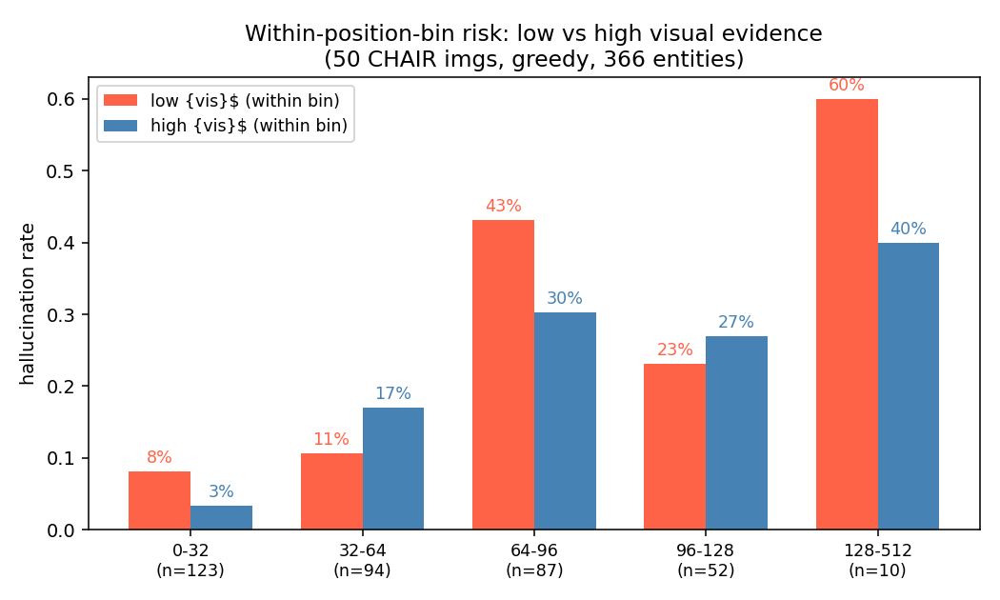

# VLM 幻觉故事图集（正文 5 图版，2026-09-02）

**一句话故事**：长文幻觉 = 视觉证据供给的慢性流失（预算通道）+ 上下文读取偏离视觉兼容 token（内容通道）。floor 稳定视觉访问，v2 修复上下文路由。不训练、零阈值、单前向。

**主公式**（L5-26，pre-softmax）：

$$\widehat S_j = S_j + \beta F_j\ (\text{floor});\qquad \widehat S_r = S_r + \nu\, d_t\, c_{t,r} - \kappa\ (\text{v2})$$

**终版性能**（LLaVA-1.5-7B，同协议）：

| Benchmark | greedy | 本方法 |
|---|---|---|
| CHAIR (Cs/Ci/Recall) | 49.4/15.1/78.0 | **28.0/6.0/73.0** |
| AMBER (CHAIR/Cover/Hal/Cog) | 7.7/51.3/35.3/4.1 | **4.0/52.4/23.2/1.5** |
| POPE (Acc/F1) | 87.0/87.5 | **88.32/88.21** |
| MME (Total) | 638.33 | **653.33** |

---

## 正文图 1：病端锚点——幻觉集中发生在视觉证据耗竭的位置段

幻觉率随位置 6%→50%（近一个数量级），视觉证据 $IL_{vis}$ 同步坠落 11.1→1.9；注意力质量早早走平、稀释归一化后证据仍单调坠（2.65→0.82）——**流失的是内容密度，不是看的量**。这排除"分母变大"的机械解释，也排除触发式干预（缺口是慢性的，见附录 A2）。

## 正文图 2：层段论证——流失发生在哪，就干预哪（现象，非消融）

左：正确实体的 $IL_{vis}$ 逐层轨迹按位置段展开——证据峰值在 L14-26 随生成进行性塌陷；右：逐层流失量 = IL(前段) − IL(后段)，**L0-4 无可救（流失≈0）、L5-26 集中全部流失的 86%**（L27-31 占 14%，主要 L29）。

**层段 L5-26 的正当性来源就此一条**：视觉证据的流失集中在 L5-26（86%）——干预施加在流失发生的地方。叙事顺序成立：现象（流失）→ 流失在哪（本图）→ 干预那（方法）。500 图消融表（L5-18/L14-26/L0-31 均更差）只作实验部分的边界验证，不进 motivation。

## 正文图 3：floor 的机制（同一历史 teacher-forced 因果对照）

同一历史开关 floor：图像注意力质量 0.061→0.236 且全程水平（反漂移），patch 熵 0.81→0.93（摊平）；ΔA 面板显示注意力从贪心热点铺向被忽视中场。floor 的准确读法：**对每个图像 patch 的非负乘性访问增益**（odds × $e^{\beta F_j}$），不是目标寻找。

## 正文图 4：v2 的机制（效应链 + 打乱对照因果证明）

上：效应链四环（$c$ 矩阵 → 施加偏置 → $\Delta\omega$ → logit 翻转）。下：剂量-效应链 + 阴性对照——真 $c$ 下 margin 随 ν 穿过零线翻转，**打乱 $c$（同剂量）在工作点不翻转**：起作用的是路由结构，不是注入量。

## 正文图 5：双路径闭环——方法按住了现象的两条线

| 指标（后段桶） | greedy | floor | floor+v2 |
|---|---|---|---|
| $IL_{vis}$（floor 的职责） | 1.9 | 10.3 | 8.4 |
| $G_t$（v2 的职责） | 0.903 | 0.922 | **0.931** |
| 幻觉率 | **50%** | 20.7% | **19.5%** |
| 实体覆盖 | 366 | 488 | **510** |

floor 托供给、v2 修路由、幻觉率共同压低、覆盖递增——**不是少说换的**。

**样本级**：greedy *"a collage of three different rooms... bed... vase... remote"*（3 幻觉+框架错）→ floor+v2 *"a spacious living room with a large couch, a television, and a dining table..."*（全清）。图 `assets/svd/example_v2_COCO_102947.jpg`。

---

## 适用域（一条负结果决定任务分工）

POPE adversarial 上 floor 的翻转账本：rescue 8（全 gt-yes）vs break 21（20 个 gt-no）——判断任务上 floor ≈ yes 偏置。**所以：长文用 floor+v2，判断任务只用 v2。**判据：视觉预算是否欠费。

---

# 附录（审计存档，审稿备查）

### A1. $F$ 的符号结构：全负、反跟踪、不是证据地图

spearman($|m|$, 注意力)≈−0.97；AlignLift $L(F)=0.75<1$（shuffle=1.00）；$F^+$ 在 L3+ 覆盖率精确为 0（relumean ≡ greedy，500 图）。**正文措辞护栏：只说"预算注入+摊平"，不说"指向证据"。**

### A2. 前兆图（慢性缺口的直接证据）

### A3. POPE 病端可分性

### A4. 逐层四量（含 null 对照）与逐头符号统计

### A5. 桶内 low/high IL 风险（位置混杂控制，50 图未通过，待 500 图）

### A6. v2 柱状图（全 token）与 v2 不抬聚合 $G$（措辞边界）

### A7. 被砍掉的方向存档：D_t / Gram / SVD 谱线 / POPE 静态图

### A8. 贡献图样本对照（幻觉弥散 vs 正确聚焦）

| 幻觉 "bed" | 正确 "couch" |
|---|---|
|  |  |

### A9. 漂移主图（floor 量端动机的原始版）

