# 故事图集：幻觉 = 视觉供给流失 + 上下文路由失配（2026-09-02 重构版）

**一句话故事**：长文幻觉 = 视觉证据供给的慢性流失（预算通道）+ 上下文读取偏离视觉兼容 token（内容通道）。floor 稳定视觉访问（自校准预算下限），v2 修复上下文路由（共扎根重分配）。每个组件的职责由测量指定，不由直觉指定。

**主公式**（L5-26，pre-softmax，零阈值，单前向）：

$$\widehat S_j = S_j + \beta F_j\quad(\text{floor}),\qquad \widehat S_r = S_r + \nu\, d_t\, c_{t,r} - \kappa\quad(\text{v2})$$

**终版性能**（LLaVA-1.5-7B，同协议）：

| Benchmark | greedy | 本方法 | 关键点 |
|---|---|---|---|
| CHAIR (Cs/Ci/Recall) | 49.4/15.1/78.0 | **28.0/6.0/73.0** | 500 图定案 |
| AMBER (CHAIR/Cover/Hal/Cog) | 7.7/51.3/35.3/4.1 | **4.0/52.4/23.2/1.5**（ν=1.0） | Cover 不降反升 |
| POPE (Acc/F1) | 87.0/87.5（论文值） | **88.32/88.21**（按 split 取优） | adversarial 全场最强 |
| MME (Total) | 638.33 | **653.33** | content-only v2 + γ0.25 |

---

# 第一幕：病端现象（自然存在、零干预）

## 1. 锚点现象：幻觉集中发生在视觉证据耗竭的位置段（Figure 1 核心）

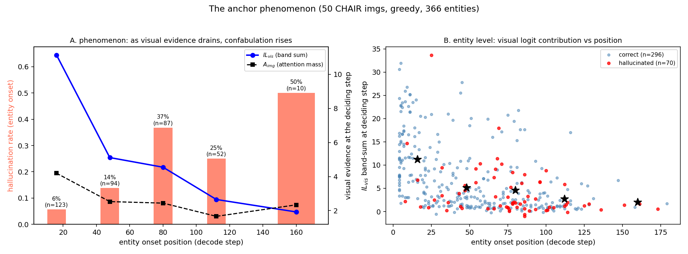

幻觉率随位置 6%→14%→37%→50%（近一个数量级上升），视觉证据 $IL_{vis}$ 同步坠落 11.1→1.9；注意力质量 $A_{img}$ 早早走平——**流失的是内容密度，不是看的量**（稀释归一化 $IL/A_{img}$ 仍 2.65→0.82 单调坠，排除"分母变大"的机械解释）。右图实体散点：幻觉（红）聚在低证据 × 后段区域。

## 2. 漂移与前兆：缺口是慢性的

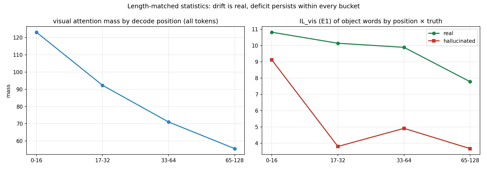

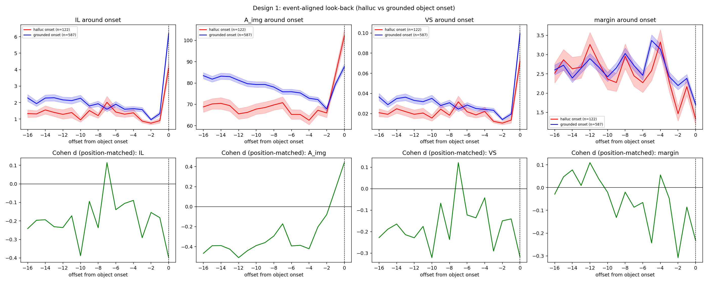

视觉质量随位置 −55%（123→55.6）；IL/A_img/VS 在幻觉实体起点前 16 步持续偏低（位置匹配 d −0.2~−0.4）。**慢性病 → 触发式干预不可行 → floor 必须每步恒剂量。**

## 3. 病灶在内容通路：$IL_{vis}$/$G_t$ 可分，看的量不可分

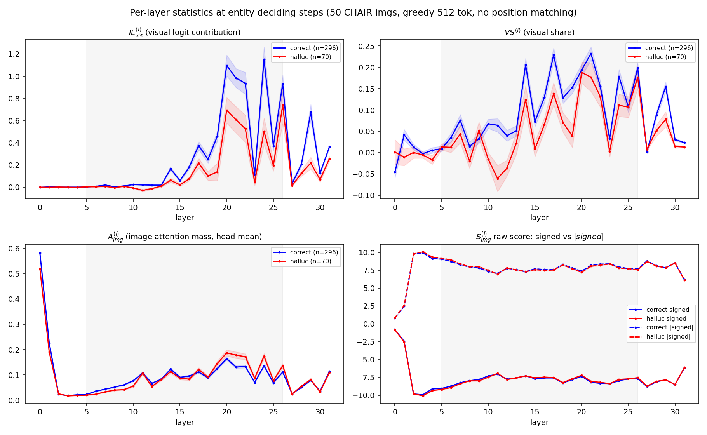

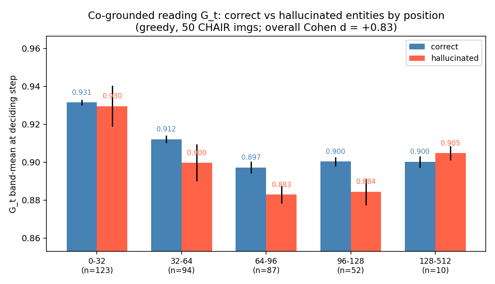

实体决定步逐层：$IL_{vis}$/$VS$ 可分（d=+0.30/+0.23，写入带 L14-24 最清晰），$A_{img}$/$|S_{img}|$ 完全不可分（d≈+0.02）。$G_t$（共扎根读取）：**correct 0.9152 vs halluc 0.8926，d=+0.83——全项目最强病端信号**，4/5 位置桶方向一致。

## 4. POPE：错误决策没有充分读取共扎根的问题内容

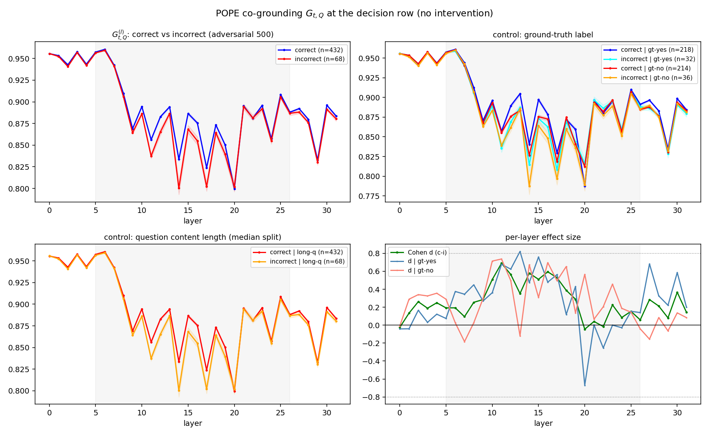

adversarial 500：$G_{t,Q}$ correct 0.8835 vs incorrect 0.8750，d=+0.30，gt-yes/no 标签控制同向（+0.28/+0.31）。判断任务上病端同型。

---

# 第二幕：方法机制（它"是"什么）

## 5. floor 的因果效应（同一历史 teacher-forced，差异 100% 归因于 F）

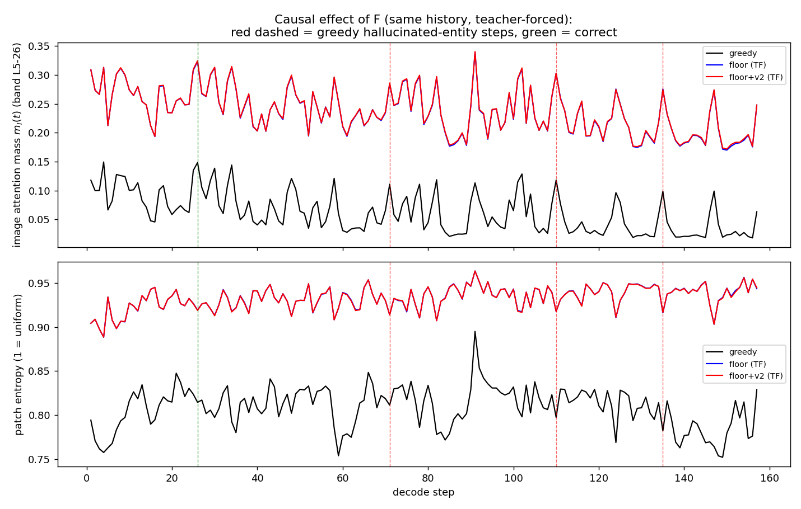

$m_I$：greedy 0.061 且后段下滑 → floor 0.236 全程水平（×3.9，反漂移）；patch 熵 0.81→0.93（摊平）。红虚线 = greedy 出幻觉的步，全部落在其曲线低谷。

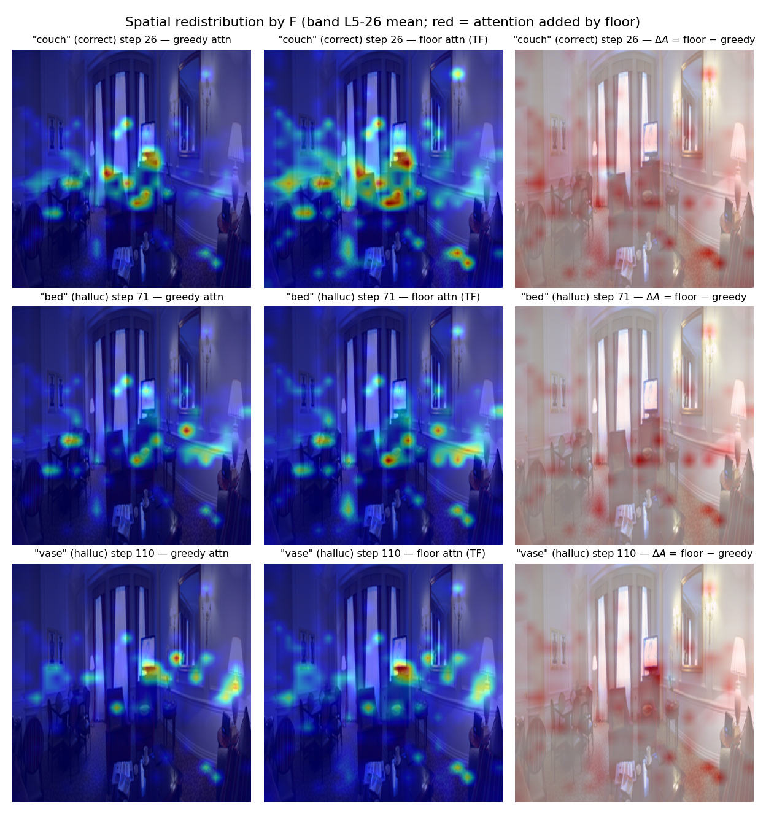

ΔA 面板：floor 从贪心热点抽走（蓝）、铺向被忽视中场（红）——摊平的空间版。

## 6. v2 效应链：结构 → 操作 → 注意力 → 决策

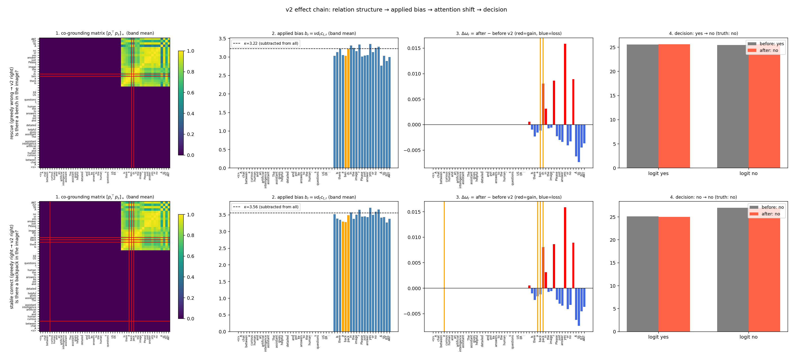

①$c$ 矩阵（问题 token 共扎根块）；②施加的偏置 $b_r=\nu d_t c_{t,r}$（κ 虚线）；③$\Delta\omega$（格式 token 失血、物体 token 获得）；④yes/no logit 翻转（rescue "bench" yes→no）。

## 7. v2 因果证明：剂量-效应链 + 打乱对照

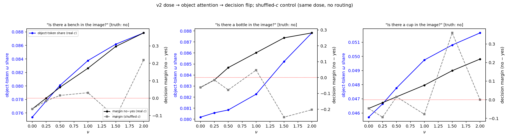

真 $c$：margin 随 ν 单调上升穿过零线（翻转），物体份额同步上升；**打乱 $c$（同剂量、无路由结构）在工作点 ν≤1.0 全部不翻转**——起作用的是路由结构，不是注入量。

## 8. v2 的 token 级作用（全输入 token 不删）

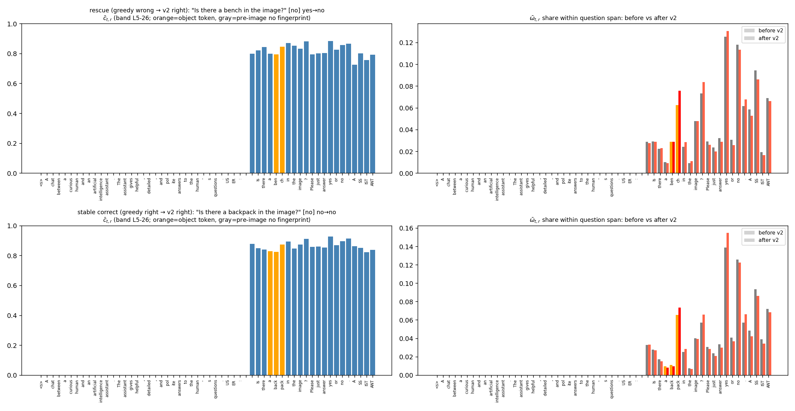

左：$c_{t,r}$（system 段为 0：因果掩码无视觉指纹）；右：$\omega$ 前后对比——v2 后物体 token 份额 3×（"ch" 0.025→0.076），格式锚点（"yes" 后缀）下降。**v2 把锚在答案格式上的注意力搬回有视觉支撑的物体。**

---

# 第三幕：疗效闭环（方法按住了现象）

## 9. 双路径闭环（Figure 2，三配置终版）

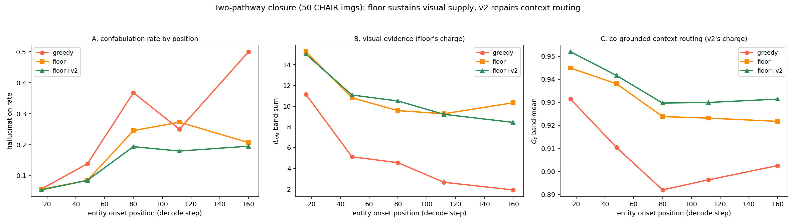

| 指标（后段桶） | greedy | floor | floor+v2 |
|---|---|---|---|
| $IL_{vis}$（视觉供给） | 1.9 | 10.3 | 8.4 |
| $G_t$（上下文路由） | 0.903 | 0.922 | **0.931** |
| 幻觉率 | **50%** | 20.7% | **19.5%** |
| 实体覆盖 | 366 | 488 | **510** |

**floor 托起 IL（floor≈fv2≫greedy）、v2 修复 G（fv2 最高）、幻觉率共同压低、覆盖递增**——分工在位置分辨层面闭合。

## 10. 两配置版闭环（病 vs 药的直接对照）

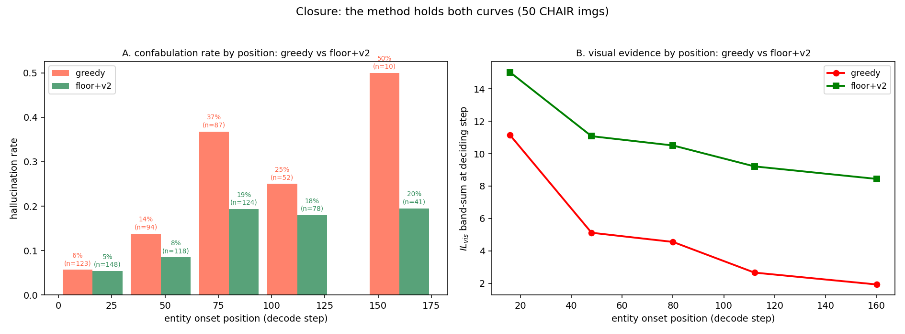

左：幻觉率 greedy（后段 50%）vs floor+v2（压平到 ~20%）；右：$IL_{vis}$ greedy（坠落）vs floor+v2（高位走平）。**病在哪、药修哪、修没修好，一张图。**

## 11. 样本级疗效

greedy：*"a collage of three different rooms... bedroom with a bed... vase... remote"*（3 幻觉+框架错误）→ floor+v2：*"a spacious living room with a large couch, a television, and a dining table..."*（幻觉全清、框架纠正、真实物体全保留）。

---

# 适用域与边界（正文必须保留的两个负结果）

## 12. floor 只适用长文：POPE 翻转账本

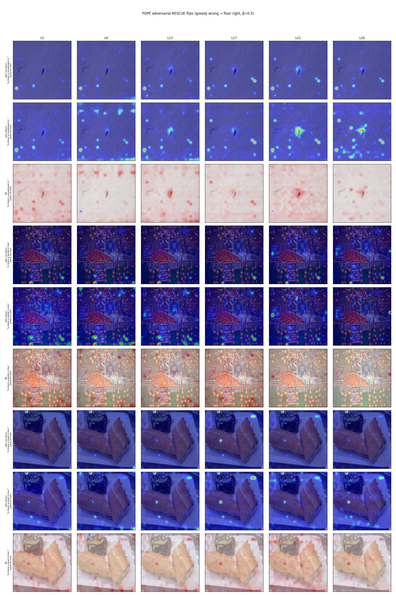

floor 在 POPE adversarial：rescue 8（全 gt-yes）vs break 21（20 个 gt-no）——**判断任务上 floor 几乎纯粹是 yes 偏置**（看图多就说 yes）。所以 POPE/MME 只用 v2。这不是缺陷披露，是适用域的测量证据。

## 13. v2 不抬聚合 $G$（措辞边界）

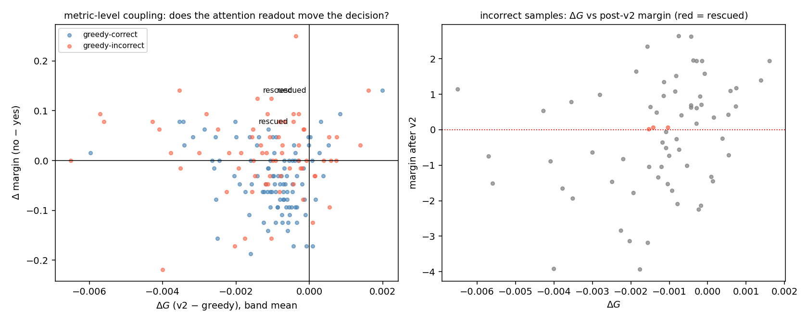

ΔG vs Δmargin 无耦合（corr=−0.095）。v2 起效靠按 $c$ 的逐 token 重排 × 跨层复利，不靠"抬高聚合 $G$"——正文不得声称"$G$ 提升"，只能说"修复发生在同一结构上"。

---

# 串联自检表

| 故事环节 | 图 | 关键数字 |
|---|---|---|
| 幻觉集中在证据耗竭位置 | §1 | 6%→50% / IL 11.1→1.9 |
| 缺口是慢性的（恒剂量的依据） | §2 | −55%、持续 16 步 |
| 病灶在内容通路 | §3 | IL +0.30 / $G_t$ **+0.83** / $A_{img}$ +0.03 |
| POPE 同型病端 | §4 | d=+0.30，标签稳健 |
| floor = 预算注入 + 摊平 | §5 | $m_I$ ×3.9 水平、熵 0.81→0.93 |
| v2 = 共扎根重排 | §6-8 | 打乱对照不翻转；物体份额 3× |
| 双路径闭环 | §9-10 | 50%→19.5%、覆盖 366→510 |
| 适用域 | §12 | floor 只长文（8 vs 21 账本） |

---

# 附录：机制审计存档（负结果，审稿备查，不进正文主线）

这些实验杀掉了所有表层直觉，是正文措辞的护栏（它们保证我们不声称"$F$ 指向证据"），但不承担说服力：

| 存档 | 图 | 一句话 |
|---|---|---|
| $F$ 全负 + 反跟踪 | 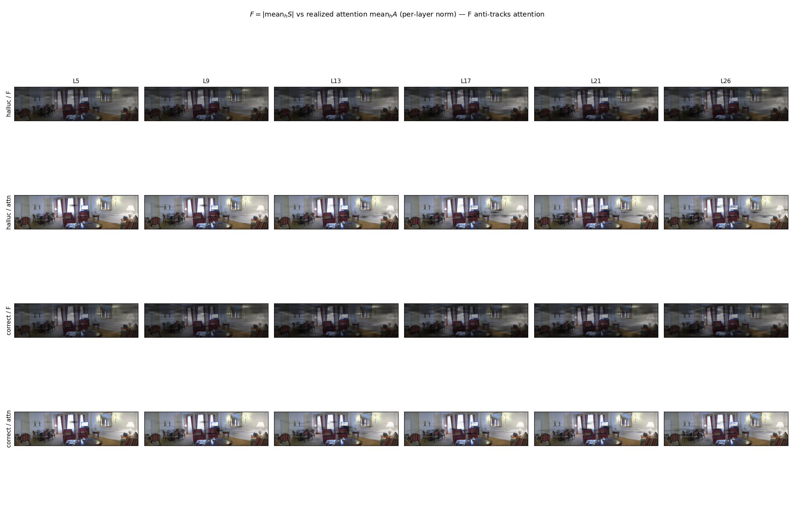 | spearman −0.97：$F$ 高亮被忽视区 |
| relu 全空 | 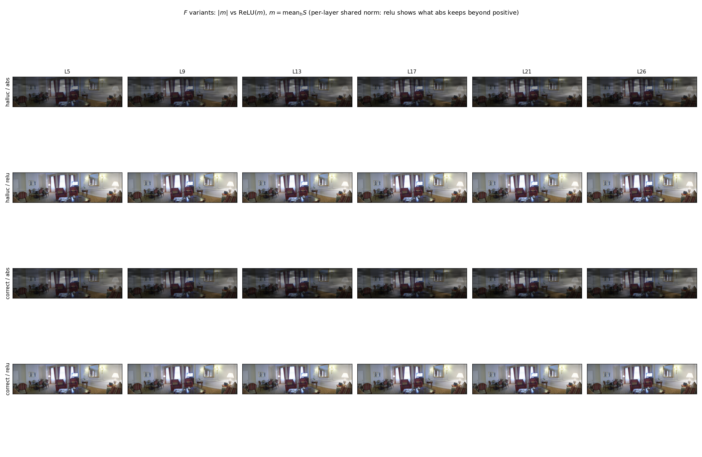 | $\mathrm{ReLU}(m)\equiv0$；relumean≡greedy（500 图） |
| AlignLift | 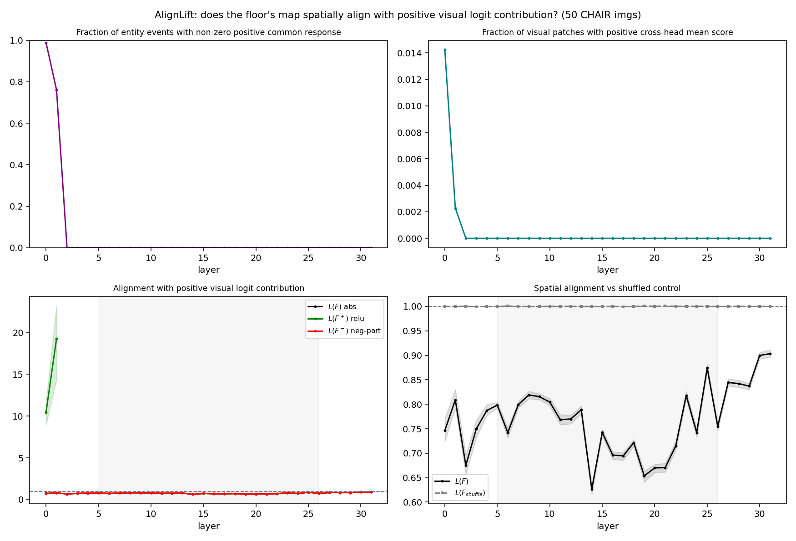 | $L(F)=0.75<1$，shuffle=1.00：$F$ 非证据地图 |
| 逐头符号 | 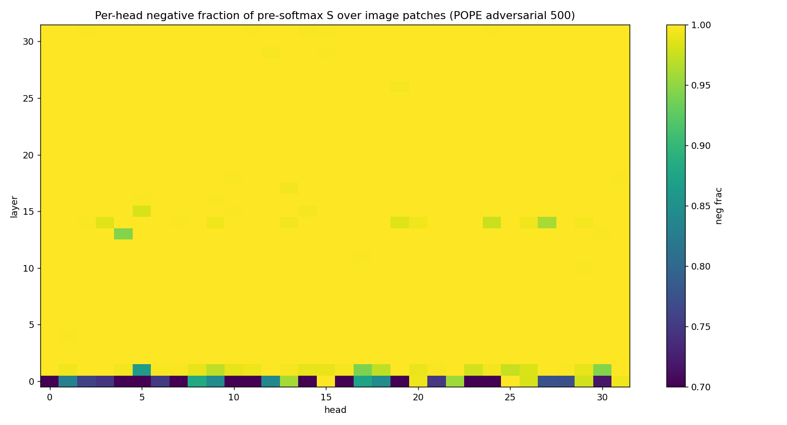 | band 内逐头 0.96-1.00 全负；$F$≡$g$ |
| 静态图不可分 | 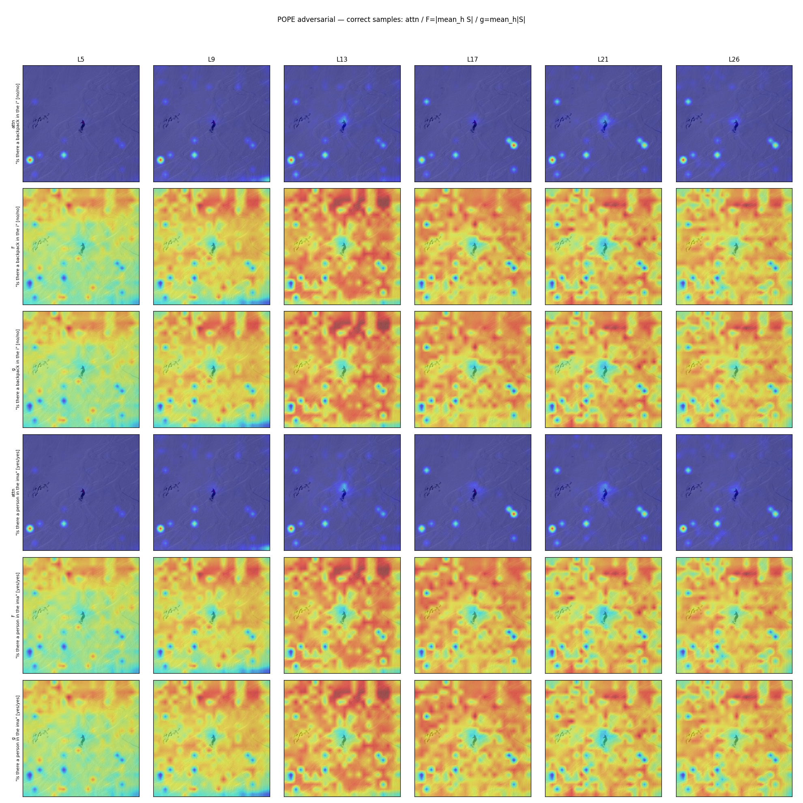 | 单点地图两类无差异 |
| floor 弥散 | 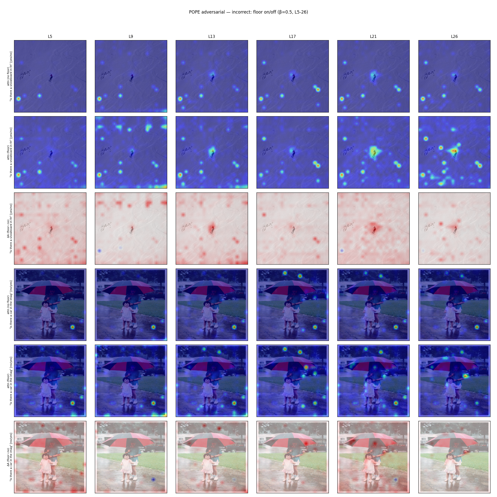 | 注入后注意力全图摊开 |
| 贡献图对照 | 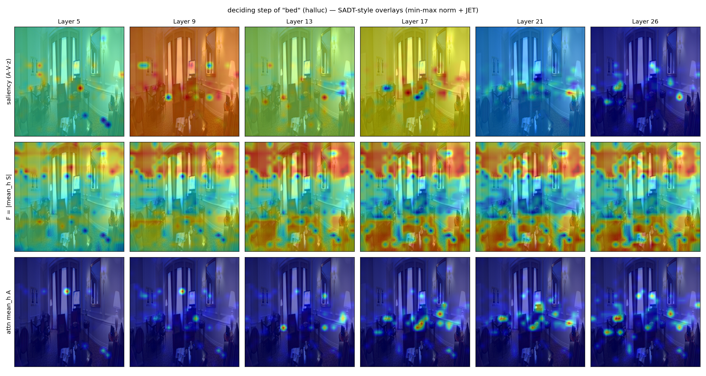 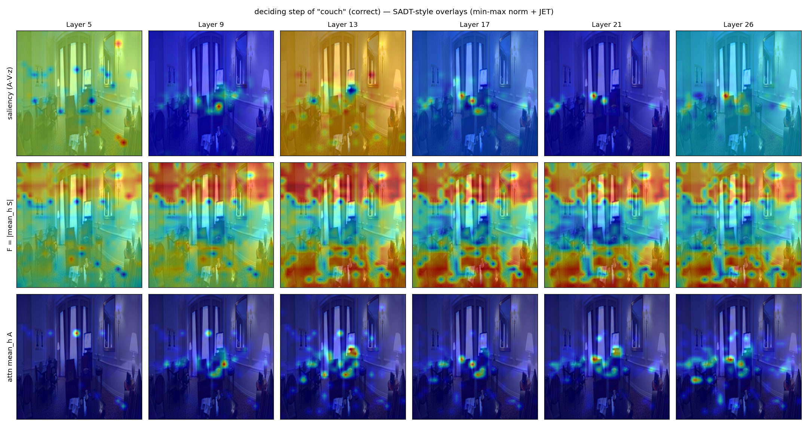 | 幻觉弥散 vs 正确聚焦 |
| D_t / Gram / SVD 存档 | 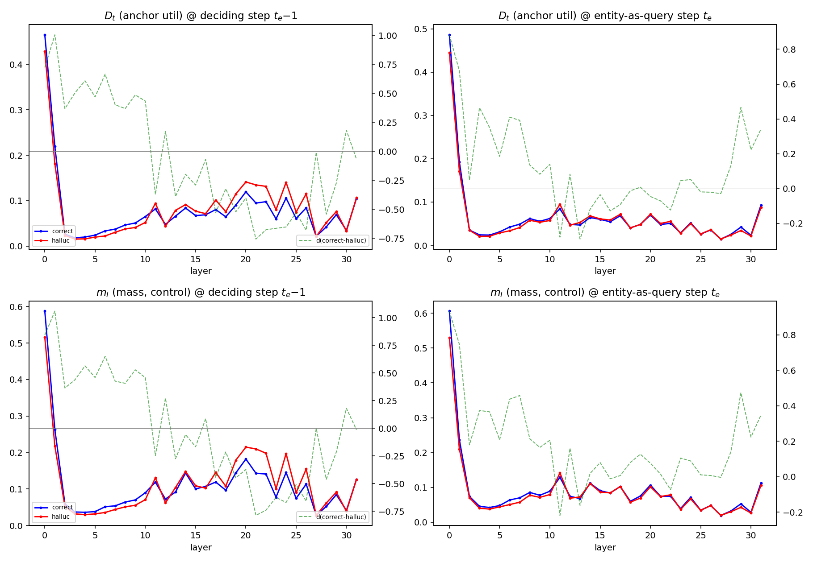 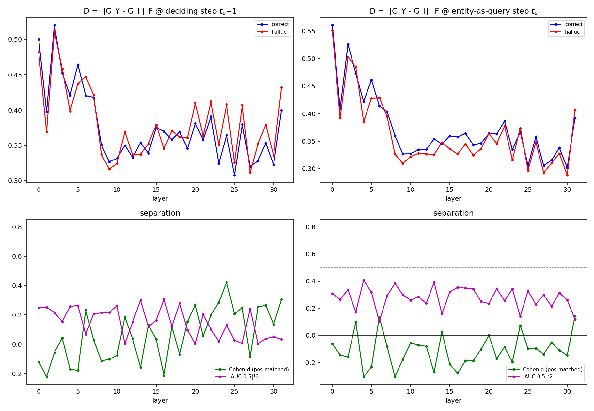 | 三个方向全部证伪（详见 svd_new.md §11-18） |
